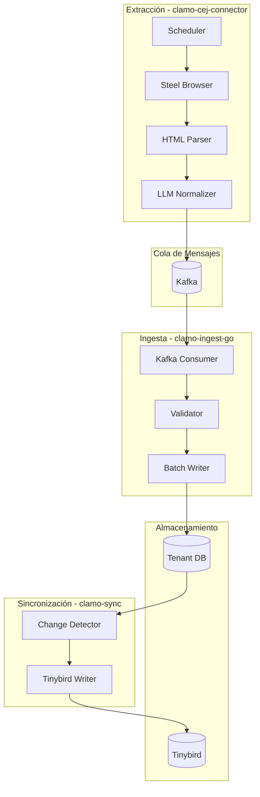
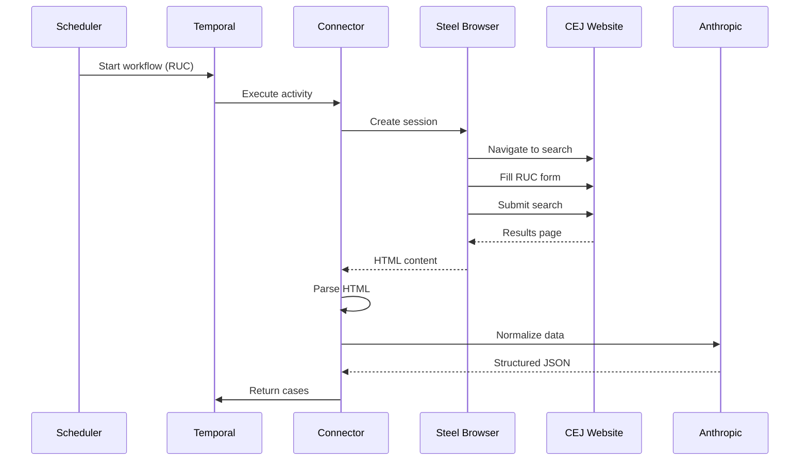

# Pipeline de Datos

El pipeline de datos de Clamo automatiza la extracción, normalización e ingesta de información desde el Centro de Justicia Electrónico (CEJ) del Poder Judicial peruano.

## Arquitectura General



## Componentes

### clamo-cej-connector

Servicio Python que extrae datos del CEJ usando browser automation.

| Tecnología | Uso |
|------------|-----|
| Python 3.11 | Runtime |
| Temporal | Orquestación de workflows |
| Steel | Browser automation cloud |
| Playwright | Control del navegador |
| Anthropic | Normalización con LLM |

#### Flujo de Extracción



#### Normalización con LLM

El HTML crudo del CEJ se procesa con Claude para extraer información estructurada:

```python
# Ejemplo simplificado
async def normalize_movement(raw_html: str) -> Movement:
    prompt = f"""
    Extrae la información del siguiente movimiento procesal del CEJ.
    
    HTML:
    {raw_html}
    
    Responde en JSON con el siguiente formato:
    {{
        "date": "YYYY-MM-DD",
        "description": "...",
        "resolution": "número de resolución o null",
        "classification": "RESOLUCION|ESCRITO|NOTIFICACION|AUDIENCIA|OTRO",
        "isNotification": true/false,
        "summary": "resumen en una oración"
    }}
    """
    
    response = await anthropic.messages.create(
        model="claude-3-haiku-20240307",
        messages=[{"role": "user", "content": prompt}],
    )
    
    return Movement(**json.loads(response.content[0].text))
```

### clamo-ingest-go

Worker de alta performance en Go para inserción batch.

| Tecnología | Uso |
|------------|-----|
| Go 1.22 | Runtime |
| Kafka | Consumo de eventos |
| pgx | Driver PostgreSQL |
| COPY | Inserción batch |

#### Procesamiento de Eventos

```go
type CaseReadyEvent struct {
    CompanyID string    `json:"companyId"`
    Cases     []Case    `json:"cases"`
    Timestamp time.Time `json:"timestamp"`
}

func (w *Worker) ProcessBatch(events []CaseReadyEvent) error {
    // Agrupar por tenant
    byTenant := make(map[string][]Case)
    for _, event := range events {
        byTenant[event.CompanyID] = append(
            byTenant[event.CompanyID], 
            event.Cases...,
        )
    }
    
    // Insertar por tenant
    for companyID, cases := range byTenant {
        conn, err := w.getTenantConnection(companyID)
        if err != nil {
            return err
        }
        
        err = w.batchInsert(conn, cases)
        if err != nil {
            return err
        }
    }
    
    return nil
}

func (w *Worker) batchInsert(conn *pgx.Conn, cases []Case) error {
    // Usar COPY para inserción masiva
    _, err := conn.CopyFrom(
        context.Background(),
        pgx.Identifier{"cases"},
        []string{"id", "expediente", "plaintiff", "defendant", ...},
        pgx.CopyFromSlice(len(cases), func(i int) ([]any, error) {
            c := cases[i]
            return []any{c.ID, c.Expediente, c.Plaintiff, c.Defendant, ...}, nil
        }),
    )
    return err
}
```

### clamo-sync

Servicio Rust que sincroniza datos hacia Tinybird para analytics.

```rust
// Detector de cambios usando CDC
async fn sync_changes(pool: &PgPool, tinybird: &TinybirdClient) -> Result<()> {
    // Obtener cambios desde último sync
    let changes = sqlx::query_as!(
        CaseChange,
        r#"
        SELECT * FROM case_changes
        WHERE synced_at IS NULL
        ORDER BY changed_at
        LIMIT 1000
        "#
    )
    .fetch_all(pool)
    .await?;
    
    if changes.is_empty() {
        return Ok(());
    }
    
    // Enviar a Tinybird
    tinybird.ingest("cases", &changes).await?;
    
    // Marcar como sincronizados
    let ids: Vec<_> = changes.iter().map(|c| c.id).collect();
    sqlx::query!(
        "UPDATE case_changes SET synced_at = NOW() WHERE id = ANY($1)",
        &ids
    )
    .execute(pool)
    .await?;
    
    Ok(())
}
```

## Eventos Kafka

### Tópicos

| Tópico | Productor | Consumidor | Descripción |
|--------|-----------|------------|-------------|
| `cej.case.ready` | cej-connector | ingest-go | Casos listos para insertar |
| `cej.case.error` | cej-connector | monitoring | Errores de extracción |
| `case.updated` | ingest-go | sync | Casos actualizados |

### Formato de Eventos

```json
{
  "eventId": "evt_abc123",
  "eventType": "cej.case.ready",
  "timestamp": "2025-01-02T12:00:00Z",
  "payload": {
    "companyId": "cmp_xyz789",
    "monitoredEntityId": "ent_123",
    "cases": [
      {
        "expediente": "00001-2024-0-1234-JR-LA-01",
        "plaintiff": "Juan Pérez",
        "defendant": "Empresa S.A.C.",
        "movements": [...]
      }
    ]
  },
  "metadata": {
    "source": "cej-connector",
    "version": "1.0"
  }
}
```

## Scheduling

El scheduler de Temporal coordina la extracción:

```python
# Workflow de extracción
@workflow.defn
class ExtractCasesWorkflow:
    @workflow.run
    async def run(self, company_id: str, ruc: str) -> ExtractResult:
        # Crear sesión de browser
        session = await workflow.execute_activity(
            create_browser_session,
            start_to_close_timeout=timedelta(minutes=2),
        )
        
        try:
            # Buscar casos por RUC
            cases = await workflow.execute_activity(
                search_cases_by_ruc,
                args=[session, ruc],
                start_to_close_timeout=timedelta(minutes=10),
            )
            
            # Normalizar con LLM
            normalized = await workflow.execute_activity(
                normalize_cases,
                args=[cases],
                start_to_close_timeout=timedelta(minutes=5),
            )
            
            # Publicar a Kafka
            await workflow.execute_activity(
                publish_cases,
                args=[company_id, normalized],
                start_to_close_timeout=timedelta(minutes=1),
            )
            
            return ExtractResult(success=True, count=len(normalized))
            
        finally:
            await workflow.execute_activity(
                close_browser_session,
                args=[session],
            )
```

### Frecuencia de Extracción

| Plan | Frecuencia | Entidades |
|------|------------|-----------|
| Free | Diaria | 5 |
| Pro | Cada 4 horas | 50 |
| Enterprise | Cada hora | Ilimitadas |

## Manejo de Errores

### Reintentos

```python
# Política de reintentos en Temporal
retry_policy = RetryPolicy(
    initial_interval=timedelta(seconds=10),
    maximum_interval=timedelta(minutes=10),
    backoff_coefficient=2.0,
    maximum_attempts=5,
    non_retryable_error_types=["InvalidRUCError", "PermissionDeniedError"],
)
```

### Dead Letter Queue

Eventos que fallan después de reintentos van a DLQ:

```python
async def handle_failed_event(event: CaseReadyEvent, error: Exception):
    await kafka.produce(
        topic="cej.case.dlq",
        value={
            "originalEvent": event,
            "error": str(error),
            "failedAt": datetime.utcnow().isoformat(),
            "attempts": event.metadata.get("attempts", 0) + 1,
        },
    )
```

## Monitoreo

### Métricas

| Métrica | Descripción |
|---------|-------------|
| `cej_extraction_duration_seconds` | Tiempo de extracción por RUC |
| `cej_cases_extracted_total` | Casos extraídos |
| `cej_movements_extracted_total` | Movimientos extraídos |
| `ingest_batch_size` | Tamaño de batch de inserción |
| `ingest_latency_seconds` | Latencia de ingesta |
| `sync_lag_seconds` | Retraso de sincronización |

### Alertas

```yaml
# Prometheus alerting rules
groups:
  - name: pipeline
    rules:
      - alert: HighExtractionLatency
        expr: histogram_quantile(0.95, cej_extraction_duration_seconds) > 300
        for: 5m
        labels:
          severity: warning
        annotations:
          summary: "Extracción del CEJ lenta"
          
      - alert: IngestLagHigh
        expr: kafka_consumer_lag > 10000
        for: 10m
        labels:
          severity: critical
        annotations:
          summary: "Lag de ingesta alto"
```

## Próximos Pasos

<CardGroup cols={2}>
  <Card
    title="Asistentes IA"
    icon="robot"
    href="/arquitectura/asistentes-ia"
  >
    Arquitectura de los agentes LangGraph.
  </Card>
  <Card
    title="Analytics"
    icon="chart-line"
    href="/arquitectura/analiticas"
  >
    Pipeline de analytics con Tinybird.
  </Card>
</CardGroup>

