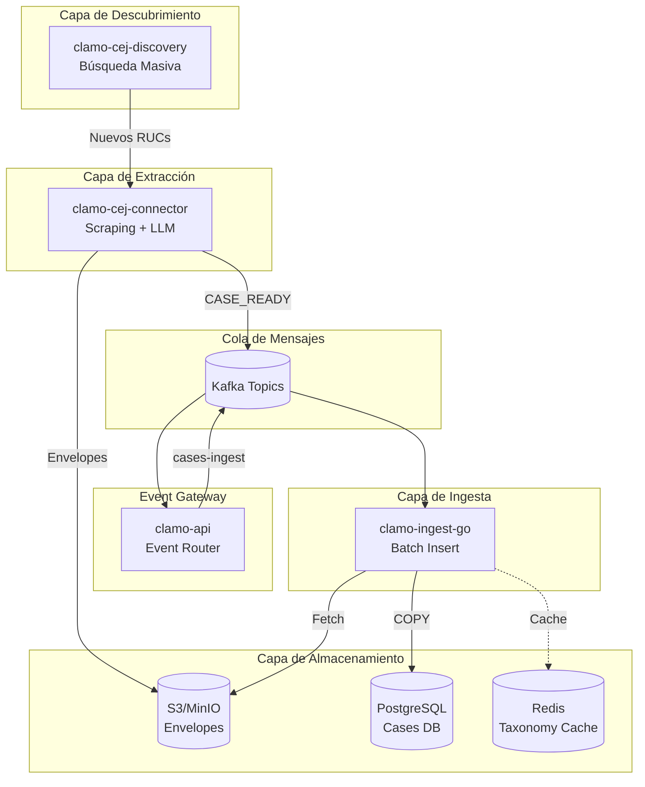
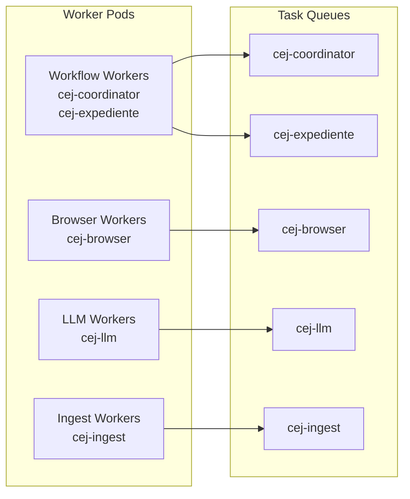
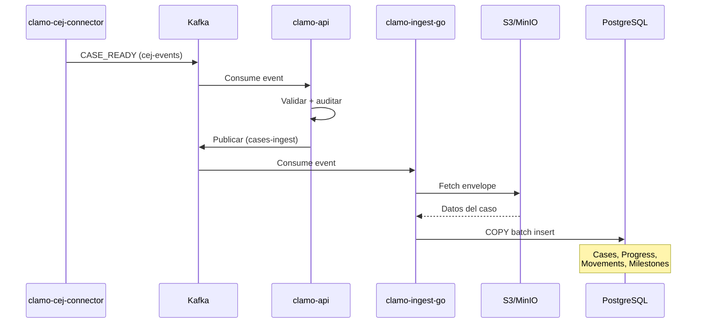
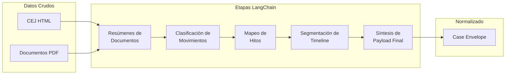

# Pipeline de Datos

El pipeline de datos de Clamo automatiza la extracción, normalización e ingesta de información del Centro de Justicia Electrónico de Perú (CEJ).

## Visión General del Pipeline



## Componentes

### clamo-cej-discovery

**Propósito**: Descubrimiento masivo de nuevos identificadores de casos (RUCs) del CEJ.

**Tecnología**: Python, Playwright, Steel.dev, Temporal

**Características Clave**:
- Búsqueda masiva por números correlativos (1-99999)
- Detención inteligente cuando la tasa de "no encontrado" es alta
- Almacenamiento incremental de resultados de búsqueda en CSV a MinIO
- Notificaciones en tiempo real vía Ably cuando se encuentran casos

<Note>
**Importante**: clamo-cej-discovery almacena **resultados de búsqueda** en CSV (metadatos básicos como expediente, partes, fecha). Esto es diferente del pipeline de ingesta principal que usa **JSON Envelopes** para datos completos normalizados.
</Note>

**Flujo**:
1. Iterar a través de números correlativos
2. Buscar en el CEJ cada correlativo
3. Extraer metadatos básicos del caso
4. Almacenar resultados de búsqueda en CSV en MinIO
5. Notificar a sistemas downstream sobre nuevos casos

### clamo-cej-connector

**Propósito**: Extracción completa de casos con automatización de navegador y normalización basada en LLM.

**Tecnología**: Python, FastAPI, Playwright, Steel.dev, Temporal, Anthropic (Claude)

**Etapas del Pipeline de Datos**:

| Etapa | Actividad | Descripción |
|-------|-----------|-------------|
| Browser | `cej_browser_search` | Sesión Steel, resolución de CAPTCHA, captura de HTML |
| Parsing | `cej_parse_html` | Convertir HTML a DTOs `CejHtmlDetail` |
| Documentos | `cej_download_documents` | Descargar PDFs, extracción con LlamaParse |
| LLM | `cej_llm_*` | Resúmenes, clasificaciones, hitos |
| DB | `cej_ingest_normalized_case` | Upsert vía `CejIngestor` |

**Topología de Workers**:



**Workflows de Temporal**:
- `CejCaseJobWorkflow` - Orquestador de nivel superior, genera workflows hijos
- `CejExpedienteWorkflow` - Flujo completo de extracción para un caso individual

### clamo-ingest-go

**Propósito**: Inserción batch de alto rendimiento en la base de datos.

**Tecnología**: Go 1.25+, Kafka, Temporal, PostgreSQL (pgx), Redis

**Optimizaciones de Rendimiento**:
- PostgreSQL `COPY FROM` para inserciones masivas (10-100x más rápido)
- Cache de taxonomía en Redis reduce consultas a DB en 90%
- Connection pooling (20 conexiones máximas)
- Reintentos automáticos con backoff exponencial

**Flujo de Datos**:



**Tablas Insertadas**:
- `Cases` - UPSERT en expediente + company_id
- `CaseProgress` - Línea de tiempo de etapa/subetapa
- `Movements` - Acciones del expediente
- `StatusSnapshots` - Estado point-in-time
- `CaseMilestones` - Eventos importantes

## Pipeline de Normalización LLM

El connector usa Anthropic Claude para normalización multi-etapa:



**Etapas LLM**:
1. **Resúmenes de Documentos** - Extraer información clave de PDFs
2. **Clasificación de Movimientos** - Categorizar acciones del caso
3. **Mapeo de Hitos** - Identificar eventos importantes
4. **Segmentación de Timeline** - Dividir en etapas/subetapas
5. **Síntesis Final** - Producir envelope normalizado

## Formato de Almacenamiento: JSON Envelopes

<Warning>
**Importante**: El pipeline de ingesta principal **NO usa CSV**. Los datos normalizados se almacenan como **JSON Envelopes** en S3/MinIO.
</Warning>

### ¿Por qué JSON y no CSV?

| Aspecto | CSV | JSON Envelope |
|---------|-----|---------------|
| **Estructura** | Plana (filas/columnas) | Jerárquica (anidada) |
| **Relaciones** | No soporta | Caso → Movimientos → Hitos |
| **Metadata** | Limitada | Rica (artefactos LLM, timestamps) |
| **Validación** | Manual | Schema (Protobuf/Zod) |

### Estructura del Envelope

```typescript
// @getclamo/contracts - NormalizationArtifactsEnvelope
interface NormalizationArtifactsEnvelope {
  case: NormalizedCase;           // Datos del caso
  movements: Movement[];          // Lista de movimientos
  milestones: Milestone[];        // Hitos identificados
  artifacts: {
    browser: BrowserSessionPayload;  // Sesión de scraping
    extraction: ExtractionArtifacts; // HTML parseado
    llm: LlmArtifacts;               // Resultados de Claude
  };
  metadata: {
    extractedAt: string;
    normalizedAt: string;
    version: string;
  };
}
```

### Ruta de Almacenamiento

```
s3://clamo-envelopes/
└── cases/
    └── {YYYY}/
        └── {MM}/
            └── {DD}/
                └── {case_uuid}.json
```

**Ejemplo**: `s3://clamo-envelopes/cases/2024/01/15/case_abc123.json`

### Diferencia con clamo-cej-discovery

| Servicio | Formato | Bucket | Contenido |
|----------|---------|--------|-----------|
| **clamo-cej-discovery** | CSV | `cej-bulk-search` | Metadatos básicos de búsqueda |
| **clamo-cej-connector** | JSON | `clamo-envelopes` | Datos completos normalizados |

## Estrategia de Caching

El connector CEJ implementa caching multi-nivel:

| Configuración | Default | Descripción |
|---------------|---------|-------------|
| `CACHE_ENABLED` | `true` | Habilitar/deshabilitar caching |
| `CACHE_BACKEND` | `memory` | `memory` o `redis`/`valkey` |
| `CACHE_TTL_SECONDS` | `1200` | TTL default de 20 minutos |
| `CACHE_FORCE_REFRESH_PARAM` | `force_refresh` | Query param para bypass de cache |

Artefactos cacheados incluyen:
- HTML de sesión del navegador
- Detalles del caso parseados
- Documentos descargados
- Resultados de normalización LLM

## Observabilidad

### Tracing y Logging
- **Logfire** - Spans desde FastAPI + actividades Temporal
- **LangSmith** - Tracing de etapas LangChain (resúmenes, clasificaciones)

### Métricas
- Tiempos por etapa: `browser_time`, `http_time`, `llm_time`, `db_time`
- Profundidad de cola para load shedding
- Latencia de ejecución de workflow tasks (objetivo menor a 1s)

### Search Attributes (Temporal)
- `TenantId` - Identificador de empresa
- `ExpedienteId` - Identificador de caso
- `ForceRefresh` - Flag de bypass de cache
- `CacheHit` - Cache hit/miss
- `MovementCount` - Número de movimientos

## Recomendaciones de Escalamiento

Para 150 envíos de jobs concurrentes:
- ~5 pods de workflow
- ~15 pods de actividad (divididos entre browser/LLM/ingest)
- Todos los workers usan la misma imagen de contenedor
- La variable de entorno `WORKER_ROLE` determina la asignación de cola

## Documentación Relacionada

- [Servicio clamo-cej-connector](/es/servicios/clamo-cej-connector)
- [Servicio clamo-cej-discovery](/es/servicios/clamo-cej-discovery)
- [Servicio clamo-ingest-go](/es/servicios/clamo-ingest-go)
