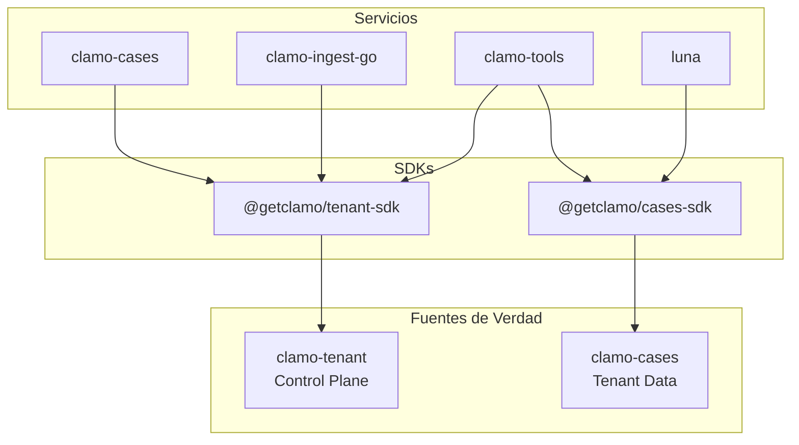
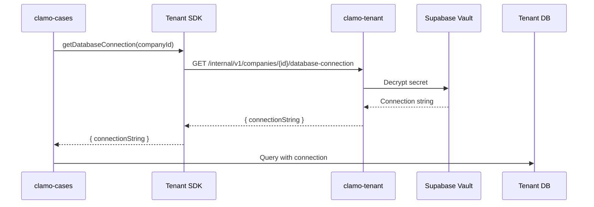

# SDKs de Servicio

Clamo utiliza **SDKs de servicio** para toda comunicación entre microservicios. Esto garantiza contratos tipados, validaciones centralizadas y una única fuente de verdad para cada dominio.

## Principio: No Queries Directas

<Warning>
**Regla Fundamental:** Los servicios **nunca** deben hacer queries directas a bases de datos de otros dominios. Toda comunicación pasa por SDKs que encapsulan la lógica de negocio.
</Warning>

### ¿Por qué?

| Queries Directas | SDKs de Servicio |
|------------------|------------------|
| Acopla servicios a esquemas de DB | Contratos estables vía API |
| Duplica validaciones | Validaciones centralizadas |
| Difícil de auditar | Logging y tracing unificado |
| Sin control de acceso | Permisos por endpoint |
| Cambios de schema rompen todo | Versionado de API |

## Arquitectura



## clamo-tenant como Fuente de Verdad

El servicio `clamo-tenant` es la **única fuente de verdad** para:

- **Empresas (Companies)**: Registro, configuración, planes
- **Usuarios**: Membresías, roles, permisos
- **Conexiones de DB**: Credenciales de tenant databases
- **Organizaciones WorkOS**: Mapeo org → company

### Tenant SDK

```typescript
import Tenant from "@getclamo/tenant";

// Crear cliente
const tenant = new Tenant({
  baseURL: process.env.TENANT_SERVICE_URL,
  apiKey: "internal-service-token", // Para rutas internas
});

// Obtener empresa por organización WorkOS
const company = await tenant.internal.companies.getByOrganization(orgId);

// Obtener connection string del tenant
const { connectionString } = await tenant.internal.companies.getDatabaseConnection(companyId);
```

### Endpoints Internos del Tenant

| Método | Endpoint | Descripción |
|--------|----------|-------------|
| `GET` | `/internal/v1/companies/by-org/{orgId}` | Empresa por WorkOS org |
| `GET` | `/internal/v1/companies/{id}/database-connection` | Connection string |
| `GET` | `/internal/v1/companies/{id}/users` | Usuarios de la empresa |
| `POST` | `/internal/v1/companies/{id}/provision` | Provisionar DB |

## Flujo de Resolución de Tenant

Cuando un servicio necesita acceder a datos de un tenant:



### Implementación en clamo-cases

```typescript
// clamo-cases/src/clients/sdk/tenant.client.ts
import Tenant from "@getclamo/tenant";

let _client: Tenant | null = null;

export function getTenantClient(): Tenant {
  if (_client !== null) {
    return _client;
  }

  _client = new Tenant({
    baseURL: env.TENANT_SERVICE_URL,
    // Internal routes are secured by network isolation
    apiKey: "internal-service-token",
    defaultHeaders: { Authorization: null },
  });

  return _client;
}
```

### Middleware de Tenant

```typescript
// clamo-cases/src/middleware/tenant.ts
import { getTenantClient } from "@getclamo/database";
import type Tenant from "@getclamo/tenant";

export function createTenantMiddleware(deps: {
  controlDb: PrismaClient;
  tenantSdk: Tenant;
}) {
  return async (c: Context, next: Next) => {
    const orgId = c.req.header("x-workos-org-id");
    
    // 1. Resolver company via SDK (no query directa)
    const company = await deps.tenantSdk.internal.companies.getByOrganization(orgId);
    
    // 2. Obtener connection string via SDK
    const { connectionString } = await deps.tenantSdk.internal.companies
      .getDatabaseConnection(company.id);
    
    // 3. Crear cliente de tenant DB
    const tenantDb = await getTenantClient({
      companyId: company.id,
      connectionString,
    });
    
    c.set("tenantDb", tenantDb);
    c.set("company", company);
    
    await next();
  };
}
```

## Cache de Conexiones

Para evitar resolver conexiones en cada request, `clamo-database` implementa un cache LRU:

```typescript
// clamo-database/src/tenant-client.ts
class TenantClientCache {
  private cache: Map<string, CacheEntry> = new Map();
  private config: TenantClientCacheConfig;

  async getClient(info: TenantConnectionInfo): Promise<PrismaClient> {
    // Check cache first
    const existing = this.cache.get(info.companyId);
    if (existing) {
      existing.lastAccessed = Date.now();
      return existing.client;
    }

    // Create new client
    const client = new PrismaClient({
      datasources: { db: { url: info.connectionString } },
    });
    await client.$connect();

    // Evict oldest if at capacity
    if (this.cache.size >= this.config.maxSize) {
      this.evictOldest();
    }

    this.cache.set(info.companyId, {
      client,
      lastAccessed: Date.now(),
      companyId: info.companyId,
    });

    return client;
  }
}
```

### Configuración del Cache

```typescript
interface TenantClientCacheConfig {
  /** Maximum connections to cache (default: 20) */
  maxSize: number;
  /** TTL for idle connections in ms (default: 5 minutes) */
  idleTtlMs: number;
}

// Uso
const cache = getTenantClientCache({
  maxSize: 50,
  idleTtlMs: 10 * 60 * 1000, // 10 minutes
});
```

## Cases SDK

Para servicios que necesitan acceder a datos de casos:

```typescript
import Cases from "@getclamo/cases";

const cases = new Cases({
  baseURL: process.env.CASES_SERVICE_URL,
  apiKey: "internal-service-token",
});

// Desde clamo-tools (para Luna)
const caseData = await cases.internal.companies(companyId).cases.get(caseId);
const movements = await cases.internal.companies(companyId).cases(caseId).movements.list();
```

### Endpoints Internos de Cases

| Método | Endpoint | Descripción |
|--------|----------|-------------|
| `GET` | `/internal/v1/companies/{companyId}/cases` | Listar casos |
| `GET` | `/internal/v1/companies/{companyId}/cases/{id}` | Obtener caso |
| `POST` | `/internal/v1/companies/{companyId}/cases` | Crear caso (ingesta) |
| `PUT` | `/internal/v1/companies/{companyId}/cases/{id}` | Actualizar caso |
| `POST` | `/internal/v1/companies/{companyId}/ingest-runs` | Crear run de ingesta |

## SDKs Disponibles

### TypeScript

```bash
pnpm add @getclamo/tenant-sdk
pnpm add @getclamo/cases-sdk
```

### Python

```bash
pip install getclamo-tenant
pip install getclamo-cases
```

### Rust

```bash
cargo add clamo-tenant-sdk
cargo add clamo-cases-sdk
```

## Generación de SDKs

Los SDKs se generan automáticamente desde los OpenAPI specs:

```bash
# En el repo del servicio
pnpm run generate:openapi  # Genera openapi.yaml

# En el repo del SDK
pnpm run generate          # Genera cliente desde spec
pnpm run build
pnpm publish
```

## Beneficios

### 1. Contratos Tipados

```typescript
// El SDK tiene tipos completos
const company = await tenant.internal.companies.get(id);
// company: Company (tipado completo)

// Errores de compilación si el API cambia
company.nonExistentField; // ❌ TypeScript error
```

### 2. Validaciones Centralizadas

```typescript
// clamo-tenant valida todo antes de responder
// Los consumidores no necesitan re-validar
const { connectionString } = await tenant.internal.companies
  .getDatabaseConnection(companyId);

// Si llegamos aquí, sabemos que:
// - La empresa existe
// - Tiene una DB provisionada
// - El connection string es válido
```

### 3. Versionado de API

```typescript
// SDK v2 puede coexistir con v1
import TenantV1 from "@getclamo/tenant-sdk/v1";
import TenantV2 from "@getclamo/tenant-sdk/v2";

// Migración gradual
const tenant = useNewApi ? new TenantV2(config) : new TenantV1(config);
```

### 4. Observabilidad

```typescript
// El SDK incluye tracing automático
const tenant = new Tenant({
  baseURL: env.TENANT_SERVICE_URL,
  // Tracing headers se propagan automáticamente
  defaultHeaders: {
    "x-request-id": requestId,
  },
});
```

## Próximos Pasos

<CardGroup cols={2}>
  <Card
    title="Multi-Tenancy"
    icon="building"
    href="/es/guias/multi-tenancy"
  >
    Arquitectura de base de datos por tenant.
  </Card>
  <Card
    title="API Reference"
    icon="code"
    href="/es/api-reference/introduccion"
  >
    Documentación de endpoints públicos e internos.
  </Card>
</CardGroup>
