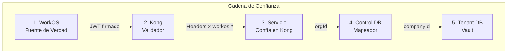
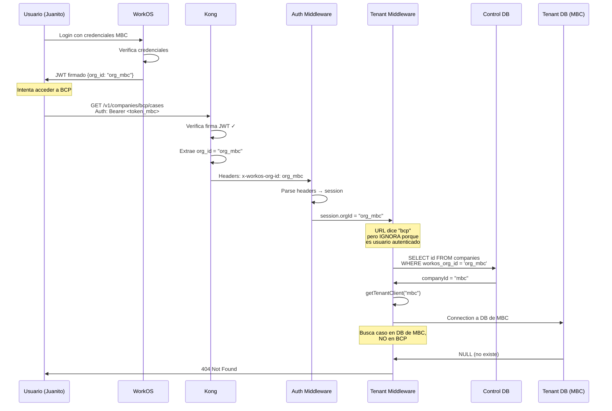
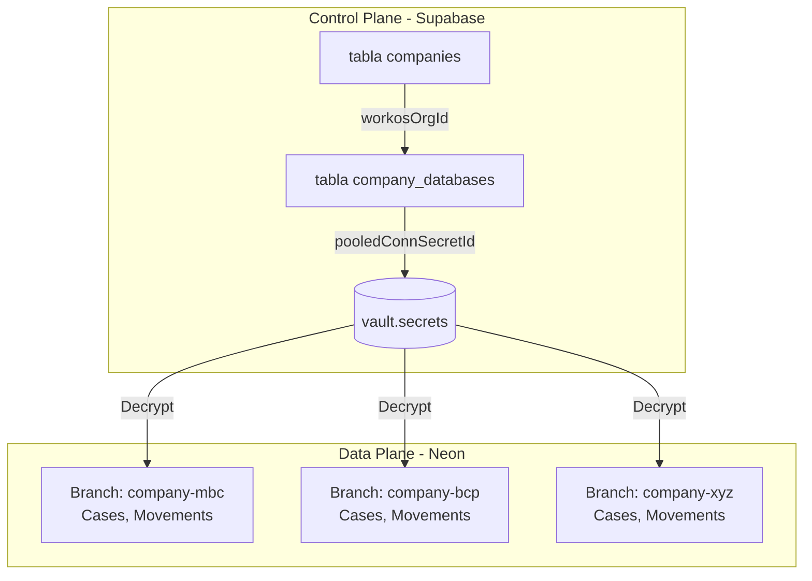

# Arquitectura de Seguridad

Clamo implementa una arquitectura de seguridad integral basada en una **cadena de confianza** que garantiza el aislamiento completo entre tenants.

## La Cadena de Confianza



| Componente | Responsabilidad |
|------------|-----------------|
| **WorkOS** | Genera JWT firmado con llave privada. El `org_id` está DENTRO del JWT firmado. |
| **Kong** | Verifica firma con llave pública. Si válido → extrae claims a headers. Si inválido → 401. |
| **Servicio** | Si hay headers `x-workos-*` → Kong ya validó. Usa `org_id` del header, NO del URL. |
| **Control DB** | Mapea `workosOrgId` → `companyId` interno. Una org solo mapea a una compañía. |
| **Tenant DB** | Cada compañía tiene su propia base de datos. Sin `companyId` correcto = sin acceso. |

## El JWT y el Aislamiento de Tenants

### Anatomía del JWT de WorkOS

Cuando un usuario se autentica, WorkOS genera un JWT firmado:

```json
{
  "sub": "user_123_juanito",
  "org_id": "org_mbc_workos_id",  // ← FIJO, firmado, no modificable
  "role": "member",
  "permissions": ["cases:read", "cases:write"],
  "iss": "https://api.workos.com/...",
  "exp": 1234567890
}
```

<Warning>
**Punto Crítico de Seguridad:** El `org_id` está **FIRMADO** dentro del JWT.

- El usuario NO puede cambiar el `org_id` en su token
- No puede "falsificar" que pertenece a otra organización
- Si trabaja para MBC, su token SIEMPRE tendrá `org_id = "org_mbc_workos_id"`
- Si intenta modificar el JWT, la firma se invalida y Kong lo rechaza
</Warning>

### Flujo de Validación Completo



## Ataques Imposibles

### Intento 1: Cambiar el companyId en el URL

```bash
# Juanito hace este request malicioso:
GET /v1/companies/bcp/cases/def
Authorization: Bearer <token_de_juanito_con_org_mbc>
```

**¿Qué pasa?**

```typescript
// 1. Kong decodifica el JWT
const jwtPayload = {
  sub: "user_123_juanito",
  org_id: "org_mbc_workos_id"  // ← MBC, no BCP
};

// 2. Kong inyecta headers
// x-workos-org-id: org_mbc_workos_id  ← El REAL del token

// 3. Auth Middleware crea session
session = {
  userId: "user_123_juanito",
  orgId: "org_mbc_workos_id",  // ← Tomado del header, no del URL
};

// 4. Tenant Middleware IGNORA el URL para usuarios autenticados
const requestedCompanyId = c.req.param("companyId");  // "bcp" del URL
// ⚠️ PERO NO LO USA si es usuario autenticado!

// En su lugar, hace lookup por orgId:
const company = await controlDb.company.findUnique({
  where: { workosOrgId: session.orgId }  // ← Usa "org_mbc_workos_id"
});
// Resultado: company.id = "mbc"

// 5. Obtiene DB de MBC (no BCP)
const tenantDb = await getTenantClient({
  companyId: "mbc",  // ← Siempre la del token
  connectionString: "postgres://...mbc..."
});
```

**Resultado:** Busca el caso en la base de datos de MBC, no en BCP. Si no existe, devuelve 404.

### Intento 2: Modificar el JWT para cambiar org_id

```bash
# Juanito intenta crear un JWT falso:
# Cambia manualmente org_id de "org_mbc" a "org_bcp"
```

**¿Qué pasa?**

```typescript
// 1. Kong valida la firma del JWT
const isValid = verifyJwtSignature(
  token,
  publicKey  // Llave pública de WorkOS
);

// Resultado: false ❌
// La firma NO coincide porque modificó el payload

// 2. Kong rechaza el request
HTTP 401 Unauthorized
{
  "error": "invalid_token",
  "message": "JWT signature verification failed"
}

// ❌ El request NUNCA llega al servicio
```

WorkOS firma los JWTs con su llave privada. **Solo WorkOS puede crear JWTs válidos.**

### Intento 3: Robar el JWT de otro usuario

```bash
# Juanito roba el token de Pedro (que trabaja en BCP)
GET /v1/companies/bcp/cases/def
Authorization: Bearer <token_robado_de_pedro>
```

**¿Qué pasa?**

El request **funciona**... pero Juanito necesitaría robar el token de Pedro.

**Protecciones contra robo de tokens:**

| Protección | Descripción |
|------------|-------------|
| **Corta duración** | Tokens expiran en 15-60 minutos |
| **HTTPS** | Transmisión encriptada |
| **HttpOnly cookies** | No accesibles por JavaScript |
| **Revocación** | Usuario puede invalidar sesiones |

## Usuarios Multi-Organización

WorkOS soporta usuarios que trabajan en múltiples compañías:

```typescript
// Usuario trabaja en MBC y BCP
const user = {
  id: "user_juanito",
  organizations: [
    { id: "org_mbc", role: "admin" },
    { id: "org_bcp", role: "member" }
  ]
};
```

### ¿Cómo funciona?

1. En el UI de login, Juanito elige a qué organización entrar
2. WorkOS genera un JWT **específico para esa org**:

```javascript
// Si elige MBC:
const tokenMBC = {
  sub: "user_juanito",
  org_id: "org_mbc",
  role: "admin"
};

// Si elige BCP:
const tokenBCP = {
  sub: "user_juanito",
  org_id: "org_bcp",
  role: "member"
};
```

3. Para cambiar de org, debe usar un "org switcher" que regenera el JWT

<Note>
**Implicación:** Incluso con acceso multi-org, el token en ese momento solo representa **UNA** organización. No puede acceder a ambas simultáneamente con un solo token.
</Note>

## Acceso Interno (Servicio-a-Servicio)

Los servicios internos acceden sin JWT, usando el `companyId` del URL:

```bash
# Desde un servicio interno (red Tailscale/K8s)
GET /internal/v1/companies/bcp/cases/def
# Sin headers de autenticación
```

**¿Qué pasa?**

```typescript
// 1. No hay headers → Auth middleware detecta llamada interna
// 2. Crea session interna
session = { 
  principalType: "service", 
  orgId: "internal", 
  role: "admin" 
};

// 3. Tenant middleware detecta principalType === "service"
// 4. USA companyId del URL: c.req.param("companyId") = "bcp"
// 5. Obtiene connection string de BCP
// 6. Accede a tenant DB de BCP
```

<Warning>
**¿Por qué es seguro?** La red interna (Tailscale/K8s) es confiable. Solo servicios de Clamo pueden acceder a esta red. Los endpoints `/internal/...` no están expuestos públicamente.
</Warning>

## Arquitectura de Base de Datos Multi-Tenant

### Modelo de Dos Planos

| Plano | Base de Datos | Propósito |
|-------|---------------|-----------|
| **Control Plane** | Supabase (PostgreSQL) | Metadatos de tenant, usuarios, mapeo org→company |
| **Data Plane** | Neon (PostgreSQL branches) | Datos de casos aislados por empresa |

### Aislamiento de Tenants



### Seguridad de Connection Strings

Los connection strings se almacenan **encriptados** en Supabase Vault:

```sql
-- Estructura del Vault
vault.secrets (
  id uuid,
  name text,        -- ej., "company-mbc-pooled"
  secret text,      -- Connection string encriptado
)

-- Vista de desencriptación (requiere permisos)
vault.decrypted_secrets (
  id uuid,
  name text,
  decrypted_secret text  -- Connection string en texto plano
)
```

## Gestión de Secretos

### Supabase Vault

| Tipo de Secreto | Ejemplo |
|-----------------|---------|
| Conexiones de base de datos | URLs pooled/direct de Neon |
| API keys | Tinybird, SendGrid, Ably |
| Credenciales de servicio | Steel.dev, Anthropic |

### Variables de Entorno

| Variable | Descripción |
|----------|-------------|
| `SUPABASE_URL` | URL del control plane |
| `SUPABASE_SERVICE_KEY` | Service role key (acceso al vault) |
| `WORKOS_API_KEY` | API key de WorkOS |
| `WORKOS_CLIENT_ID` | Client ID de WorkOS |

## Seguridad de API

### Headers de Kong (Producción)

En producción, Kong API Gateway valida el JWT y añade headers upstream:

| Header | Descripción |
|--------|-------------|
| `x-workos-user-id` | ID del usuario autenticado |
| `x-workos-org-id` | ID de la organización WorkOS |
| `x-workos-role` | Rol del usuario en la organización |
| `x-workos-permissions` | Permisos del usuario |

### Rate Limiting

| Tipo de Endpoint | Límite |
|------------------|--------|
| Público | 100 req/min |
| Autenticado | 1000 req/min |
| Webhook | 10 req/seg |

## Encriptación

| Estado de Datos | Método |
|-----------------|--------|
| En Reposo | AES-256 (Neon, Supabase) |
| En Tránsito | TLS 1.3 |
| Secretos | Encriptación de Supabase Vault |
| JWTs | RS256 (firma asimétrica) |

## Resumen: Por Qué el Sistema es Seguro

```
┌─────────────────────────────────────────────────────────────────┐
│  GARANTÍAS DE SEGURIDAD                                         │
├─────────────────────────────────────────────────────────────────┤
│                                                                  │
│  ✅ El org_id está FIRMADO en el JWT                            │
│     → No se puede falsificar sin la llave privada de WorkOS     │
│                                                                  │
│  ✅ Kong valida ANTES de que llegue al servicio                 │
│     → JWTs inválidos nunca alcanzan la lógica de negocio        │
│                                                                  │
│  ✅ El servicio usa org_id del HEADER, no del URL               │
│     → Manipular el URL no cambia a qué tenant accedes           │
│                                                                  │
│  ✅ Cada tenant tiene su propia base de datos                   │
│     → Aislamiento físico, no solo lógico                        │
│                                                                  │
│  ✅ Connection strings encriptados en Vault                     │
│     → Incluso con acceso al control plane, no ves credenciales  │
│                                                                  │
│  ✅ Red interna aislada (Tailscale/K8s)                         │
│     → Endpoints internos no expuestos públicamente              │
│                                                                  │
└─────────────────────────────────────────────────────────────────┘
```

## Próximos Pasos

<CardGroup cols={2}>
  <Card
    title="Multi-Tenancy"
    icon="building"
    href="/es/guias/multi-tenancy"
  >
    Arquitectura de base de datos por tenant.
  </Card>
  <Card
    title="Autenticación"
    icon="key"
    href="/es/guias/autenticacion"
  >
    Guía de integración con WorkOS.
  </Card>
  <Card
    title="SDKs de Servicio"
    icon="plug"
    href="/es/arquitectura/sdks-servicio"
  >
    Comunicación servicio-a-servicio.
  </Card>
  <Card
    title="API Reference"
    icon="code"
    href="/es/api-reference/introduccion"
  >
    Endpoints públicos e internos.
  </Card>
</CardGroup>
