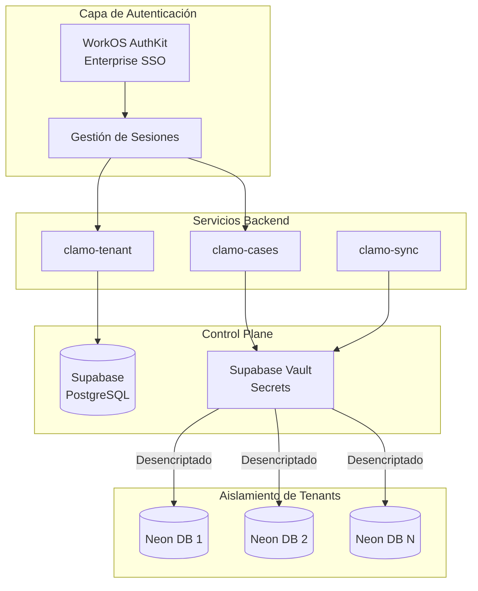
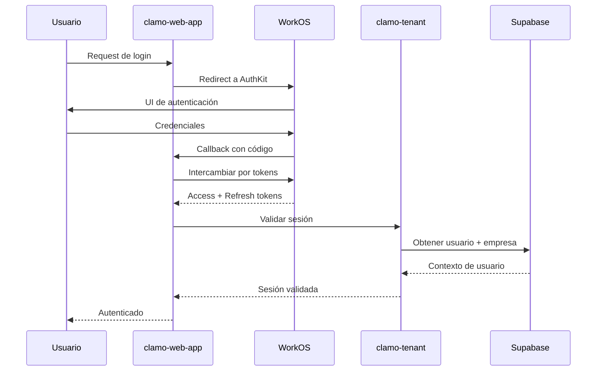
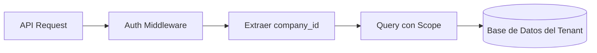
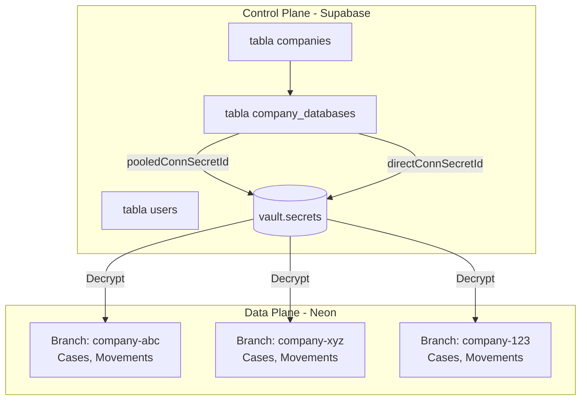

# Arquitectura de Seguridad

Clamo implementa una arquitectura de seguridad integral que cubre autenticación, autorización, aislamiento multi-tenant y gestión de secretos.

## Visión General



## Autenticación

### WorkOS AuthKit

Clamo usa [WorkOS AuthKit](https://workos.com/docs/user-management) para autenticación, proporcionando:

- **Email/Password** - Autenticación estándar
- **Social Login** - Google, Microsoft, GitHub
- **Enterprise SSO** - SAML, OIDC para clientes enterprise
- **Directory Sync** - Provisioning automático de usuarios desde IdPs

**Puntos de Integración**:
- `clamo-web-app` - Usa `@workos-inc/authkit-nextjs` para auth server-side
- `clamo-tenant` - Sincroniza organizaciones de WorkOS con empresas internas

### Flujo de Sesión



### Estructura de Tokens

| Token | Propósito | Duración |
|-------|-----------|----------|
| Access Token | Autenticación de API | 15 minutos |
| Refresh Token | Renovación de token | 30 días |
| Session Token | Estado del frontend | Sesión del navegador |

## Autorización

### Control de Acceso Basado en Roles (RBAC)

Los usuarios tienen roles asignados dentro de su organización:

| Rol | Permisos |
|-----|----------|
| `owner` | Acceso completo, facturación, gestión de usuarios |
| `admin` | Gestión de usuarios, todas las operaciones de casos |
| `member` | Acceso estándar a casos |
| `viewer` | Acceso de solo lectura |

### Aislamiento de Organización

Cada request de API está limitado a la organización del usuario:



El `company_id` se extrae de la sesión autenticada y se usa para:
1. Enrutar a la base de datos correcta del tenant
2. Filtrar todas las queries a los datos de ese tenant
3. Aplicar row-level security

## Arquitectura de Base de Datos Multi-Tenant

### Modelo de Dos Planos

| Plano | Base de Datos | Propósito |
|-------|---------------|-----------|
| **Control Plane** | Supabase (PostgreSQL) | Metadatos de tenant, usuarios, datos de referencia |
| **Data Plane** | Neon (PostgreSQL branches) | Datos de casos aislados por empresa |

### Aislamiento de Tenants

Cada empresa tiene una branch de base de datos Neon dedicada:



### Seguridad de Connection Strings

Los connection strings se almacenan encriptados en Supabase Vault:

```sql
-- Estructura del Vault
vault.secrets (
  id uuid,
  name text,        -- ej., "company-abc-pooled"
  secret text,      -- Connection string encriptado
  ...
)

-- Vista de desencriptación (requiere RLS)
vault.decrypted_secrets (
  id uuid,
  name text,
  decrypted_secret text  -- Connection string en texto plano
)
```

Los servicios acceden a los connection strings vía la vista de desencriptación del vault:

```sql
SELECT 
  cd.company_id,
  vs_pooled.decrypted_secret as pooled_connection,
  vs_direct.decrypted_secret as direct_connection
FROM company_databases cd
LEFT JOIN vault.decrypted_secrets vs_pooled 
  ON vs_pooled.name = cd."pooledConnSecretId"
LEFT JOIN vault.decrypted_secrets vs_direct 
  ON vs_direct.name = cd."directConnSecretId"
WHERE cd.company_id = $1
```

## Gestión de Secretos

### Supabase Vault

Toda la configuración sensible se almacena en Supabase Vault:

| Tipo de Secreto | Ejemplo |
|-----------------|---------|
| Conexiones de base de datos | URLs pooled/direct de Neon |
| API keys | Tinybird, SendGrid, Ably |
| Credenciales de servicio | Steel.dev, Anthropic |

### Variables de Entorno

Los servicios reciben configuración no sensible vía variables de entorno:

| Variable | Descripción |
|----------|-------------|
| `SUPABASE_URL` | URL del control plane |
| `SUPABASE_SERVICE_KEY` | Service role key (acceso al vault) |
| `TINYBIRD_HOST` | Endpoint de analytics |

### Integración de clamo-sync con Vault

El servicio de sync en Rust obtiene conexiones de tenants desde el vault:

```rust
// discovery/supabase.rs
pub async fn list_tenants(&self) -> Result<Vec<TenantConfig>> {
    // Usar RPC para ejecutar query con desencriptación del vault
    let tenants = self.client
        .rpc("get_active_tenants_with_connections", json!({}))
        .execute()
        .await?;
    
    Ok(tenants)
}
```

## Seguridad de API

### Autenticación de Requests

Todos los endpoints de API requieren autenticación:

```typescript
// Patrón de middleware
app.use("/api/*", async (c, next) => {
  const token = c.req.header("Authorization")?.replace("Bearer ", "");
  
  if (!token) {
    return c.json({ error: "Unauthorized" }, 401);
  }
  
  const session = await validateToken(token);
  c.set("session", session);
  
  await next();
});
```

### Rate Limiting

Los endpoints de API implementan rate limiting:

| Tipo de Endpoint | Límite |
|------------------|--------|
| Público | 100 req/min |
| Autenticado | 1000 req/min |
| Webhook | 10 req/seg |

### Configuración CORS

Los requests cross-origin están restringidos a orígenes permitidos:

```typescript
const corsConfig = {
  origin: [
    "https://app.clamo.dev",
    "https://*.clamo.dev",
    process.env.NODE_ENV === "development" && "http://localhost:3000",
  ].filter(Boolean),
  credentials: true,
};
```

## Seguridad de Datos

### Encriptación

| Estado de Datos | Método |
|-----------------|--------|
| En Reposo | AES-256 (Neon, Supabase) |
| En Tránsito | TLS 1.3 |
| Secretos | Encriptación de Supabase Vault |

### Retención de Datos

| Tipo de Datos | Retención |
|---------------|-----------|
| Datos de casos | Indefinido (datos del cliente) |
| Logs de auditoría | 2 años |
| Datos de sesión | 30 días |
| Analytics | 1 año |

### Logging de Auditoría

Las operaciones críticas se registran:

- Eventos de autenticación de usuarios
- Acceso a datos (lectura/escritura)
- Cambios de configuración
- Uso de API keys

## Documentación Relacionada

- [Guía de Multi-Tenancy](/es/guias/multi-tenancy)
- [Guía de Autenticación](/es/guias/autenticacion)
- [Servicio clamo-tenant](/es/servicios/clamo-tenant)
