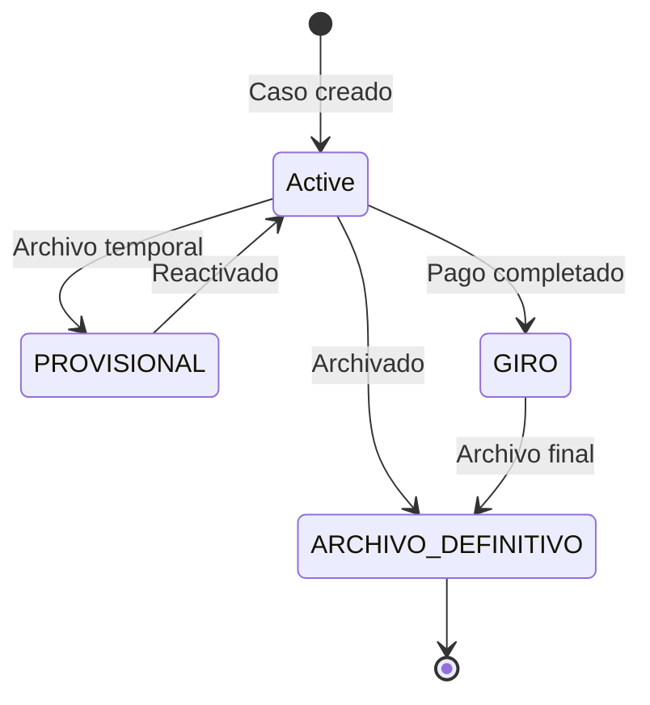
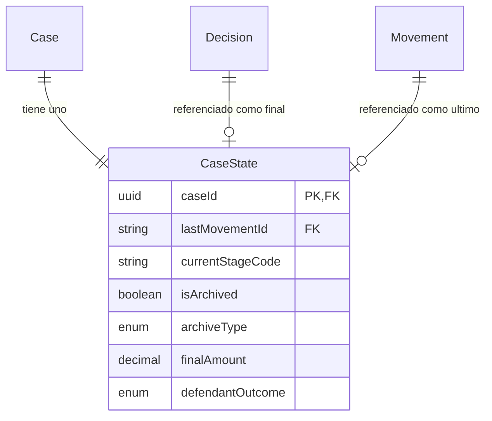

La entidad **CaseState** es una tabla de proyeccion que mantiene una vista desnormalizada del estado actual de cada caso. Permite consultas rapidas de UI sin joins complejos o agregaciones.

## Vision General

CaseState sigue el **patron de proyeccion**: se deriva de datos fuente (movimientos, decisiones) y puede reconstruirse en cualquier momento. Esto permite:

- Consultas rapidas de dashboard con filtros simples
- Agregaciones pre-calculadas para analitica
- Complejidad de consulta reducida en la capa de aplicacion

<Note>
  Hay exactamente un registro CaseState por Case. El `caseId` es tanto la clave primaria como la clave foranea a Case.
</Note>

## Referencia de Campos

### Seguimiento de Movimiento

| Campo | Tipo | Descripcion |
|-------|------|-------------|
| `caseId` | `string` | Clave primaria, referencia Case.id |
| `lastMovementId` | `string?` | ID del movimiento mas reciente |
| `lastMovementAt` | `DateTime?` | Fecha del movimiento mas reciente |

### Clasificacion de Etapa

| Campo | Tipo | Descripcion |
|-------|------|-------------|
| `currentStageCode` | `string?` | Stage.code actual |
| `currentSubStageCode` | `string?` | SubStage.code actual |
| `currentMilestoneCode` | `string?` | Milestone.code actual |

### Estado de Archivo

| Campo | Tipo | Descripcion |
|-------|------|-------------|
| `isArchived` | `boolean` | Si el caso esta archivado |
| `archiveType` | `ArchiveType?` | PROVISIONAL o DEFINITIVE |
| `finalStatus` | `EstadoFinal?` | Categoria de estado final |
| `archivedAt` | `DateTime?` | Cuando se archivo el caso |

### Flags Procesales

| Campo | Tipo | Descripcion |
|-------|------|-------------|
| `defaulted` | `Json?` | FlagState para rebelde |
| `noAppeal` | `Json?` | FlagState para consentido |

### Resumen de Decision

| Campo | Tipo | Descripcion |
|-------|------|-------------|
| `finalDecisionId` | `string?` | ID de la decision final |
| `finalAmount` | `Decimal?` | Monto total otorgado |
| `defendantOutcome` | `DefendantOutcome?` | Resultado final para demandado |
| `decisionDate` | `DateTime?` | Fecha de decision final |

<Warning>
  Los valores de FlagState son inmutables una vez establecidos en `true`. Un estado rebelde o consentido no puede revertirse en procedimientos normales.
</Warning>

## Tipos de Archivo y Estado Final

### Tipos de Archivo

| Tipo | Descripcion |
|------|-------------|
| `PROVISIONAL` | Archivo temporal, caso puede reactivarse |
| `DEFINITIVE` | Archivo permanente, caso concluido |

### Estado Final (EstadoFinal)

| Estado | Descripcion |
|--------|-------------|
| `GIRO` | Pago/ejecucion completada |
| `ARCHIVO_DEFINITIVO` | Archivado definitivamente |
| `PENDIENTE` | Pendiente de resolucion |

## Relaciones de Entidades

## Entidades Relacionadas

<CardGroup cols={2}>
  <Card title="Case" icon="briefcase" href="/es/entidades/case">
    Entidad de caso fuente
  </Card>
  <Card title="Movement" icon="timeline" href="/es/entidades/movement">
    Referencia de ultimo movimiento
  </Card>
  <Card title="Decision" icon="gavel" href="/es/entidades/decision">
    Referencia de decision final
  </Card>
  <Card title="Enums" icon="list" href="/es/entidades/enums">
    ArchiveType, EstadoFinal, DefendantOutcome
  </Card>
</CardGroup>
