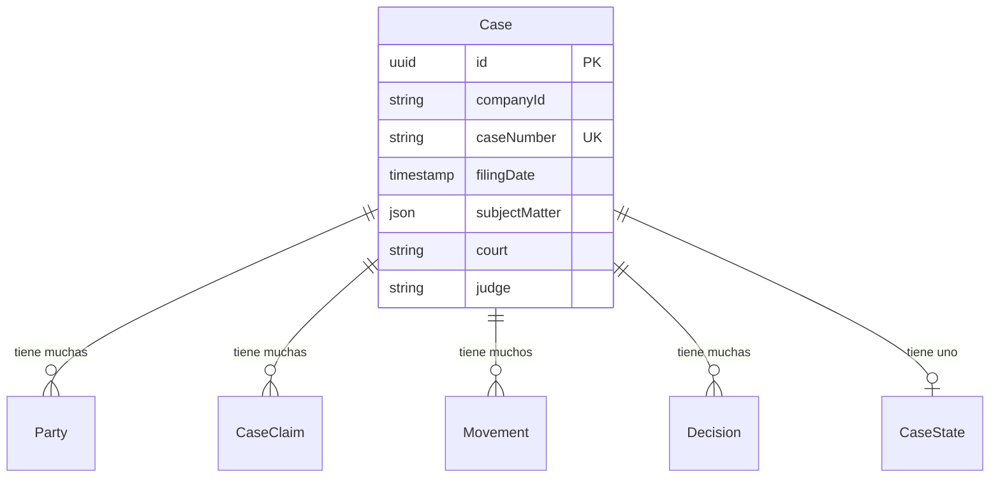

La entidad **Case** es la entidad central en Clamo, representando un expediente judicial en el sistema judicial peruano. Los casos agregan datos de multiples fuentes: CEJ (Consulta de Expedientes Judiciales), analisis de IA e input manual de usuarios.

## Vision General

Cada caso pertenece a una sola empresa y contiene:
- Identificacion central (numero de expediente, fecha de presentacion)
- Campos de multiples fuentes usando el patron SourcedValue
- Metadatos originados en CEJ (juzgado, juez, distrito)
- Insights derivados por IA (fecha de conclusion)
- Anotaciones manuales (usuario responsable, asesor externo)

<Note>
  Varios campos de Case usan el patron **SourcedValue** para rastrear datos de multiples fuentes (CEJ, IA, manual). La prioridad de fuente (manual > IA > CEJ) puede configurarse por campo segun requisitos de negocio.
</Note>

## Referencia de Campos

### Campos Centrales

| Campo | Tipo | Descripcion |
|-------|------|-------------|
| `id` | `string` | UUID clave primaria, auto-generado |
| `companyId` | `string` | ID de Company (validado a nivel de app, sin FK) |
| `caseNumber` | `string` | Numero de expediente oficial de CEJ |
| `filingDate` | `DateTime?` | Fecha en que el caso fue presentado |

### Campos SourcedValue

Estos campos almacenan datos de multiples fuentes en una estructura JSONB:

| Campo | Tipo | Descripcion |
|-------|------|-------------|
| `subjectMatter` | `Json` | Array de materias legales |
| `processType` | `Json?` | Tipo de proceso legal |
| `stage` | `Json?` | Etapa procesal actual |
| `abstract` | `Json?` | Resumen del caso/sumilla |
| `conclusionReason` | `Json?` | Razon de conclusion del caso |

### Campos Originados en CEJ

| Campo | Tipo | Descripcion |
|-------|------|-------------|
| `cejJudicialDistrict` | `string?` | Distrito judicial (ej., "Lima", "Callao") |
| `court` | `string?` | Nombre del juzgado |
| `judge` | `string?` | Nombre del juez que preside |
| `legalSpecialist` | `string?` | Especialista legal asignado |
| `specialty` | `string?` | Especialidad legal (laboral, civil, etc.) |

### Campos Manuales

| Campo | Tipo | Descripcion |
|-------|------|-------------|
| `manualInternalResponsibleId` | `string?` | ID de usuario del responsable interno |
| `manualExternalAdvisor` | `string?` | Nombre del asesor legal externo |

<Warning>
  Los campos `companyId` y `manualInternalResponsibleId` referencian entidades en la base de datos del Plano de Control. Estos son IDs escalares sin restricciones de clave foranea.
</Warning>

## Relaciones de Entidades

## Entidades Relacionadas

<CardGroup cols={2}>
  <Card title="Party" icon="users" href="/es/entidades/party">
    Demandantes, demandados y otras partes
  </Card>
  <Card title="Claim" icon="file-invoice-dollar" href="/es/entidades/claim">
    Pretensiones legales
  </Card>
  <Card title="Movement" icon="timeline" href="/es/entidades/movement">
    Eventos de linea de tiempo e historial
  </Card>
  <Card title="Case State" icon="chart-line" href="/es/entidades/case-state">
    Proyeccion de estado desnormalizado
  </Card>
</CardGroup>
