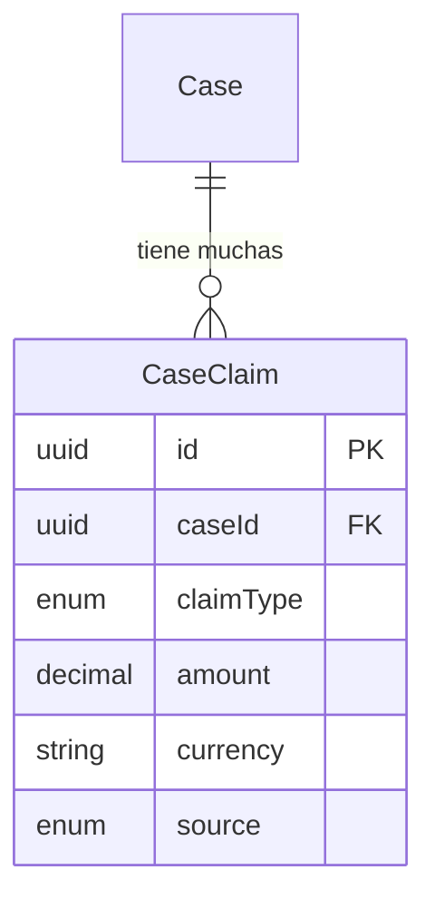

La entidad **CaseClaim** representa pretensiones individuales dentro de un caso legal. Las pretensiones se tipifican para capturar diferentes categorias como reposicion, indemnizacion o nulidad de acto, con campos especificos por tipo para montos, cargos y descripciones.

## Vision General

Un caso puede tener multiples pretensiones, cada una representando una demanda legal especifica. El tipo de pretension determina que campos son relevantes:

| Tipo de Pretension | Campos Principales | Caso de Uso |
|--------------------|-------------------|-------------|
| `REINSTATEMENT` | `position` | Empleado busca restitucion de puesto |
| `COMPENSATION` | `amount`, `currency` | Danos monetarios |
| `ACTION_NULLITY` | `actionDescription` | Nulificacion de una accion |
| `OTHER` | `description` | Pretensiones miscelaneas |

## Referencia de Campos

| Campo | Tipo | Descripcion |
|-------|------|-------------|
| `id` | `string` | UUID clave primaria |
| `caseId` | `string` | Clave foranea al Case padre |
| `claimType` | `ClaimType` | Categoria de la pretension |
| `amount` | `Decimal?` | Valor monetario con 2 decimales |
| `currency` | `string?` | Codigo de moneda ISO (tipicamente "PEN") |
| `reason` | `string?` | Explicacion de la pretension |
| `actionDescription` | `string?` | Descripcion del acto a nulificar |
| `position` | `string?` | Titulo del cargo para pretensiones de reposicion |
| `description` | `string?` | Descripcion de texto libre para tipo "OTHER" |
| `source` | `ClaimSource` | Origen de estos datos de pretension |

## Fuentes de Pretension

| Fuente | Descripcion | Confiabilidad |
|--------|-------------|---------------|
| `CEJ` | Extraido de datos de caso CEJ | Oficial pero puede ser incompleto |
| `AI` | Identificado por analisis de IA | Alta precision, necesita verificacion |
| `MANUAL` | Ingresado por usuario | Verificado por usuario |

<Note>
  Pretensiones de diferentes fuentes pueden superponerse o entrar en conflicto. La aplicacion debe proporcionar UI para que los usuarios fusionen, dedupliquen o prioricen pretensiones.
</Note>

## Relaciones de Entidades

## Entidades Relacionadas

<CardGroup cols={2}>
  <Card title="Case" icon="briefcase" href="/es/entidades/case">
    Entidad de caso padre
  </Card>
  <Card title="Decision" icon="gavel" href="/es/entidades/decision">
    Las decisiones pueden referenciar montos otorgados
  </Card>
  <Card title="Enums" icon="list" href="/es/entidades/enums">
    Enums ClaimType y ClaimSource
  </Card>
</CardGroup>
