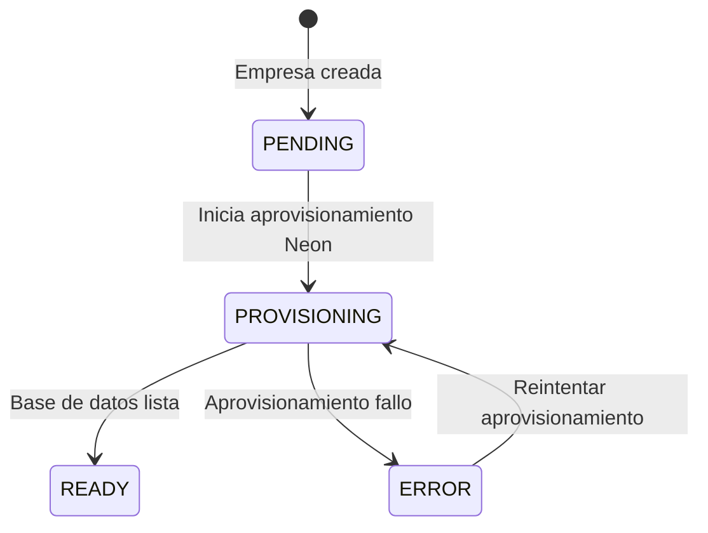
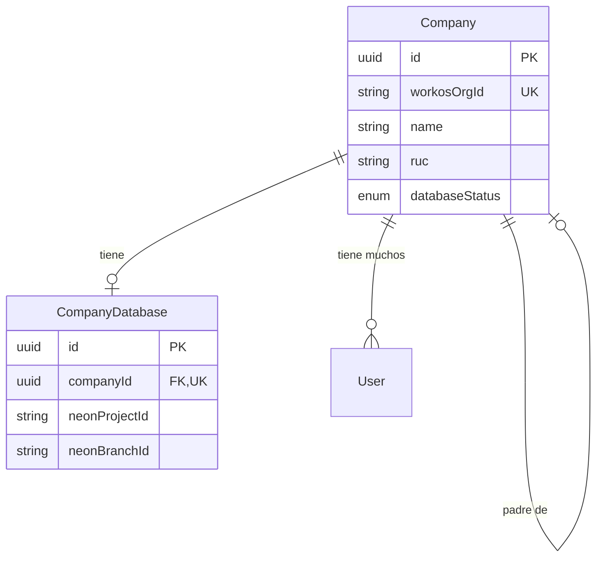

La entidad **Company** representa una organizacion que usa Clamo. Cada empresa tiene un registro **CompanyDatabase** asociado que almacena informacion de conexion para su rama de base de datos Neon aislada.

## Company

La entidad Company almacena detalles de la organizacion, informacion de facturacion y rastrea el estado de aprovisionamiento de base de datos.

| Campo | Tipo | Descripcion |
|-------|------|-------------|
| `id` | `string` | UUID clave primaria |
| `workosOrgId` | `string` | Identificador unico de WorkOS para SSO |
| `name` | `string` | Nombre legible de la empresa |
| `ruc` | `string?` | RUC peruano (11 digitos) |
| `parentId` | `string?` | Referencia a Company padre para organizaciones jerarquicas |
| `plan` | `string?` | Nivel de suscripcion: `"free"`, `"pro"`, `"enterprise"` |
| `databaseStatus` | `DatabaseStatus` | Estado actual del aprovisionamiento de base de datos |
| `billingEmail` | `string?` | Direccion de email para facturacion |
| `settings` | `Json` | Configuracion especifica de la empresa |
| `features` | `Json` | Array de feature flags habilitados |

### Ciclo de Vida del Estado de Base de Datos

<Note>
  El campo `databaseStatus` rastrea el ciclo de vida de aprovisionamiento de la rama Neon. La aplicacion debe hacer polling o usar webhooks para detectar cuando el estado se convierte en `READY`.
</Note>

## CompanyDatabase

La entidad CompanyDatabase almacena metadatos de conexion de Neon para la rama de base de datos aislada de una empresa.

| Campo | Tipo | Descripcion |
|-------|------|-------------|
| `id` | `string` | UUID clave primaria |
| `companyId` | `string` | Referencia uno-a-uno a Company |
| `neonProjectId` | `string` | Proyecto Neon que contiene esta rama |
| `neonBranchId` | `string` | ID de rama Neon para este tenant |
| `databaseHost` | `string` | Hostname para conexiones de base de datos |
| `pooledConnSecretId` | `string` | ID de secreto de Vault para conexion PgBouncer |
| `directConnSecretId` | `string` | ID de secreto de Vault para conexion directa |

<Warning>
  Los strings de conexion se almacenan en Supabase Vault, no directamente en la base de datos. Los campos `pooledConnSecretId` y `directConnSecretId` referencian secretos de Vault.
</Warning>

## Relaciones de Entidades

## Entidades Relacionadas

<CardGroup cols={2}>
  <Card title="User" icon="user" href="/es/entidades/user">
    Usuarios pertenecientes a esta empresa
  </Card>
  <Card title="Case" icon="briefcase" href="/es/entidades/case">
    Casos almacenados en la base de datos tenant
  </Card>
  <Card title="Enums" icon="list" href="/es/entidades/enums">
    Referencia del enum DatabaseStatus
  </Card>
</CardGroup>
