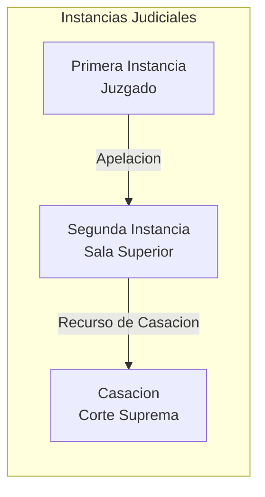
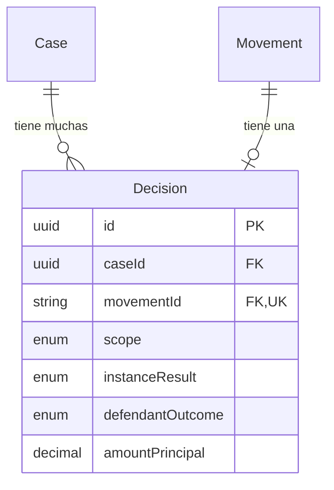

La entidad **Decision** captura decisiones judiciales detectadas de movimientos de casos. Las decisiones rastrean el alcance (nivel de instancia), resultado y cualquier monto otorgado.

## Vision General

Las decisiones estan vinculadas a movimientos especificos en la linea de tiempo del caso. Un solo caso puede tener multiples decisiones en diferentes instancias:

- **Primera Instancia**: Fallo inicial del juzgado
- **Segunda Instancia**: Fallo del tribunal de apelacion
- **Casacion**: Fallo de la Corte Suprema

## Referencia de Campos

### Campos Centrales

| Campo | Tipo | Descripcion |
|-------|------|-------------|
| `id` | `string` | UUID clave primaria |
| `caseId` | `string` | Clave foranea al Case padre |
| `movementId` | `string` | Clave foranea al Movement fuente (unico) |
| `scope` | `DecisionScope` | Nivel de instancia de la decision |
| `decidedAt` | `DateTime?` | Fecha en que se emitio la decision |

### Campos de Resultado

| Campo | Tipo | Descripcion |
|-------|------|-------------|
| `instanceResult` | `InstanceResult?` | Resultado legal de la decision |
| `defendantOutcome` | `DefendantOutcome?` | Si es favorable para el demandado |
| `aiDocumentSummary` | `string?` | Resumen de la decision generado por IA |
| `judges` | `Json?` | Array de nombres de jueces en el panel |
| `reportingJudge` | `string?` | Juez que redacto la decision |

### Campos Financieros

| Campo | Tipo | Descripcion |
|-------|------|-------------|
| `amountPrincipal` | `Decimal?` | Monto principal otorgado |
| `amountOthers` | `Decimal?` | Montos adicionales (intereses, costas) |

## Alcance de Decision

| Alcance | Descripcion | Nivel de Tribunal |
|---------|-------------|-------------------|
| `FIRST_INSTANCE` | Decision del juzgado de primera instancia | Juzgado |
| `SECOND_INSTANCE` | Decision del tribunal de apelacion | Sala Superior |
| `CASSATION` | Decision de la Corte Suprema | Corte Suprema |

## Resultados de Instancia

| Resultado | Descripcion |
|-----------|-------------|
| `FUNDADA` | Pretension acogida (demandante gana) |
| `INFUNDADA` | Pretension rechazada en el fondo |
| `IMPROCEDENTE` | Pretension procesalmente inadmisible |
| `CONFIRMA` | Decision inferior confirmada |
| `REVOCA` | Decision inferior revocada |
| `ANULA` | Decision inferior anulada |

## Resultado para Demandado

| Resultado | Descripcion |
|-----------|-------------|
| `FAVORABLE` | Decision favorece al demandado |
| `DESFAVORABLE` | Decision contra el demandado |

<Note>
  El `defendantOutcome` se deriva de `instanceResult` y la posicion del demandado. Un resultado `FUNDADA` es tipicamente `DESFAVORABLE` para demandados en casos laborales donde el empleador es el demandado.
</Note>

## Relaciones de Entidades

## Entidades Relacionadas

<CardGroup cols={2}>
  <Card title="Case" icon="briefcase" href="/es/entidades/case">
    Entidad de caso padre
  </Card>
  <Card title="Movement" icon="timeline" href="/es/entidades/movement">
    Movimiento fuente de la decision
  </Card>
  <Card title="Case State" icon="chart-line" href="/es/entidades/case-state">
    Proyeccion de estado incluye decision final
  </Card>
  <Card title="Enums" icon="list" href="/es/entidades/enums">
    DecisionScope, InstanceResult, DefendantOutcome
  </Card>
</CardGroup>
