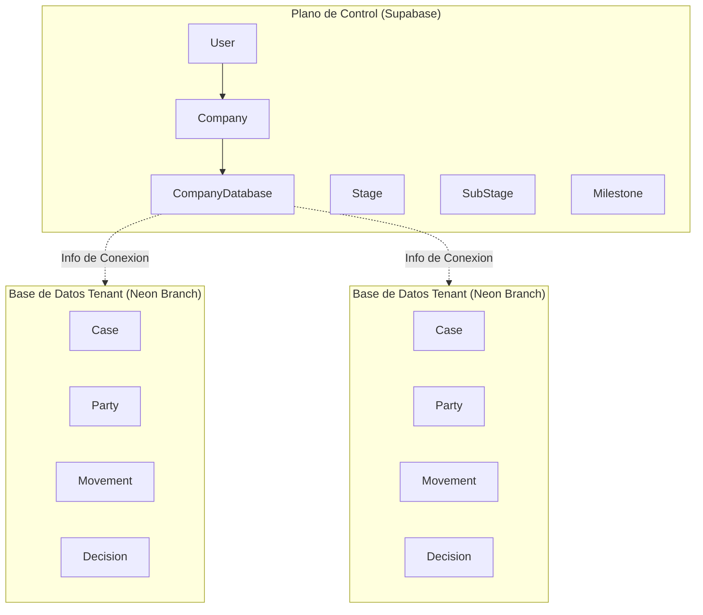
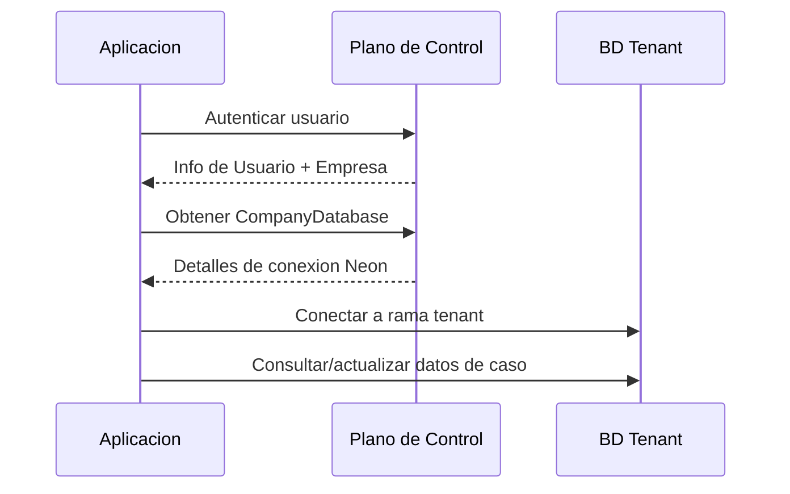

Clamo utiliza una **arquitectura de dos bases de datos** para separar las preocupaciones del plano de control multi-tenant de los datos aislados de cada tenant. Este diseno proporciona fuerte aislamiento de datos, escalamiento independiente y cumplimiento con requisitos de residencia de datos.

## Vision General de la Arquitectura

## Base de Datos del Plano de Control

El **Plano de Control** esta alojado en Supabase y almacena:

- **Gestion de empresas** - Organizaciones que usan la plataforma
- **Gestion de usuarios** - Cuentas de usuario y sus asociaciones con empresas
- **Metadatos de base de datos** - Informacion de conexion de Neon para cada tenant
- **Datos de referencia** - Etapas procesales, sub-etapas e hitos

<CardGroup cols={2}>
  <Card title="Company" icon="building" href="/es/entidades/company">
    Organizacion y aprovisionamiento de base de datos
  </Card>
  <Card title="User" icon="user" href="/es/entidades/user">
    Cuentas de usuario y onboarding
  </Card>
  <Card title="Stages" icon="layer-group" href="/es/entidades/stages">
    Datos de referencia de etapas procesales
  </Card>
  <Card title="Enums" icon="list" href="/es/entidades/enums">
    Todos los tipos de enumeracion
  </Card>
</CardGroup>

## Base de Datos Tenant

Cada empresa tiene una **Base de Datos Tenant** aislada alojada en una rama de Neon. Las bases de datos tenant almacenan:

- **Datos de casos** - Expedientes judiciales y sus metadatos
- **Partes** - Demandantes, demandados y otras partes involucradas
- **Linea de tiempo** - Movimientos, anexos y notificaciones
- **Decisiones** - Decisiones judiciales y resultados
- **Proyecciones** - Estado desnormalizado para consultas rapidas

<CardGroup cols={2}>
  <Card title="Case" icon="briefcase" href="/es/entidades/case">
    La entidad principal de expediente judicial
  </Card>
  <Card title="Party" icon="users" href="/es/entidades/party">
    Participantes del caso
  </Card>
  <Card title="Claim" icon="file-invoice-dollar" href="/es/entidades/claim">
    Pretensiones legales
  </Card>
  <Card title="Movement" icon="timeline" href="/es/entidades/movement">
    Eventos de linea de tiempo e historial
  </Card>
  <Card title="Decision" icon="gavel" href="/es/entidades/decision">
    Decisiones judiciales
  </Card>
  <Card title="Case State" icon="chart-line" href="/es/entidades/case-state">
    Tabla de proyeccion para UI
  </Card>
  <Card title="Ingest Run" icon="download" href="/es/entidades/ingest-run">
    Seguimiento de ingesta
  </Card>
</CardGroup>

## Referencias Entre Bases de Datos

<Warning>
  **No hay claves foraneas** entre las bases de datos del Plano de Control y Tenant. Las referencias entre bases de datos usan IDs escalares que son validados a nivel de aplicacion.
</Warning>

Patrones comunes de referencia entre bases de datos:

| Campo Tenant | Referencia | Validacion |
|--------------|------------|------------|
| `Case.companyId` | `Company.id` | Nivel de app |
| `Case.manualInternalResponsibleId` | `User.id` | Nivel de app |
| `Movement.stageCode` | `Stage.code` | Nivel de app |
| `Movement.subStageCode` | `SubStage.code` | Nivel de app |
| `Movement.milestoneCode` | `Milestone.code` | Nivel de app |

## Flujo de Datos

## Decisiones Clave de Diseno

<AccordionGroup>
  <Accordion title="Por que bases de datos separadas?">
    - **Aislamiento de datos**: Los datos de cada tenant estan fisicamente separados
    - **Cumplimiento**: Soporta requisitos de residencia de datos
    - **Rendimiento**: Las bases de datos tenant pueden escalar independientemente
    - **Seguridad**: Una brecha en un tenant no expone a otros
  </Accordion>

  <Accordion title="Por que ramas de Neon?">
    El modelo de rama-por-tenant de Neon proporciona:
    - Aprovisionamiento instantaneo de base de datos
    - Eficiencia copy-on-write
    - Escalamiento automatico e hibernacion
    - Recuperacion point-in-time por tenant
  </Accordion>

  <Accordion title="Por que sin claves foraneas entre BDs?">
    Las claves foraneas entre bases de datos requeririan:
    - Transacciones distribuidas
    - Garantias de consistencia complejas
    - Acoplamiento fuerte entre bases de datos

    En cambio, validamos referencias a nivel de aplicacion y mantenemos consistencia eventual.
  </Accordion>
</AccordionGroup>
