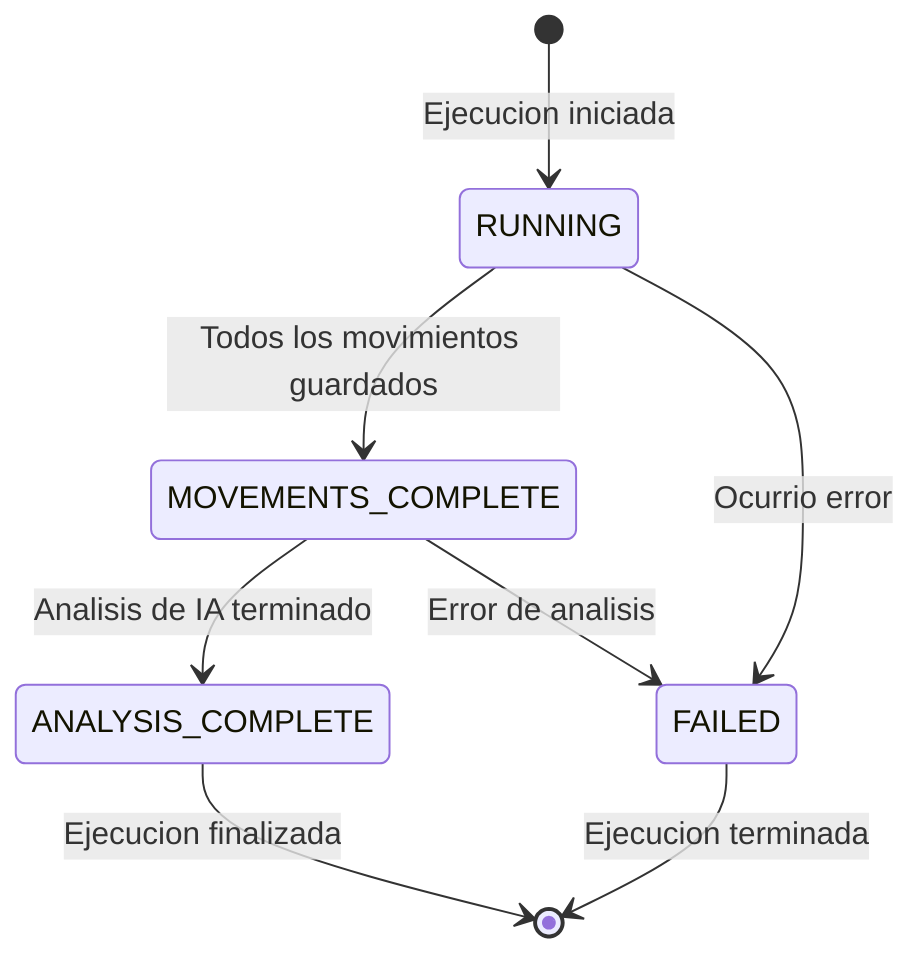
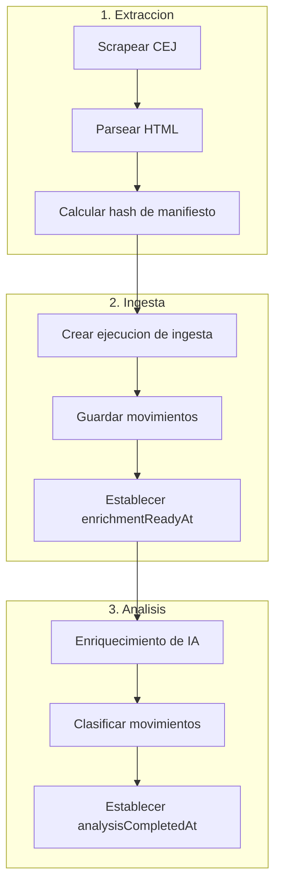
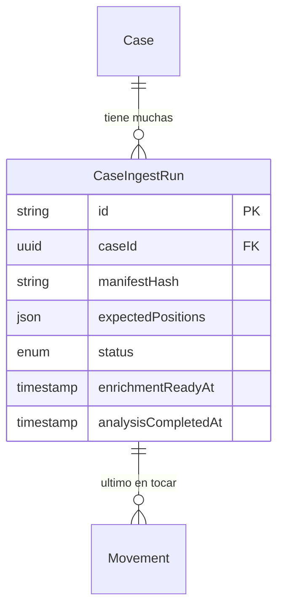

La entidad **CaseIngestRun** rastrea operaciones individuales de extraccion e ingesta de datos para un caso. Proporciona idempotencia respaldada por base de datos, seguimiento de completitud y manejo de errores para el pipeline de ingesta.

## Vision General

Cada ejecucion de ingesta representa una sola operacion de extraccion de CEJ (Consulta de Expedientes Judiciales). La ejecucion rastrea:

- Que movimientos se esperan de esta extraccion
- Estado actual del proceso de ingesta
- Timestamps de completitud para etapas del pipeline
- Informacion de error si la ejecucion falla

<Note>
  Las ejecuciones de ingesta usan IDs deterministicos suministrados por el cliente, habilitando operaciones idempotentes. Re-ejecutar la misma extraccion con el mismo manifiesto produce el mismo ID de ejecucion.
</Note>

## Referencia de Campos

### Campos de Identidad

| Campo | Tipo | Descripcion |
|-------|------|-------------|
| `id` | `string` | UUID deterministico (suministrado por cliente) |
| `caseId` | `string` | Clave foranea al Case padre |
| `expediente` | `string` | Numero de caso para logging/debugging |

### Campos de Manifiesto

| Campo | Tipo | Descripcion |
|-------|------|-------------|
| `manifestHash` | `string` | SHA-256 del HTML/manifiesto fuente |
| `expectedPositions` | `Json` | Array de posiciones de movimiento a ingerir |

### Campos de Estado

| Campo | Tipo | Descripcion |
|-------|------|-------------|
| `status` | `CaseIngestRunStatus` | Estado actual del pipeline |
| `enrichmentReadyAt` | `DateTime?` | Cuando los movimientos estan listos para IA |
| `analysisCompletedAt` | `DateTime?` | Cuando completo el analisis de IA |

### Campos de Error

| Campo | Tipo | Descripcion |
|-------|------|-------------|
| `errorMessage` | `string?` | Descripcion de error legible |
| `errorDetails` | `Json?` | Informacion de error estructurada |

## Estado de Ejecucion de Ingesta

| Estado | Descripcion | Siguiente Paso |
|--------|-------------|----------------|
| `RUNNING` | Extraccion en progreso | Esperar movimientos |
| `MOVEMENTS_COMPLETE` | Todos los movimientos guardados en BD | Iniciar analisis de IA |
| `ANALYSIS_COMPLETE` | Enriquecimiento de IA terminado | Ejecucion completa |
| `FAILED` | Ocurrio error | Verificar detalles de error |

## Flujo del Pipeline

<Warning>
  El mismo hash de manifiesto para el mismo caso siempre produce el mismo ID de ejecucion. Esto significa que re-procesar datos sin cambios encontrara la ejecucion existente en lugar de crear un duplicado.
</Warning>

## Relaciones de Entidades

## Entidades Relacionadas

<CardGroup cols={2}>
  <Card title="Case" icon="briefcase" href="/es/entidades/case">
    Entidad de caso padre
  </Card>
  <Card title="Movement" icon="timeline" href="/es/entidades/movement">
    Los movimientos rastrean lastIngestRunId
  </Card>
  <Card title="Enums" icon="list" href="/es/entidades/enums">
    Enum CaseIngestRunStatus
  </Card>
</CardGroup>
