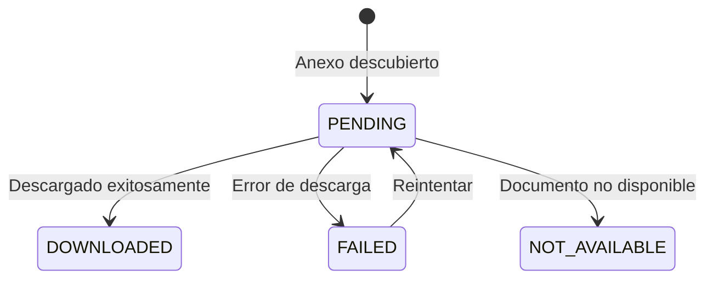
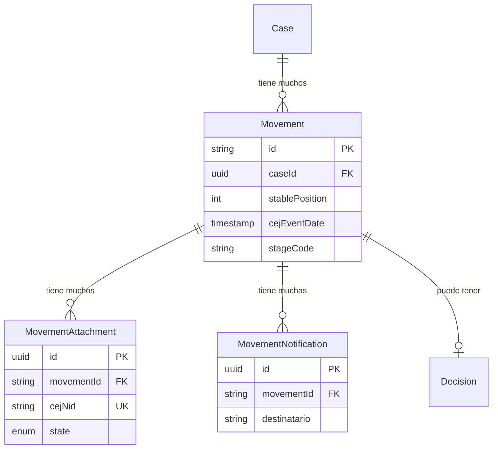

La entidad **Movement** representa eventos de linea de tiempo en un caso legal, formando un historial inmutable de los procedimientos. Cada movimiento puede tener **anexos** (documentos) y **notificaciones** (registros de entrega).

## Movement

Los movimientos son el registro cronologico de todo lo que sucede en un caso. Usan un ID deterministico y un sistema de posicionamiento estable disenado para ingesta incremental eficiente.

<Note>
  **Posicion Estable**: Los movimientos usan un campo `stablePosition` donde 1 = movimiento mas antiguo. Esto nunca cambia cuando se agregan nuevos movimientos, a diferencia de la posicion de CEJ donde 1 = mas reciente.
</Note>

### Campos Centrales

| Campo | Tipo | Descripcion |
|-------|------|-------------|
| `id` | `string` | UUID deterministico de numero de caso + posicion |
| `caseId` | `string` | Clave foranea al Case padre |
| `stablePosition` | `int` | Posicion cronologica (1 = mas antiguo) |
| `cejEventDate` | `DateTime?` | Fecha de resolucion o ingreso |
| `cejDecreeDate` | `DateTime?` | Fecha de proveido |

### Campos CEJ

| Campo | Tipo | Descripcion |
|-------|------|-------------|
| `cejActo` | `string?` | Tipo de acto procesal |
| `cejResolution` | `string?` | Numero/identificador de resolucion |
| `cejDescription` | `string?` | Descripcion cruda de CEJ |
| `cejFolios` | `int?` | Numero de folios del documento |

### Campos SourcedValue

| Campo | Tipo | Descripcion |
|-------|------|-------------|
| `name` | `Json?` | Nombre para mostrar en UI |
| `summary` | `Json?` | Resumen generado por IA o manual |
| `tags` | `Json?` | Array de tags de clasificacion |

### Campos de Clasificacion

| Campo | Tipo | Descripcion |
|-------|------|-------------|
| `stageCode` | `string?` | Referencia Stage.code |
| `subStageCode` | `string?` | Referencia SubStage.code |
| `milestoneCode` | `string?` | Referencia Milestone.code |

<Warning>
  Los campos `stageCode`, `subStageCode` y `milestoneCode` referencian entidades en la base de datos del Plano de Control. Estos son validados a nivel de aplicacion, no por claves foraneas.
</Warning>

## MovementAttachment

Documentos anexados a movimientos, como PDFs, ordenes judiciales o archivos de evidencia.

| Campo | Tipo | Descripcion |
|-------|------|-------------|
| `id` | `string` | UUID clave primaria |
| `movementId` | `string` | Referencia al movimiento padre |
| `cejNid` | `string?` | Identificador unico de documento CEJ |
| `kind` | `string` | Formato de documento: `PDF`, `HTML`, `IMAGE` |
| `label` | `string?` | Nombre de documento legible |
| `state` | `AttachmentState` | Estado de descarga/procesamiento |
| `aiExtractedText` | `string?` | Texto extraido via IA/OCR |

### Estados de Anexo

## MovementNotification

Registros de notificacion asociados con movimientos, rastreando entrega a partes.

| Campo | Tipo | Descripcion |
|-------|------|-------------|
| `id` | `string` | UUID clave primaria |
| `movementId` | `string` | Referencia al movimiento padre |
| `destinatario` | `string` | Nombre del destinatario |
| `fechaEnvio` | `DateTime?` | Fecha en que se envio la notificacion |
| `formaEntrega` | `string?` | Metodo de entrega (electronico, fisico) |
| `extraFechas` | `Json?` | Mapa de fechas adicionales |

## Relaciones de Entidades

## Entidades Relacionadas

<CardGroup cols={2}>
  <Card title="Case" icon="briefcase" href="/es/entidades/case">
    Entidad de caso padre
  </Card>
  <Card title="Decision" icon="gavel" href="/es/entidades/decision">
    Decisiones vinculadas a movimientos
  </Card>
  <Card title="Stages" icon="layer-group" href="/es/entidades/stages">
    Referencias Stage/SubStage/Milestone
  </Card>
  <Card title="Enums" icon="list" href="/es/entidades/enums">
    Enum AttachmentState
  </Card>
</CardGroup>
