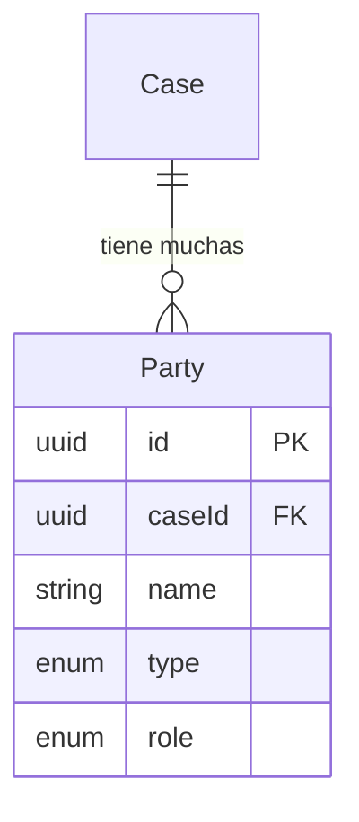

La entidad **Party** representa individuos u organizaciones involucradas en un caso legal. Las partes se clasifican por su tipo (persona natural o entidad juridica) y su rol en el procedimiento (demandante, demandado, tercero u otro).

## Vision General

Cada caso tiene una o mas partes. Configuraciones comunes incluyen:
- **Casos laborales**: Empleado (demandante) vs. Empleador (demandado)
- **Casos civiles**: Multiples demandantes y/o demandados
- **Casos complejos**: Terceros, intervinientes y otros participantes

## Referencia de Campos

| Campo | Tipo | Descripcion |
|-------|------|-------------|
| `id` | `string` | UUID clave primaria |
| `caseId` | `string` | Clave foranea al Case padre |
| `name` | `string` | Nombre legal completo de la parte |
| `type` | `PartyType` | Clasificacion del tipo de entidad |
| `role` | `PartyRole` | Rol en el procedimiento legal |
| `createdAt` | `DateTime` | Cuando se creo el registro |
| `updatedAt` | `DateTime` | Cuando se modifico por ultima vez |

## Tipos de Parte

| Tipo | Descripcion | Ejemplo |
|------|-------------|---------|
| `NATURAL` | Persona natural / individuo | "Juan Perez Garcia" |
| `JURIDICA` | Entidad juridica / corporacion | "Empresa ABC S.A.C." |
| `UNKNOWN` | Tipo aun no determinado | Datos de CEJ no procesados |

<Note>
  El tipo `UNKNOWN` se usa durante la ingesta inicial de datos cuando el tipo de parte no puede determinarse de los datos fuente. Debe resolverse a traves de analisis de IA o clasificacion manual.
</Note>

## Roles de Parte

| Rol | Descripcion | Posicion Tipica |
|-----|-------------|-----------------|
| `PLAINTIFF` | Parte iniciadora / demandante | Presenta la demanda |
| `DEFENDANT` | Parte que responde / demandado | Se defiende contra las pretensiones |
| `THIRD_PARTY` | Tercero | Parte unida o interviniente |
| `OTHER` | Otros participantes | Testigos, peritos, etc. |

## Relaciones de Entidades

<Warning>
  Los datos de CEJ pueden contener entradas duplicadas de partes o nombres inconsistentes. La aplicacion debe deduplicar partes por nombre normalizado dentro de un caso.
</Warning>

## Entidades Relacionadas

<CardGroup cols={2}>
  <Card title="Case" icon="briefcase" href="/es/entidades/case">
    Entidad de caso padre
  </Card>
  <Card title="Enums" icon="list" href="/es/entidades/enums">
    Enums PartyType y PartyRole
  </Card>
</CardGroup>
