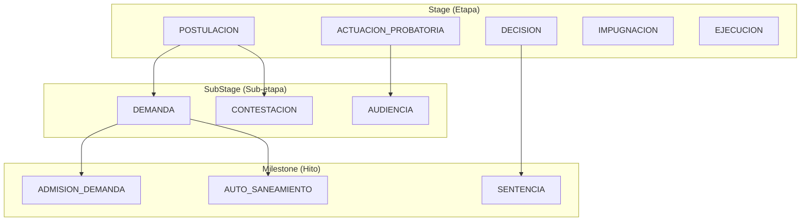
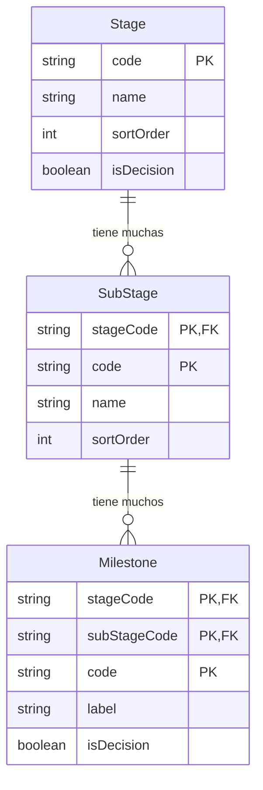

Las entidades **Stage**, **SubStage** y **Milestone** forman un sistema jerarquico de datos de referencia para clasificar procedimientos legales. Esta taxonomia de tres niveles permite categorizacion consistente de movimientos de casos a traves del proceso judicial peruano.

## Vision General

La jerarquia de etapas representa las fases procesales de un caso legal:

<Note>
  Los datos de referencia de Stage se almacenan en la base de datos del **Plano de Control** (Supabase) y se comparten entre todos los tenants. Los codigos de clasificacion de movimientos en bases de datos tenant referencian esta taxonomia compartida.
</Note>

## Stage

Las etapas representan las macro fases de un proceso legal.

| Campo | Tipo | Descripcion |
|-------|------|-------------|
| `code` | `string` | Identificador unico (PK) |
| `name` | `string` | Nombre de etapa legible |
| `sortOrder` | `int` | Orden de visualizacion/flujo de trabajo |
| `description` | `string?` | Descripcion detallada |
| `isDecision` | `boolean` | True si la etapa contiene decisiones |

### Etapas Comunes

| Codigo | Nombre | Descripcion |
|--------|--------|-------------|
| `POSTULACION` | Postulacion | Fase inicial de presentacion |
| `ACTUACION_PROBATORIA` | Actuacion Probatoria | Presentacion de pruebas |
| `DECISION` | Decision | Fase de sentencia |
| `IMPUGNACION` | Impugnacion | Fase de apelaciones |
| `EJECUCION` | Ejecucion | Fase de ejecucion |

## SubStage

Las SubStages representan fases dentro de una etapa. Usan una clave primaria compuesta de `(stageCode, code)`.

| Campo | Tipo | Descripcion |
|-------|------|-------------|
| `stageCode` | `string` | Referencia Stage.code padre |
| `code` | `string` | Identificador de SubStage |
| `name` | `string` | Nombre legible |
| `sortOrder` | `int` | Orden dentro de la etapa padre |
| `description` | `string?` | Descripcion detallada |

## Milestone

Los Milestones son eventos especificos dentro de una sub-etapa. Usan una clave primaria compuesta de `(stageCode, subStageCode, code)`.

| Campo | Tipo | Descripcion |
|-------|------|-------------|
| `stageCode` | `string` | Referencia Stage.code |
| `subStageCode` | `string` | Referencia SubStage.code |
| `code` | `string` | Identificador de Milestone |
| `label` | `string` | Etiqueta legible |
| `isDecision` | `boolean` | True si el hito es un punto de decision |

<Warning>
  Las Stages estan en el Plano de Control, pero los movimientos estan en bases de datos tenant. No hay claves foraneas entre ellos. El codigo de aplicacion debe validar referencias de etapa.
</Warning>

## Relaciones de Entidades

## Entidades Relacionadas

<CardGroup cols={2}>
  <Card title="Movement" icon="timeline" href="/es/entidades/movement">
    Los movimientos referencian codigos de etapa
  </Card>
  <Card title="Case State" icon="chart-line" href="/es/entidades/case-state">
    Etapa actual rastreada en estado
  </Card>
  <Card title="Decision" icon="gavel" href="/es/entidades/decision">
    Hitos de decision disparan deteccion
  </Card>
</CardGroup>
