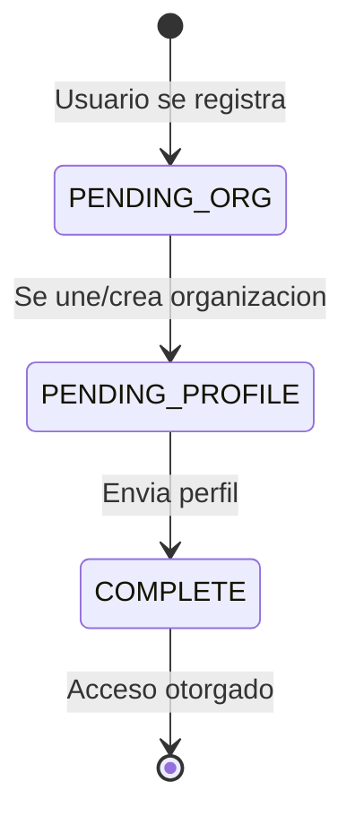
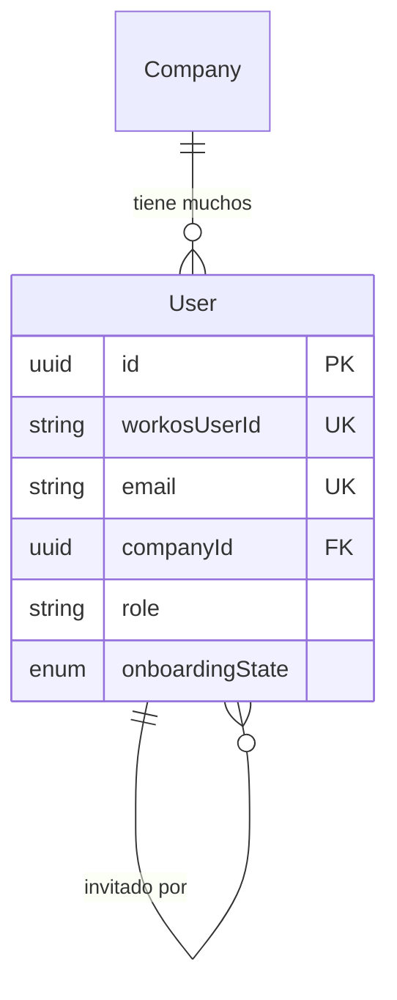

La entidad **User** representa cuentas de usuario individuales en Clamo. Los usuarios estan asociados con una empresa y son rastreados a traves de un flujo de onboarding que asegura la configuracion adecuada de la organizacion antes de acceder a los datos de casos.

## Vision General

Los usuarios se autentican via WorkOS y progresan a traves de un flujo de onboarding que:
1. Los asocia con una organizacion
2. Recopila informacion de perfil
3. Otorga acceso a la base de datos tenant de su empresa

## Referencia de Campos

| Campo | Tipo | Descripcion |
|-------|------|-------------|
| `id` | `string` | UUID clave primaria |
| `workosUserId` | `string` | Identificador unico de autenticacion WorkOS |
| `email` | `string` | Direccion de email del usuario, debe ser unica |
| `firstName` | `string?` | Nombre del usuario |
| `lastName` | `string?` | Apellido del usuario |
| `companyId` | `string?` | Referencia a la Company a la que pertenece el usuario |
| `role` | `string?` | Rol del usuario: `"owner"`, `"admin"`, `"member"` |
| `onboardingState` | `OnboardingState` | Paso actual en el flujo de onboarding |
| `onboardingData` | `Json?` | Almacenamiento temporal para respuestas de formulario |
| `invitedBy` | `string?` | ID del usuario que invito a este usuario |
| `invitedAt` | `DateTime?` | Timestamp cuando se envio el email de invitacion |
| `acceptedAt` | `DateTime?` | Timestamp cuando el usuario acepto la invitacion |

## Maquina de Estados de Onboarding

| Estado | Descripcion | Siguiente Accion |
|--------|-------------|------------------|
| `PENDING_ORG` | Usuario autenticado pero no unido a empresa | Crear empresa o aceptar invitacion |
| `PENDING_PROFILE` | Usuario asociado con empresa pero perfil incompleto | Completar formulario de perfil |
| `COMPLETE` | Onboarding terminado, acceso completo otorgado | N/A |

<Note>
  El campo `onboardingData` almacena temporalmente respuestas de formulario durante el flujo de onboarding. Estos datos pueden limpiarse despues de que el onboarding se complete.
</Note>

## Roles de Usuario

| Rol | Permisos |
|-----|----------|
| `owner` | Acceso completo, puede eliminar empresa, gestionar facturacion |
| `admin` | Gestionar usuarios, configurar ajustes |
| `member` | Acceso estandar a casos y reportes |

<Warning>
  El control de acceso basado en roles se aplica a nivel de aplicacion. La base de datos almacena el string de rol pero no aplica permisos.
</Warning>

## Relaciones de Entidades

## Entidades Relacionadas

<CardGroup cols={2}>
  <Card title="Company" icon="building" href="/es/entidades/company">
    Organizacion a la que pertenece el usuario
  </Card>
  <Card title="Enums" icon="list" href="/es/entidades/enums">
    Referencia del enum OnboardingState
  </Card>
</CardGroup>
