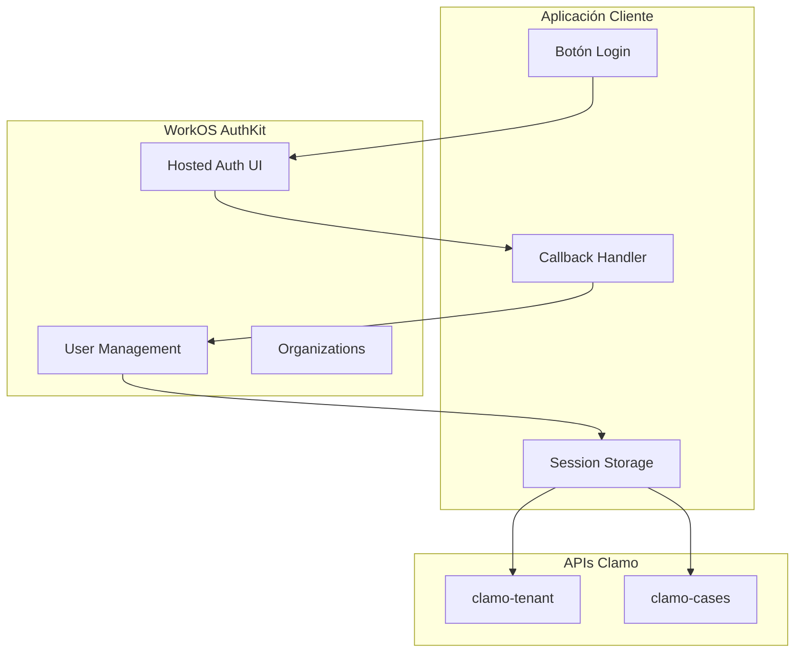

# Guía de Autenticación

Esta guía explica cómo implementar autenticación completa con Clamo usando WorkOS AuthKit.

## Arquitectura de Autenticación



## Prerrequisitos

1. Cuenta de WorkOS con AuthKit habilitado
2. Credenciales de WorkOS:
   - `WORKOS_API_KEY`
   - `WORKOS_CLIENT_ID`
3. Redirect URI configurado en WorkOS Dashboard

## Configuración de WorkOS

### 1. Crear Aplicación en WorkOS

1. Accede al [WorkOS Dashboard](https://dashboard.workos.com)
2. Crea una nueva aplicación o selecciona una existente
3. Habilita "User Management"
4. Configura las Redirect URIs:

```
# Desarrollo
http://localhost:3001/callback

# Producción
https://tu-app.com/callback
```

### 2. Variables de Entorno

```bash
# .env.local
WORKOS_API_KEY=sk_live_...
WORKOS_CLIENT_ID=client_...
WORKOS_REDIRECT_URI=http://localhost:3001/callback
WORKOS_COOKIE_PASSWORD=<32+ chars random string>
```

## Implementación con Next.js

### Instalación

```bash
npm install @workos-inc/authkit-nextjs
```

### Configuración

```typescript
// middleware.ts
import { authkitMiddleware } from '@workos-inc/authkit-nextjs';

export default authkitMiddleware({
  middlewareAuth: {
    enabled: true,
    unauthenticatedPaths: ['/', '/login'],
  },
});

export const config = {
  matcher: [
    '/((?!_next/static|_next/image|favicon.ico).*)',
  ],
};
```

### Página de Login

```tsx
// app/login/page.tsx
import { getSignInUrl } from '@workos-inc/authkit-nextjs';

export default async function LoginPage() {
  const signInUrl = await getSignInUrl();
  
  return (
    <div className="flex flex-col items-center justify-center min-h-screen">
      <h1 className="text-2xl font-bold mb-4">Iniciar Sesión en Clamo</h1>
      <a
        href={signInUrl}
        className="bg-blue-600 text-white px-6 py-3 rounded-lg"
      >
        Continuar con WorkOS
      </a>
    </div>
  );
}
```

### Callback Handler

```typescript
// app/callback/route.ts
import { handleAuth } from '@workos-inc/authkit-nextjs';

export const GET = handleAuth({
  returnPathname: '/dashboard',
});
```

### Obtener Sesión

```typescript
// app/dashboard/page.tsx
import { getSession } from '@workos-inc/authkit-nextjs';
import { redirect } from 'next/navigation';

export default async function DashboardPage() {
  const session = await getSession();
  
  if (!session) {
    redirect('/login');
  }
  
  const { user, accessToken, organizationId } = session;
  
  return (
    <div>
      <h1>Bienvenido, {user.firstName}</h1>
      <p>Organización: {organizationId}</p>
    </div>
  );
}
```

## Crear Session Token de Clamo

<Warning>
**Nota:** El header `x-clamo-session` es **legacy** y solo se usa en desarrollo local sin Kong. En producción, los backends confían en los headers `x-workos-*` que Kong inyecta después de validar el JWT.
</Warning>

En desarrollo local (sin Kong), puedes crear un session token para testing:

```typescript
// lib/clamo-session.ts (SOLO PARA DESARROLLO LOCAL)
import { getSession } from '@workos-inc/authkit-nextjs';

interface ClamoSession {
  userId: string;
  workosUserId: string;
  organizationId: string;
  companyId: string;
  email: string;
  role: 'admin' | 'member';
}

export async function getClamoSession(): Promise<{
  accessToken: string;
  sessionToken: string;
} | null> {
  const workosSession = await getSession();
  
  if (!workosSession) {
    return null;
  }
  
  // Obtener datos de Clamo
  const response = await fetch(`${process.env.TENANT_SERVICE_URL}/v1/me`, {
    headers: {
      'Authorization': `Bearer ${workosSession.accessToken}`,
    },
  });
  
  if (!response.ok) {
    return null;
  }
  
  const clamoUser = await response.json();
  
  // Crear session token (legacy, solo para dev local)
  const sessionData: ClamoSession = {
    userId: clamoUser.id,
    workosUserId: workosSession.user.id,
    organizationId: workosSession.organizationId!,
    companyId: clamoUser.companyId,
    email: clamoUser.email,
    role: clamoUser.role,
  };
  
  const sessionToken = Buffer.from(
    JSON.stringify(sessionData)
  ).toString('base64url');
  
  return {
    accessToken: workosSession.accessToken,
    sessionToken,
  };
}
```

## Cliente API de Clamo

En producción, las llamadas a la API pasan por Kong que valida el JWT y añade headers `x-workos-*`. En desarrollo local, el frontend inyecta estos headers directamente:

```typescript
// lib/clamo-client.ts
import { getSession } from '@workos-inc/authkit-nextjs';

class ClamoClient {
  private baseUrl: string;
  
  constructor() {
    this.baseUrl = process.env.CASES_SERVICE_URL!;
  }
  
  private async getHeaders() {
    const session = await getSession();
    
    if (!session) {
      throw new Error('No autenticado');
    }
    
    // En producción, Kong añade estos headers después de validar el JWT
    // En desarrollo local, los añadimos directamente
    return {
      'Authorization': `Bearer ${session.accessToken}`,
      'x-workos-user-id': session.user.id,
      'x-workos-org-id': session.organizationId || '',
      'Content-Type': 'application/json',
    };
  }
  
  async getCases(params?: Record<string, string>) {
    const headers = await this.getHeaders();
    const query = new URLSearchParams(params).toString();
    
    const response = await fetch(
      `${this.baseUrl}/v1/cases?${query}`,
      { headers }
    );
    
    if (!response.ok) {
      const error = await response.json();
      throw new Error(error.error.message);
    }
    
    return response.json();
  }
  
  async getCase(id: string) {
    const headers = await this.getHeaders();
    
    const response = await fetch(
      `${this.baseUrl}/v1/cases/${id}`,
      { headers }
    );
    
    if (!response.ok) {
      const error = await response.json();
      throw new Error(error.error.message);
    }
    
    return response.json();
  }
}

export const clamoClient = new ClamoClient();
```

## Manejo de Organizaciones

WorkOS permite que un usuario pertenezca a múltiples organizaciones. Clamo mapea cada organización a una empresa:

```typescript
// Obtener organizaciones del usuario
import WorkOS from '@workos-inc/node';

const workos = new WorkOS(process.env.WORKOS_API_KEY);

async function getUserOrganizations(userId: string) {
  const { data: memberships } = await workos.userManagement.listOrganizationMemberships({
    userId,
  });
  
  return memberships.map(m => ({
    organizationId: m.organizationId,
    role: m.role,
  }));
}
```

### Cambiar de Organización

```typescript
// Forzar selección de organización en el login
import { getSignInUrl } from '@workos-inc/authkit-nextjs';

const signInUrl = await getSignInUrl({
  organizationId: 'org_...',  // Pre-seleccionar organización
});
```

## Logout

```typescript
// app/api/logout/route.ts
import { signOut } from '@workos-inc/authkit-nextjs';

export async function GET() {
  return signOut();
}
```

## Proteger API Routes

```typescript
// app/api/cases/route.ts
import { getSession } from '@workos-inc/authkit-nextjs';
import { NextResponse } from 'next/server';

export async function GET() {
  const session = await getSession();
  
  if (!session) {
    return NextResponse.json(
      { error: { code: 'UNAUTHORIZED', message: 'No autenticado' } },
      { status: 401 }
    );
  }
  
  // Proxy a Clamo API con headers x-workos-*
  const response = await fetch(`${process.env.CASES_SERVICE_URL}/v1/cases`, {
    headers: {
      'Authorization': `Bearer ${session.accessToken}`,
      'x-workos-user-id': session.user.id,
      'x-workos-org-id': session.organizationId || '',
    },
  });
  
  const data = await response.json();
  return NextResponse.json(data);
}
```

## Roles y Permisos

### Verificar Rol

```typescript
import { getSession } from '@workos-inc/authkit-nextjs';

async function requireAdmin() {
  const session = await getSession();
  
  if (!session) {
    throw new Error('No autenticado');
  }
  
  // Obtener rol de Clamo
  const response = await fetch(`${process.env.TENANT_SERVICE_URL}/v1/me`, {
    headers: {
      'Authorization': `Bearer ${session.accessToken}`,
      'x-workos-user-id': session.user.id,
      'x-workos-org-id': session.organizationId || '',
    },
  });
  
  const user = await response.json();
  
  if (user.role !== 'admin') {
    throw new Error('Se requieren permisos de administrador');
  }
  
  return user;
}
```

### Componente de Protección

```tsx
// components/AdminOnly.tsx
'use client';

import { useSession } from './SessionProvider';

export function AdminOnly({ children }: { children: React.ReactNode }) {
  const { user } = useSession();
  
  if (user?.role !== 'admin') {
    return null;
  }
  
  return <>{children}</>;
}
```

## Refresh de Tokens

WorkOS maneja automáticamente el refresh de tokens con AuthKit. Si necesitas hacerlo manualmente:

```typescript
import WorkOS from '@workos-inc/node';

const workos = new WorkOS(process.env.WORKOS_API_KEY);

async function refreshAccessToken(refreshToken: string) {
  const { accessToken, refreshToken: newRefreshToken } = 
    await workos.userManagement.authenticateWithRefreshToken({
      clientId: process.env.WORKOS_CLIENT_ID!,
      refreshToken,
    });
  
  return { accessToken, refreshToken: newRefreshToken };
}
```

## Solución de Problemas

<AccordionGroup>
  <Accordion title="Error: Organization not found">
    El usuario no pertenece a ninguna organización en WorkOS. Verifica que:
    1. El usuario haya sido invitado a una organización
    2. La organización esté vinculada a una empresa en Clamo
  </Accordion>
  
  <Accordion title="Error: Session expired">
    El access token ha expirado. AuthKit debería renovarlo automáticamente.
    Si persiste, verifica la configuración del middleware.
  </Accordion>
  
  <Accordion title="Error: CORS">
    Las llamadas a la API de Clamo deben hacerse desde el servidor (Server Components o API Routes),
    no directamente desde el cliente.
  </Accordion>
</AccordionGroup>

## Próximos Pasos

<CardGroup cols={2}>
  <Card
    title="Multi-Tenancy"
    icon="building"
    href="/guias/multi-tenancy"
  >
    Aprende sobre el modelo multi-tenant de Clamo.
  </Card>
  <Card
    title="API Reference"
    icon="code"
    href="/api-reference/autenticacion"
  >
    Documentación técnica de autenticación.
  </Card>
</CardGroup>

