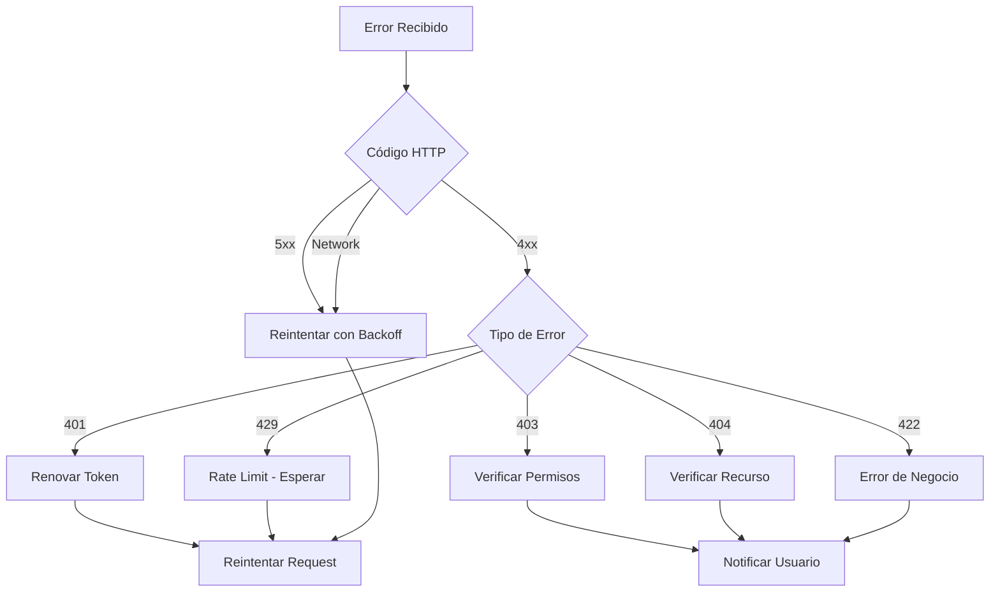

# Manejo de Errores

Esta guía proporciona estrategias para manejar los diferentes tipos de errores que pueden ocurrir al integrar con las APIs de Clamo.

## Categorías de Errores

### Errores de Cliente (4xx)

Errores causados por la request del cliente. Generalmente no se deben reintentar sin corregir el problema.

### Errores de Servidor (5xx)

Errores del lado del servidor. Se pueden reintentar con backoff exponencial.

### Errores de Red

Timeouts, conexiones rechazadas, etc. Se pueden reintentar.

## Estrategia de Manejo



## Implementación

### Cliente con Manejo de Errores

```typescript
class ClamoApiError extends Error {
  constructor(
    public code: string,
    message: string,
    public details?: Record<string, unknown>,
    public statusCode?: number
  ) {
    super(message);
    this.name = 'ClamoApiError';
  }
}

class ClamoClient {
  private baseUrl: string;
  private maxRetries = 3;
  
  async request<T>(
    method: string,
    path: string,
    options: RequestOptions = {}
  ): Promise<T> {
    let lastError: Error;
    
    for (let attempt = 0; attempt < this.maxRetries; attempt++) {
      try {
        const response = await this.makeRequest(method, path, options);
        
        if (response.ok) {
          return response.json();
        }
        
        const error = await response.json();
        
        // Manejar según código de error
        switch (response.status) {
          case 401:
            if (error.error.code === 'TOKEN_EXPIRED') {
              await this.refreshToken();
              continue; // Reintentar
            }
            throw new ClamoApiError(
              error.error.code,
              error.error.message,
              error.error.details,
              401
            );
            
          case 429:
            const retryAfter = error.error.details?.retryAfter || 60;
            await this.sleep(retryAfter * 1000);
            continue; // Reintentar
            
          case 500:
          case 502:
          case 503:
          case 504:
            const backoff = Math.pow(2, attempt) * 1000;
            await this.sleep(backoff);
            continue; // Reintentar
            
          default:
            throw new ClamoApiError(
              error.error.code,
              error.error.message,
              error.error.details,
              response.status
            );
        }
      } catch (error) {
        if (error instanceof ClamoApiError) {
          throw error;
        }
        
        // Error de red
        lastError = error as Error;
        const backoff = Math.pow(2, attempt) * 1000;
        await this.sleep(backoff);
      }
    }
    
    throw lastError!;
  }
  
  private sleep(ms: number): Promise<void> {
    return new Promise(resolve => setTimeout(resolve, ms));
  }
}
```

### Uso del Cliente

```typescript
const client = new ClamoClient();

try {
  const cases = await client.request('GET', '/v1/cases');
  console.log('Casos:', cases);
} catch (error) {
  if (error instanceof ClamoApiError) {
    switch (error.code) {
      case 'VALIDATION_ERROR':
        console.error('Error de validación:', error.details);
        break;
      case 'NOT_FOUND':
        console.error('Recurso no encontrado');
        break;
      case 'FORBIDDEN':
        console.error('Sin permisos');
        break;
      default:
        console.error('Error de API:', error.message);
    }
  } else {
    console.error('Error inesperado:', error);
  }
}
```

## Errores Comunes y Soluciones

### UNAUTHORIZED (401)

**Causa**: Token faltante, inválido o expirado.

```typescript
// Solución: Verificar y renovar token
if (error.code === 'UNAUTHORIZED' || error.code === 'TOKEN_EXPIRED') {
  const newToken = await refreshAccessToken();
  // Reintentar con nuevo token
}
```

### FORBIDDEN (403)

**Causa**: El usuario no tiene permisos para la acción.

```typescript
// Solución: Verificar rol del usuario
if (error.code === 'FORBIDDEN') {
  const user = await client.getMe();
  if (user.role !== 'admin') {
    showError('Esta acción requiere permisos de administrador');
  }
}
```

### NOT_FOUND (404)

**Causa**: El recurso no existe o fue eliminado.

```typescript
// Solución: Manejar gracefully
if (error.code === 'NOT_FOUND') {
  // Limpiar cache local si existe
  cache.delete(resourceId);
  // Redirigir o mostrar mensaje
  showNotFound('El caso solicitado no existe');
}
```

### VALIDATION_ERROR (400)

**Causa**: Datos inválidos en la request.

```typescript
// Solución: Mostrar errores específicos al usuario
if (error.code === 'VALIDATION_ERROR') {
  const errors = error.details?.errors || [];
  
  errors.forEach(err => {
    // Marcar campo con error
    setFieldError(err.field, err.message);
  });
}
```

### COMPANY_NOT_READY (422)

**Causa**: La base de datos del tenant no está lista.

```typescript
// Solución: Polling hasta que esté lista
if (error.code === 'COMPANY_NOT_READY') {
  const checkStatus = async () => {
    const company = await client.getMyCompany();
    if (company.databaseStatus === 'ready') {
      // Continuar
      return true;
    }
    if (company.databaseStatus === 'failed') {
      throw new Error('Provisioning failed');
    }
    // Seguir esperando
    return false;
  };
  
  await pollUntil(checkStatus, { interval: 5000, timeout: 60000 });
}
```

### RATE_LIMIT_EXCEEDED (429)

**Causa**: Demasiadas requests en poco tiempo.

```typescript
// Solución: Implementar rate limiting del lado del cliente
class RateLimiter {
  private requests: number[] = [];
  private limit: number;
  private window: number;
  
  constructor(limit: number, windowMs: number) {
    this.limit = limit;
    this.window = windowMs;
  }
  
  async acquire(): Promise<void> {
    const now = Date.now();
    this.requests = this.requests.filter(t => now - t < this.window);
    
    if (this.requests.length >= this.limit) {
      const oldestRequest = this.requests[0];
      const waitTime = this.window - (now - oldestRequest);
      await new Promise(r => setTimeout(r, waitTime));
    }
    
    this.requests.push(Date.now());
  }
}

const rateLimiter = new RateLimiter(100, 60000); // 100 req/min

async function makeRequest() {
  await rateLimiter.acquire();
  return client.request('GET', '/v1/cases');
}
```

## Logging de Errores

```typescript
function logError(error: ClamoApiError, context: Record<string, unknown>) {
  const logEntry = {
    timestamp: new Date().toISOString(),
    errorCode: error.code,
    errorMessage: error.message,
    statusCode: error.statusCode,
    details: error.details,
    context,
  };
  
  // Log estructurado
  console.error(JSON.stringify(logEntry));
  
  // Enviar a servicio de monitoreo
  if (error.statusCode && error.statusCode >= 500) {
    sendToSentry(error, context);
  }
}
```

## Notificación al Usuario

```typescript
function showErrorToUser(error: ClamoApiError) {
  const userMessages: Record<string, string> = {
    'UNAUTHORIZED': 'Tu sesión ha expirado. Por favor, inicia sesión nuevamente.',
    'FORBIDDEN': 'No tienes permisos para realizar esta acción.',
    'NOT_FOUND': 'El recurso solicitado no existe.',
    'VALIDATION_ERROR': 'Por favor, revisa los datos ingresados.',
    'RATE_LIMIT_EXCEEDED': 'Demasiadas solicitudes. Espera un momento e intenta de nuevo.',
    'COMPANY_NOT_READY': 'Tu cuenta está siendo configurada. Intenta en unos minutos.',
    'INTERNAL_ERROR': 'Ocurrió un error. Nuestro equipo ha sido notificado.',
  };
  
  const message = userMessages[error.code] || 'Ocurrió un error inesperado.';
  
  toast.error(message);
}
```

## Circuit Breaker

Para proteger tu aplicación de cascadas de errores:

```typescript
class CircuitBreaker {
  private failures = 0;
  private lastFailure: number = 0;
  private state: 'closed' | 'open' | 'half-open' = 'closed';
  
  constructor(
    private threshold: number = 5,
    private resetTimeout: number = 30000
  ) {}
  
  async execute<T>(fn: () => Promise<T>): Promise<T> {
    if (this.state === 'open') {
      if (Date.now() - this.lastFailure > this.resetTimeout) {
        this.state = 'half-open';
      } else {
        throw new Error('Circuit breaker is open');
      }
    }
    
    try {
      const result = await fn();
      this.onSuccess();
      return result;
    } catch (error) {
      this.onFailure();
      throw error;
    }
  }
  
  private onSuccess() {
    this.failures = 0;
    this.state = 'closed';
  }
  
  private onFailure() {
    this.failures++;
    this.lastFailure = Date.now();
    
    if (this.failures >= this.threshold) {
      this.state = 'open';
    }
  }
}

const circuitBreaker = new CircuitBreaker();

async function safeFetch() {
  return circuitBreaker.execute(() => 
    client.request('GET', '/v1/cases')
  );
}
```

## Próximos Pasos

<CardGroup cols={2}>
  <Card
    title="Mejores Prácticas"
    icon="lightbulb"
    href="/guias/mejores-practicas"
  >
    Recomendaciones para una integración robusta.
  </Card>
  <Card
    title="API Reference"
    icon="code"
    href="/api-reference/errores"
  >
    Documentación técnica de errores.
  </Card>
</CardGroup>

