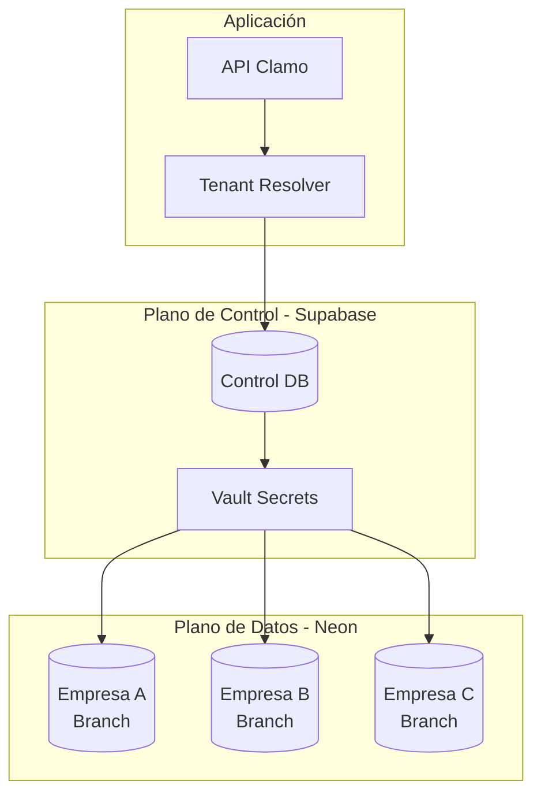
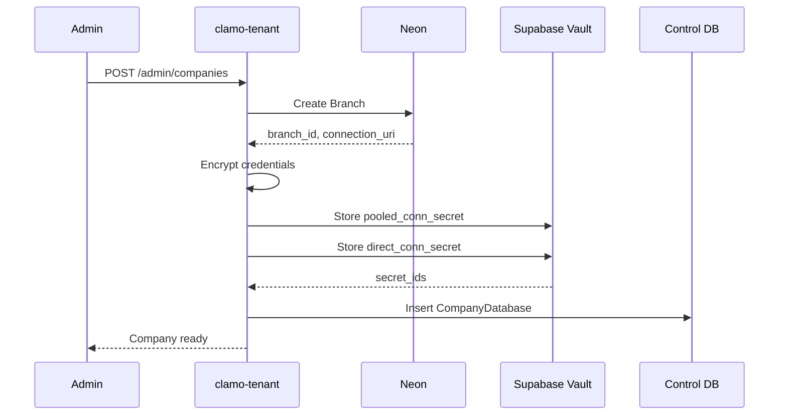

# Multi-Tenancy en Clamo

Clamo implementa un modelo de **database-per-tenant** que proporciona aislamiento completo de datos entre empresas.

## Arquitectura



## Modelo de Datos

### Base de Datos de Control

La base de datos de control almacena información global:

| Tabla | Descripción |
|-------|-------------|
| `Company` | Empresas registradas |
| `User` | Usuarios de todas las empresas |
| `CompanyDatabase` | Credenciales y metadata de bases de datos |

### Bases de Datos de Tenant

Cada empresa tiene su propia base de datos con:

| Tabla | Descripción |
|-------|-------------|
| `MonitoredEntity` | Entidades (RUCs) monitoreadas |
| `Case` | Expedientes judiciales |
| `Movement` | Movimientos procesales |
| `CaseProgress` | Historial de etapas |
| `CaseMilestone` | Hitos alcanzados |

## Flujo de Provisioning

Cuando se crea una nueva empresa:



### Código de Provisioning

```typescript
// Simplificado de clamo-tenant/provisioning.service.ts
async function provisionTenantDatabase(company: Company) {
  // 1. Crear branch en Neon
  const branch = await neonClient.createBranch({
    projectId: NEON_PROJECT_ID,
    name: `tenant-${company.id}`,
  });
  
  // 2. Obtener connection strings
  const endpoint = await neonClient.createEndpoint({
    branchId: branch.id,
    type: 'read_write',
  });
  
  const pooledUri = `postgres://${endpoint.host}:5432/${DB_NAME}?sslmode=require`;
  const directUri = `postgres://${endpoint.host}:5432/${DB_NAME}?sslmode=require`;
  
  // 3. Almacenar en Vault
  const pooledSecretId = await vault.createSecret({
    name: `tenant-${company.id}-pooled`,
    value: pooledUri,
  });
  
  const directSecretId = await vault.createSecret({
    name: `tenant-${company.id}-direct`,
    value: directUri,
  });
  
  // 4. Guardar metadata
  await prisma.companyDatabase.create({
    data: {
      companyId: company.id,
      neonProjectId: NEON_PROJECT_ID,
      neonBranchId: branch.id,
      neonEndpointId: endpoint.id,
      databaseName: DB_NAME,
      databaseHost: endpoint.host,
      databaseUser: 'neondb_owner',
      pooledConnSecretId: pooledSecretId,
      directConnSecretId: directSecretId,
    },
  });
  
  // 5. Ejecutar migraciones
  await runMigrations(directUri);
}
```

## Resolución de Tenant

Cada request resuelve dinámicamente la conexión del tenant:

```typescript
// Middleware de resolución
async function resolveTenant(c: Context, next: Next) {
  // 1. Extraer companyId del session token
  const session = decodeSession(c.req.header('x-clamo-session'));
  const { companyId } = session;
  
  // 2. Buscar credenciales
  const companyDb = await controlPrisma.companyDatabase.findUnique({
    where: { companyId },
  });
  
  if (!companyDb || companyDb.status !== 'active') {
    throw new Error('Tenant database not available');
  }
  
  // 3. Obtener connection string de Vault
  const connectionUri = await vault.getSecret(companyDb.pooledConnSecretId);
  
  // 4. Crear cliente Prisma
  const tenantPrisma = new PrismaClient({
    datasources: {
      db: { url: connectionUri },
    },
  });
  
  // 5. Adjuntar al contexto
  c.set('tenantDb', tenantPrisma);
  
  await next();
  
  // 6. Cleanup
  await tenantPrisma.$disconnect();
}
```

## Pool de Conexiones

Para optimizar el uso de conexiones, Clamo implementa un pool:

```typescript
class TenantConnectionPool {
  private connections = new Map<string, PrismaClient>();
  private lastAccess = new Map<string, number>();
  
  async getConnection(companyId: string): Promise<PrismaClient> {
    // Verificar cache
    if (this.connections.has(companyId)) {
      this.lastAccess.set(companyId, Date.now());
      return this.connections.get(companyId)!;
    }
    
    // Crear nueva conexión
    const connectionUri = await this.resolveConnectionUri(companyId);
    const client = new PrismaClient({
      datasources: { db: { url: connectionUri } },
    });
    
    this.connections.set(companyId, client);
    this.lastAccess.set(companyId, Date.now());
    
    return client;
  }
  
  // Cleanup de conexiones inactivas
  async cleanup() {
    const now = Date.now();
    const IDLE_TIMEOUT = 5 * 60 * 1000; // 5 minutos
    
    for (const [companyId, lastAccess] of this.lastAccess) {
      if (now - lastAccess > IDLE_TIMEOUT) {
        const client = this.connections.get(companyId);
        await client?.$disconnect();
        this.connections.delete(companyId);
        this.lastAccess.delete(companyId);
      }
    }
  }
}
```

## Consideraciones de Seguridad

### Aislamiento de Datos

- Cada tenant tiene su propia base de datos física (branch de Neon)
- Las credenciales están encriptadas en Supabase Vault
- No hay posibilidad de cross-tenant data leakage

### Credenciales

```typescript
// Las credenciales NUNCA se exponen en logs o respuestas
const connectionUri = await vault.getSecret(secretId);

// Uso seguro
const client = new PrismaClient({
  datasources: { db: { url: connectionUri } },
  log: ['error'], // No logear queries que podrían contener datos
});
```

### Validación de Tenant

```typescript
// Siempre validar que el usuario pertenece al tenant
async function validateTenantAccess(userId: string, companyId: string) {
  const user = await controlPrisma.user.findFirst({
    where: {
      id: userId,
      companyId: companyId,
    },
  });
  
  if (!user) {
    throw new ForbiddenError('No tienes acceso a esta empresa');
  }
  
  return user;
}
```

## Neon Branching

Clamo aprovecha el branching de Neon para:

### Ambientes de Desarrollo

```typescript
// Crear branch de desarrollo desde producción
const devBranch = await neonClient.createBranch({
  projectId: NEON_PROJECT_ID,
  parentId: productionBranchId,
  name: `dev-${Date.now()}`,
});
```

### Point-in-Time Recovery

```typescript
// Restaurar a un punto específico
const recoveryBranch = await neonClient.createBranch({
  projectId: NEON_PROJECT_ID,
  parentId: tenantBranchId,
  name: `recovery-${tenantId}`,
  pointInTime: '2025-01-01T00:00:00Z',
});
```

## Migración de Esquema

Las migraciones se ejecutan en todas las bases de datos de tenant:

```typescript
async function migrateAllTenants() {
  const companies = await controlPrisma.companyDatabase.findMany({
    where: { status: 'active' },
  });
  
  for (const company of companies) {
    const connectionUri = await vault.getSecret(company.directConnSecretId);
    
    try {
      await runPrismaMigrations(connectionUri);
      console.log(`Migrated tenant: ${company.companyId}`);
    } catch (error) {
      console.error(`Failed to migrate tenant: ${company.companyId}`, error);
    }
  }
}
```

## Monitoreo

### Métricas por Tenant

```typescript
// Tracking de uso por tenant
async function trackTenantUsage(companyId: string, operation: string) {
  await analytics.track({
    event: 'tenant_operation',
    properties: {
      companyId,
      operation,
      timestamp: new Date().toISOString(),
    },
  });
}
```

### Health Checks

```typescript
async function checkTenantHealth(companyId: string) {
  const pool = getTenantConnectionPool();
  const client = await pool.getConnection(companyId);
  
  try {
    await client.$queryRaw`SELECT 1`;
    return { status: 'healthy' };
  } catch (error) {
    return { status: 'unhealthy', error: error.message };
  }
}
```

## Límites por Plan

| Plan | Límite de Casos | Límite de Usuarios | Storage |
|------|-----------------|--------------------|---------| 
| Free | 100 | 2 | 1 GB |
| Pro | 10,000 | 20 | 10 GB |
| Enterprise | Ilimitado | Ilimitado | Ilimitado |

```typescript
async function checkPlanLimits(companyId: string) {
  const company = await controlPrisma.company.findUnique({
    where: { id: companyId },
    include: { database: true },
  });
  
  const limits = PLAN_LIMITS[company.plan];
  
  const tenantDb = await getTenantConnection(companyId);
  const caseCount = await tenantDb.case.count();
  
  if (caseCount >= limits.maxCases) {
    throw new PlanLimitError('Has alcanzado el límite de casos de tu plan');
  }
}
```

## Próximos Pasos

<CardGroup cols={2}>
  <Card
    title="Webhooks"
    icon="webhook"
    href="/guias/webhooks"
  >
    Recibe notificaciones de eventos.
  </Card>
  <Card
    title="Arquitectura"
    icon="sitemap"
    href="/inicio/arquitectura"
  >
    Vista general del sistema.
  </Card>
</CardGroup>

