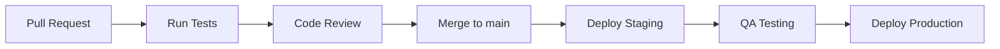

# Guía de Despliegue

Esta guía documenta los procedimientos de deployment para los diferentes servicios de Clamo.

## Ambientes

| Ambiente | Propósito | URL Base |
|----------|-----------|----------|
| Development | Desarrollo local | localhost:* |
| Staging | Testing y QA | staging.getclamo.com |
| Production | Producción | app.getclamo.com |

## CI/CD Pipeline

### GitHub Actions

Todos los repositorios usan GitHub Actions para CI/CD:

```yaml
# .github/workflows/deploy.yml
name: Deploy

on:
  push:
    branches: [main]
  pull_request:
    branches: [main]

jobs:
  test:
    runs-on: ubuntu-latest
    steps:
      - uses: actions/checkout@v4
      - uses: pnpm/action-setup@v2
      - uses: actions/setup-node@v4
        with:
          node-version: '20'
          cache: 'pnpm'
      - run: pnpm install
      - run: pnpm test
      - run: pnpm build

  deploy-staging:
    needs: test
    if: github.ref == 'refs/heads/main'
    runs-on: ubuntu-latest
    steps:
      - uses: actions/checkout@v4
      # Deploy steps...

  deploy-production:
    needs: deploy-staging
    if: github.ref == 'refs/heads/main'
    environment: production
    runs-on: ubuntu-latest
    steps:
      # Production deploy with manual approval
```

### Flujo de Deployment



## Deployment por Servicio

### Frontend (clamo-web-app)

**Plataforma**: Vercel

```bash
# Deploy manual a staging
vercel --env staging

# Deploy a producción
vercel --prod
```

**Variables de Entorno en Vercel**:
- `NEXT_PUBLIC_API_URL`
- `NEXT_PUBLIC_TENANT_API_URL`
- `WORKOS_CLIENT_ID`
- `WORKOS_API_KEY`

### APIs TypeScript (clamo-tenant, clamo-cases)

**Plataforma**: Railway / Fly.io

```bash
# Deploy con Railway CLI
railway up

# Deploy con Fly.io
fly deploy
```

**Dockerfile**:

```dockerfile
FROM node:20-alpine AS builder
WORKDIR /app
COPY package.json pnpm-lock.yaml ./
RUN npm install -g pnpm && pnpm install --frozen-lockfile
COPY . .
RUN pnpm build

FROM node:20-alpine
WORKDIR /app
COPY --from=builder /app/dist ./dist
COPY --from=builder /app/node_modules ./node_modules
COPY --from=builder /app/package.json ./
EXPOSE 4001
CMD ["node", "dist/index.js"]
```

### CEJ Connector (Python)

**Plataforma**: Docker en VM / Kubernetes

```bash
# Build imagen
docker build -t clamo-cej-connector:latest .

# Push a registry
docker tag clamo-cej-connector:latest gcr.io/clamo/cej-connector:latest
docker push gcr.io/clamo/cej-connector:latest

# Deploy en Kubernetes
kubectl apply -f k8s/cej-connector.yaml
```

### Ingest Worker (Go)

**Plataforma**: Docker en VM / Kubernetes

```bash
# Build
docker build -t clamo-ingest-go:latest .

# Deploy
kubectl rollout restart deployment/clamo-ingest-go
```

## Migraciones de Base de Datos

### Proceso de Migración

<Warning>
Las migraciones de base de datos deben ejecutarse **antes** del deployment de código nuevo.
</Warning>

```bash
# 1. Verificar estado actual
clamo db status stg

# 2. Ejecutar migraciones en staging
clamo db migrate stg

# 3. Verificar que todo funciona
# ... testing manual ...

# 4. Ejecutar en producción
clamo db migrate prd
```

### Migraciones de Tenant

Las migraciones de tenant se ejecutan en todas las bases de datos activas:

```bash
# Script de migración masiva
clamo db migrate-all-tenants prd
```

## Rollback

### Rollback de Código

```bash
# Vercel (frontend)
vercel rollback

# Railway
railway rollback

# Kubernetes
kubectl rollout undo deployment/clamo-tenant
```

### Rollback de Base de Datos

<Warning>
Los rollbacks de base de datos pueden causar pérdida de datos. Siempre haz backup antes.
</Warning>

```bash
# Con Prisma
npx prisma migrate resolve --rolled-back "migration_name"

# Con Neon (point-in-time recovery)
# Crear branch desde un punto anterior
neon branches create --name recovery --parent main --point-in-time "2025-01-01T00:00:00Z"
```

## Health Checks

### Endpoints de Health

Todos los servicios exponen:

| Endpoint | Propósito |
|----------|-----------|
| `/health` | Estado general |
| `/health/live` | Liveness (servicio corriendo) |
| `/health/ready` | Readiness (listo para tráfico) |

### Verificación Post-Deploy

```bash
#!/bin/bash
# verify-deploy.sh

SERVICES=(
  "https://api.getclamo.com/health"
  "https://tenant.getclamo.com/health"
  "https://app.getclamo.com/api/health"
)

for service in "${SERVICES[@]}"; do
  status=$(curl -s -o /dev/null -w "%{http_code}" $service)
  if [ $status -eq 200 ]; then
    echo "✓ $service is healthy"
  else
    echo "✗ $service returned $status"
    exit 1
  fi
done

echo "All services healthy!"
```

## Monitoreo Post-Deploy

### Métricas a Observar

1. **Error Rate**: Debe mantenerse < 1%
2. **Latencia P95**: Debe mantenerse < 500ms
3. **CPU/Memory**: Sin spikes anormales

### Alertas

Configuradas en Grafana/PagerDuty:

| Alerta | Condición | Severidad |
|--------|-----------|-----------|
| High Error Rate | > 5% en 5min | Critical |
| High Latency | P95 > 2s | Warning |
| Service Down | Verificación de estado fallida | Critical |
| Database Connection | Pool exhausted | Critical |

## Checklist de Deployment

### Pre-Deploy

- [ ] Tests pasando en CI
- [ ] Code review aprobado
- [ ] Migraciones de DB ejecutadas
- [ ] Variables de entorno actualizadas
- [ ] Documentación actualizada

### Deploy

- [ ] Deploy a staging exitoso
- [ ] QA testing completado
- [ ] Deploy a producción
- [ ] Health checks pasando

### Post-Deploy

- [ ] Monitorear métricas por 30min
- [ ] Verificar logs de errores
- [ ] Notificar al equipo
- [ ] Actualizar changelog

## Próximos Pasos

<CardGroup cols={2}>
  <Card
    title="Entorno de Desarrollo"
    icon="laptop-code"
    href="/es/interno/entorno-desarrollo"
  >
    Configuración del entorno local.
  </Card>
  <Card
    title="Depuración"
    icon="bug"
    href="/es/interno/depuracion"
  >
    Guía de troubleshooting.
  </Card>
</CardGroup>

