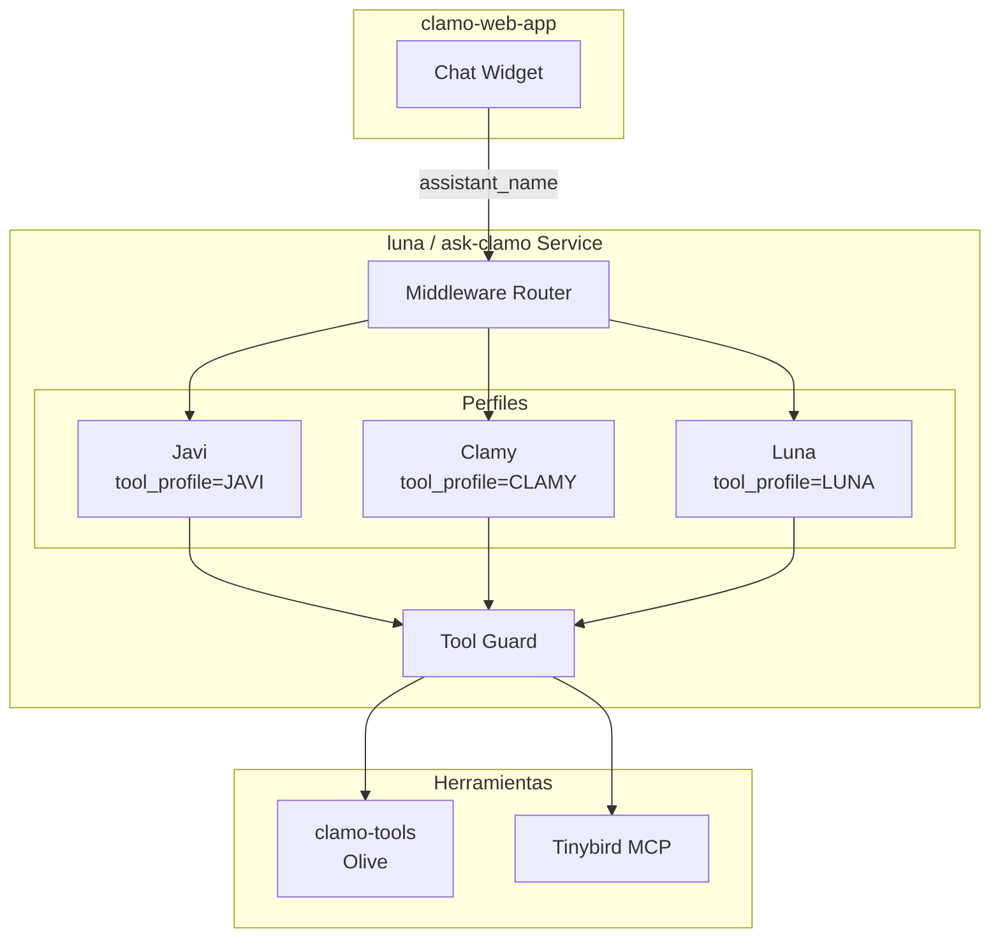

# ask-clamo (luna)

Asistente de IA unificado para Clamo. El código fuente está en el repositorio **luna** y el servicio desplegado se llama **ask-clamo**. Contiene tres **perfiles** (Javi, Clamy, Luna) que comparten el mismo despliegue LangGraph Platform con aislamiento de herramientas.

<Note>
**Arquitectura Unificada:** Javi, Clamy y Luna son perfiles (tool profiles) dentro de un único servicio. El frontend selecciona el perfil activo enviando `assistant_name` en el request.
</Note>

## Información General

| Propiedad | Valor |
|-----------|-------|
| **Repositorio** | `GetClamo/luna` |
| **Servicio Desplegado** | `ask-clamo` |
| **Lenguaje** | Python 3.13 |
| **Framework** | LangGraph Platform |
| **LLM** | Anthropic Claude |
| **Puerto** | 8000 |

## Arquitectura



## Características Principales

- **Despliegue Único**: Un grafo LangGraph, tres perfiles
- **Hilos Compartidos**: Javi, Clamy y Luna pueden ejecutarse en el mismo hilo, compartiendo historial de mensajes
- **Aislamiento de Herramientas**: Cada perfil solo ve sus herramientas designadas (middleware + guard)
- **Prompts Dinámicos**: Los prompts del sistema se seleccionan según `assistant_name` en el contexto
- **Integración MCP**: Clamy carga herramientas de analítica de Tinybird vía MCP
- **Integración Olive**: Luna accede a herramientas remotas vía clamo-tools

## Perfiles

### Javi (Asistente de Casos)

- **Propósito**: Ayudar a los usuarios a entender casos legales individuales (alcance de página)
- **Herramientas**: `get_case_details`, `get_case_progress`, `get_case_movements`, `get_case_milestones`
- **Contexto Requerido**: `case_id`, `company_id` (inyectados automáticamente desde el contexto de página)
- **Caso de Uso**: Incrustado en páginas de detalle de casos

### Clamy (Asistente de Analytics)

- **Propósito**: Generar gráficos y visualizaciones para análisis de cartera legal
- **Herramientas**: `show_chart`, `show_kpi`, `show_custom_chart`, `get_chart_template`, más herramientas MCP Tinybird
- **Contexto Requerido**: `company_id` (case_id opcional)
- **Caso de Uso**: Incrustado en páginas de analytics/dashboard

### Luna (Asistente Global)

- **Propósito**: Asistente generalista con acceso a TODOS los casos (sin alcance de página)
- **Herramientas**: `get_case_details_by_id`, `get_case_progress_by_id`, `search_cases`, `list_cases`, más herramientas de gráficos
- **Contexto Requerido**: `company_id` (case_id se pasa como argumento de herramienta)
- **Caso de Uso**: Widget de chat global, consultas cruzadas de casos, vista general de cartera

## Selección de Perfil

El frontend selecciona el perfil activo enviando `assistant_name` en el request:

```bash
curl -X POST http://localhost:8000/runs \
  -H "Content-Type: application/json" \
  -d '{
    "assistant_id": "luna",
    "thread_id": "thread_abc123",
    "input": {"messages": [{"role": "user", "content": "..."}]},
    "config": {
      "configurable": {
        "assistant_name": "javi",
        "case_id": "case_xyz789",
        "company_id": "cmp_abc123"
      }
    }
  }'
```

| Página | `assistant_name` | Contexto Adicional |
|--------|------------------|-------------------|
| Detalle de caso | `javi` | `case_id` |
| Analytics | `clamy` | - |
| Chat global | `luna` | - |

## Configuración

### Variables de Entorno

```bash
# LLM
ANTHROPIC_API_KEY=sk-ant-...

# APIs Backend
CASES_SERVICE_URL=http://localhost:4000
TENANT_SERVICE_URL=http://localhost:8001
CLAMO_TOOLS_URL=http://localhost:8080  # REQUERIDO

# Tinybird MCP
TINYBIRD_TOKEN=p.eyJ...
TINYBIRD_API_URL=https://api.tinybird.co

# LangSmith (Tracing)
LANGCHAIN_API_KEY=ls__...
LANGCHAIN_TRACING_V2=true
```

## Desarrollo Local

```bash
# Navegar al repo
cd luna

# Instalar dependencias
uv sync

# Ejecutar servidor (puerto 8000)
uv run langgraph dev --port 8000

# En otra terminal, ejecutar clamo-tools
cd clamo-tools
uv run uvicorn clamo_tools.app:app --port 8080 --reload

# Tests
uv run pytest
```

## Siguientes Pasos

<CardGroup cols={2}>
  <Card
    title="Arquitectura Detallada"
    icon="sitemap"
    href="/es/arquitectura/asistentes-ia"
  >
    Arquitectura completa de asistentes IA.
  </Card>
  <Card
    title="clamo-tools"
    icon="wrench"
    href="/es/servicios/clamo-tools"
  >
    Servidor de herramientas Olive.
  </Card>
</CardGroup>
