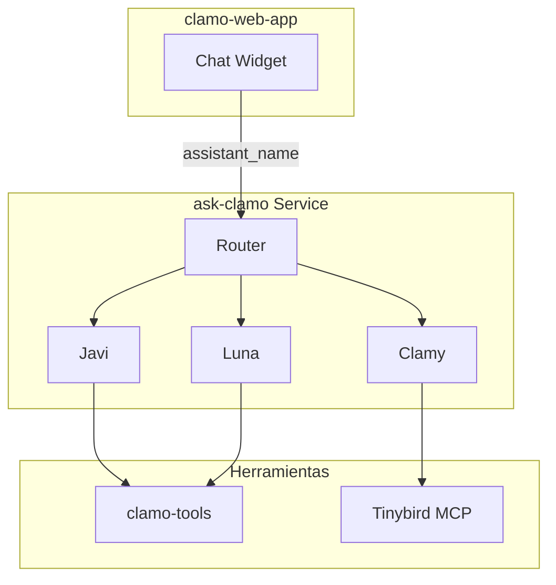

Asistente de IA unificado para Clamo. El código fuente está en el repositorio **luna**, desplegado como **ask-clamo**. Contiene tres perfiles (Javi, Clamy, Luna) que comparten el mismo despliegue LangGraph Platform con aislamiento de herramientas.

## Información General

| Propiedad | Valor |
|-----------|-------|
| **Repositorio** | `GetClamo/luna` |
| **Servicio Desplegado** | `ask-clamo` |
| **Lenguaje** | Python 3.13 |
| **Framework** | LangGraph Platform |
| **LLM** | Anthropic Claude |
| **Puerto** | 8000 |

## Arquitectura



## Perfiles

| Perfil | Propósito | Contexto |
|--------|-----------|----------|
| **Javi** | Asistente de casos (alcance de página) | `case_id`, `company_id` |
| **Clamy** | Asistente de analytics con gráficos | `company_id` |
| **Luna** | Asistente global (cross-case) | `company_id` |

## Configuración

### Variables de Entorno

```bash
# LLM
ANTHROPIC_API_KEY=sk-ant-...

# APIs Backend
CASES_SERVICE_URL=http://localhost:4000
CLAMO_TOOLS_URL=http://localhost:8080

# Tinybird MCP
TINYBIRD_TOKEN=p.eyJ...

# LangSmith (Tracing)
LANGCHAIN_API_KEY=ls__...
```

## Desarrollo Local

```bash
cd luna

# Instalar dependencias
uv sync

# Ejecutar servidor
uv run langgraph dev --port 8000

# Ejecutar clamo-tools (terminal separada)
cd clamo-tools && uv run uvicorn clamo_tools.app:app --port 8080
```

## Próximos Pasos

<CardGroup cols={2}>
  <Card
    title="clamo-dashboards"
    icon="chart-bar"
    href="/es/servicios/clamo-dashboards"
  >
    API de widgets de dashboard.
  </Card>
  <Card
    title="clamo-cases"
    icon="folder"
    href="/es/servicios/clamo-cases"
  >
    API de casos consumida por perfiles.
  </Card>
</CardGroup>
