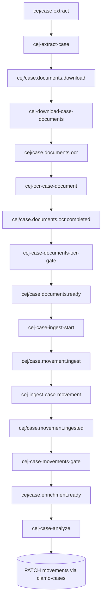

Servicio de extracción CEJ (Consulta de Expedientes Judiciales) con orquestación Inngest. Scrapea casos, descarga y procesa documentos con OCR, y ejecuta etapas de análisis con LLM.

## Información General

| Propiedad | Valor |
|-----------|-------|
| **Repositorio** | `GetClamo/clamo-cases-cej-extractor` |
| **Lenguaje** | Python 3.12 |
| **Framework** | FastAPI + Inngest |
| **Puerto** | 8003 |
| **Navegador** | Steel + Playwright |
| **OCR** | Llama Cloud |
| **LLM** | OpenRouter (Gemini, Claude) |

## Arquitectura



## Pasos del Pipeline

1. **Extract**: Scrapea CEJ usando Steel + Playwright
2. **Download**: Descarga documentos del caso
3. **OCR**: Procesa documentos con Llama Cloud
4. **Ingest**: Escribe caso + movimientos en clamo-cases
5. **Analyze**: Ejecuta etapas LLM (clasificación, enriquecimiento)
6. **Update**: PATCHea movimientos con campos generados por IA

## Iniciar una Ejecución

```json
{
  "name": "cej/case.extract",
  "data": {
    "company_id": "550e8400-e29b-41d4-a716-446655440000",
    "expediente": "04719-2017-0-1601-JP-LA-01",
    "force_refresh": true
  }
}
```

## Configuración

### Variables de Entorno

```bash
# API
PORT=8003

# clamo-cases SDK
CASES_SERVICE_URL=http://localhost:4000

# Steel (automatización de navegador)
STEEL_API_KEY=...

# Llama Cloud (OCR)
LLAMA_CLOUD_API_KEY=...

# OpenRouter (LLM)
OPENROUTER_API_KEY=...

# Inngest
INNGEST_DEV=1  # Para desarrollo local
```

## Desarrollo Local

```bash
# Instalar dependencias
make install

# Iniciar servidor Inngest dev (dashboard: http://localhost:8288)
make inngest-start

# Iniciar API (health: http://localhost:8003/health)
make dev

# Ejecutar tests
make test-unit
make test-integration
```

## Próximos Pasos

<CardGroup cols={2}>
  <Card
    title="clamo-cej-discovery"
    icon="magnifying-glass"
    href="/es/servicios/clamo-cej-discovery"
  >
    Servicio de descubrimiento masivo.
  </Card>
  <Card
    title="Entidad Case"
    icon="database"
    href="/es/entidades/case"
  >
    Documentación de la entidad Case.
  </Card>
</CardGroup>
