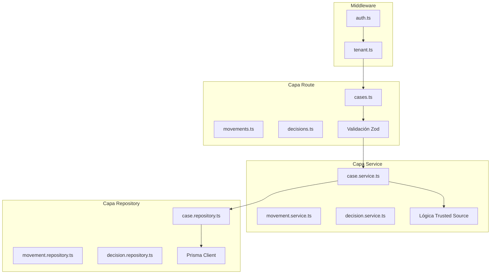

# clamo-cases

Servicio principal para la gestión de casos legales, movimientos procesales, decisiones y documentos asociados. Implementa el patrón **RRS (Repository-Route-Service)** y el modelo de **Trusted Sources** para datos multi-origen.

## Información General

| Propiedad | Valor |
|-----------|-------|
| **Repositorio** | `GetClamo/clamo-cases` |
| **Lenguaje** | TypeScript |
| **Framework** | Hono |
| **Puerto** | 4000 |
| **Base de Datos** | Neon PostgreSQL (multi-tenant) |
| **ORM** | Prisma (`@getclamo/database`) |

## Arquitectura RRS

El servicio sigue estrictamente el patrón **Repository-Route-Service**:



## Estructura de Directorios

```
clamo-cases/src/
├── routes/              # Capa Route - Solo validación Zod y respuesta JSON
│   ├── cases.ts
│   ├── movements.ts
│   ├── decisions.ts
│   ├── parties.ts
│   ├── ingest-runs.ts
│   └── stages.ts
├── services/            # Capa Service - Lógica de negocio y Trusted Source
│   ├── case.service.ts
│   ├── movement.service.ts
│   ├── decision.service.ts
│   └── ingest-run.service.ts
├── repositories/        # Capa Repository - Solo queries Prisma
│   ├── case.repository.ts
│   ├── movement.repository.ts
│   ├── decision.repository.ts
│   └── ingest-run.repository.ts
├── middleware/          # Auth y resolución de tenant
│   ├── auth.ts          # Parsea x-workos-* headers
│   └── tenant.ts        # Resuelve conexión de tenant
├── mappers/             # Transformación de datos
├── schemas/             # Schemas Zod
└── clients/sdk/         # SDK de Tenant para llamadas internas
```

## Autenticación

El servicio usa headers `x-workos-*` inyectados por Kong después de validar el JWT:

```typescript
// middleware/auth.ts
const userId = headers.get("x-workos-user-id");
const orgId = headers.get("x-workos-org-id");
const role = headers.get("x-workos-role") ?? "member";
const permissionsHeader = headers.get("x-workos-permissions");
```

<Note>
**En desarrollo local:** Sin Kong, debes pasar estos headers manualmente en tus requests.
</Note>

## Modelo de Datos con Trusted Sources

Los campos críticos usan el patrón **SourcedValue** (JSONB) para rastrear el origen de los datos:

```typescript
// Estructura SourcedValue en la base de datos
interface SourcedValue<T> {
  cej: T | null;      // Valor del scraper CEJ
  ai: T | null;       // Valor normalizado por IA
  manual: T | null;   // Valor corregido por humano
  updatedAt?: {
    cej?: string;
    ai?: string;
    manual?: string;
  };
}

// Campos que usan SourcedValue en Case
interface Case {
  id: string;
  caseNumber: string;
  companyId: string;
  filingDate: Date | null;
  
  // SourcedValue fields (JSONB)
  subjectMatter: SourcedValue<string[]>;  // Materias
  processType: SourcedValue<string>;      // Tipo de proceso
  stage: SourcedValue<string>;            // Etapa
  abstract: SourcedValue<string>;         // Sumilla
  observation: SourcedValue<string>;
  conclusionReason: SourcedValue<string>;
  
  // CEJ-sourced fields (string directo)
  cejJudicialDistrict: string | null;
  court: string | null;
  judge: string | null;
  // ...
}
```

### Resolución de Valor

```typescript
// services/case.service.ts
function resolveValue<T>(sourced: SourcedValue<T>): T | null {
  // Prioridad: manual > ai > cej
  return sourced.manual ?? sourced.ai ?? sourced.cej ?? null;
}
```

## Endpoints Principales

### Casos

| Método | Endpoint | Descripción |
|--------|----------|-------------|
| GET | `/v1/cases` | Listar casos con filtros |
| GET | `/v1/cases/:id` | Obtener detalle de caso |
| PATCH | `/v1/cases/:id` | Actualizar caso |

### Movimientos

| Método | Endpoint | Descripción |
|--------|----------|-------------|
| GET | `/v1/cases/:caseId/movements` | Listar movimientos |
| GET | `/v1/cases/:caseId/movements/:id` | Obtener movimiento |

### Decisiones

| Método | Endpoint | Descripción |
|--------|----------|-------------|
| GET | `/v1/cases/:caseId/decisions` | Listar decisiones |
| GET | `/v1/decisions/:id` | Obtener decisión |

### Ingest Runs

| Método | Endpoint | Descripción |
|--------|----------|-------------|
| GET | `/v1/cases/:caseId/ingest-runs` | Listar runs de ingesta |
| GET | `/v1/ingest-runs/:id` | Obtener estado de run |

### Endpoints Internos

<Warning>
**Solo para servicio-a-servicio.** No expuestos públicamente.
</Warning>

| Método | Endpoint | Descripción |
|--------|----------|-------------|
| GET | `/internal/v1/companies/:companyId/cases` | Listar casos (interno) |
| POST | `/internal/v1/companies/:companyId/cases` | Crear caso (ingesta) |
| PATCH | `/internal/v1/companies/:companyId/cases/:id` | Actualizar caso (ingesta) |

## Ejemplo de Flujo RRS

### Route (Solo validación)

```typescript
// routes/cases.ts
app.patch(
  "/:id",
  zValidator("json", UpdateCaseSchema),
  async (c) => {
    const id = c.req.param("id");
    const data = c.req.valid("json");
    const tenantDb = c.get("tenantDb");

    // Delegar TODO al servicio
    const result = await caseService.updateCase(tenantDb, id, data);

    return c.json(result);
  }
);
```

### Service (Lógica de negocio)

```typescript
// services/case.service.ts
async updateCase(
  tenantDb: PrismaClient,
  id: string,
  data: UpdateCaseInput
): Promise<Case> {
  const existing = await this.caseRepo.findById(tenantDb, id);

  if (!existing) {
    throw new NotFoundError("Case not found");
  }

  // Lógica de Trusted Source
  const updateData: Partial<CaseUpdateData> = {};

  if (data.subjectMatter !== undefined) {
    const current = existing.subjectMatter as SourcedValue;
    
    // Solo actualizar si es corrección manual
    updateData.subjectMatter = {
      ...current,
      manual: data.subjectMatter,
      updatedAt: {
        ...current.updatedAt,
        manual: new Date().toISOString(),
      },
    };
  }

  return this.caseRepo.update(tenantDb, id, updateData);
}
```

### Repository (Solo Prisma)

```typescript
// repositories/case.repository.ts
async update(
  db: PrismaClient,
  id: string,
  data: Partial<CaseUpdateData>
): Promise<Case> {
  return db.case.update({
    where: { id },
    data,
  });
}
```

## Configuración

### Variables de Entorno

```bash
# Servidor
PORT=4000

# Base de datos de control (para resolver tenant)
CONTROL_DATABASE_URL=postgresql://...

# Supabase (para Vault)
SUPABASE_URL=https://...
SUPABASE_SERVICE_KEY=...

# Tenant SDK (para llamadas internas)
TENANT_SERVICE_URL=http://localhost:4001

# S3 (documentos)
S3_ENDPOINT=http://localhost:9000
S3_ACCESS_KEY=...
S3_SECRET_KEY=...
S3_BUCKET=clamo-attachments

# Observabilidad
OTEL_EXPORTER_OTLP_ENDPOINT=http://localhost:4318
```

## SDK

Este servicio publica un SDK de TypeScript:

```bash
pnpm add @getclamo/cases
```

```typescript
import Cases from "@getclamo/cases";

const cases = new Cases({ baseURL: process.env.CASES_SERVICE_URL });

// Listar casos
const result = await cases.list({
  status: "EN_TRAMITE",
  page: 1,
  limit: 20,
});

// Obtener caso
const caseDetail = await cases.get("case_abc123");

// Endpoints internos (servicio-a-servicio)
const internalCases = await cases.internal
  .companies(companyId)
  .cases.list();
```

## Desarrollo Local

```bash
# Instalar dependencias
pnpm install

# Ejecutar en modo desarrollo
pnpm dev

# Build
pnpm build

# Tests
pnpm test
```

## Próximos Pasos

<CardGroup cols={2}>
  <Card
    title="Patrón RRS"
    icon="layer-group"
    href="/es/arquitectura/patron-rrs"
  >
    Documentación detallada del patrón.
  </Card>
  <Card
    title="Modelo de Datos"
    icon="database"
    href="/es/arquitectura/modelo-datos"
  >
    Patrón SourcedValue completo.
  </Card>
</CardGroup>
