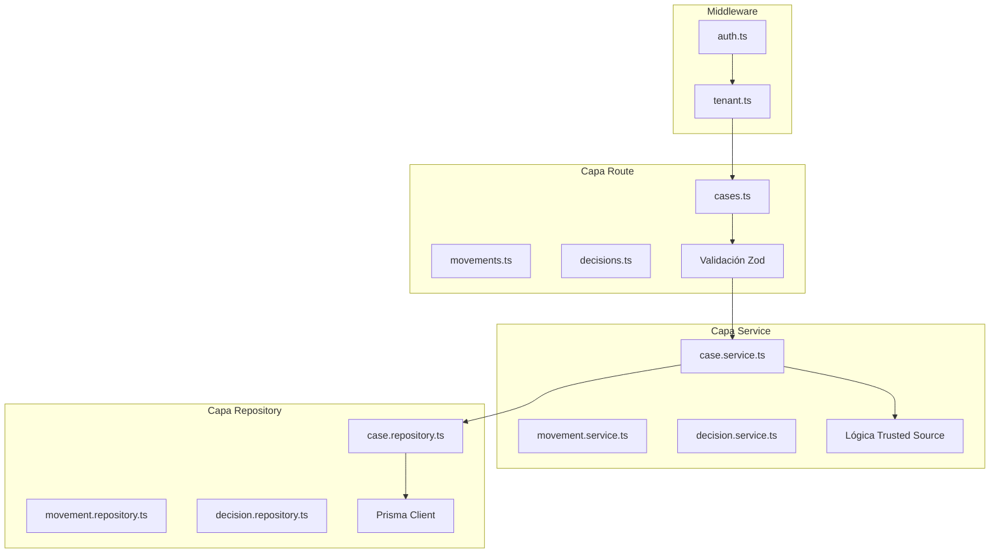

Servicio principal para la gestión de casos legales, movimientos procesales, decisiones y documentos asociados. Implementa el patrón **RRS (Repository-Route-Service)** y el modelo de **Trusted Sources** para datos multi-origen.

## Información General

| Propiedad | Valor |
|-----------|-------|
| **Repositorio** | `GetClamo/clamo-cases` |
| **Lenguaje** | TypeScript |
| **Framework** | Hono |
| **Puerto** | 4000 |
| **Base de Datos** | Neon PostgreSQL (multi-tenant) |
| **ORM** | Prisma (`@getclamo/database`) |

## Arquitectura

El servicio sigue estrictamente el patrón **Repository-Route-Service**:



## Autenticación

El servicio usa headers `x-workos-*` inyectados por Kong después de validar el JWT:

```typescript
// middleware/auth.ts
const userId = headers.get("x-workos-user-id");
const orgId = headers.get("x-workos-org-id");
const role = headers.get("x-workos-role") ?? "member";
const permissionsHeader = headers.get("x-workos-permissions");
```

<Note>
**En desarrollo local:** Sin Kong, debes pasar estos headers manualmente en tus requests.
</Note>

## Modelo de Datos

<Info>
Para la documentación completa de entidades incluyendo Case, Movement, Decision y todas las entidades relacionadas, consulta la sección de [Entidades](/es/entidades/case).
</Info>

<Info>
El patrón SourcedValue (Trusted Sources) se usa para datos multi-origen. Los campos pueden tener valores de CEJ, AI y manual con prioridad: manual > ai > cej.
</Info>

## Endpoints de API

<Info>
Para la documentación interactiva completa de la API, consulta la [Referencia de API de Cases](/api-reference/cases).
</Info>

## Configuración

### Variables de Entorno

```bash
# Servidor
PORT=4000

# Base de datos de control (para resolver tenant)
CONTROL_DATABASE_URL=postgresql://...

# Supabase (para Vault)
SUPABASE_URL=https://...
SUPABASE_SERVICE_KEY=...

# Tenant SDK (para llamadas internas)
TENANT_SERVICE_URL=http://localhost:4001

# S3 (documentos)
S3_ENDPOINT=http://localhost:9000
S3_ACCESS_KEY=...
S3_SECRET_KEY=...
S3_BUCKET=clamo-attachments

# Observabilidad
OTEL_EXPORTER_OTLP_ENDPOINT=http://localhost:4318
```

## SDKs

Este servicio publica SDKs tipados generados desde la especificación OpenAPI usando [Stainless](https://stainless.com) (TypeScript/Python) y OpenAPI Generator (Rust).

| SDK | Paquete | Repositorio |
|-----|---------|-------------|
| TypeScript | `@getclamo/cases` | [GetClamo/clamo-cases-sdk-ts](https://github.com/GetClamo/clamo-cases-sdk-ts) |
| Python | `getclamo-cases` | [GetClamo/clamo-cases-sdk-py](https://github.com/GetClamo/clamo-cases-sdk-py) |
| Rust | `clamo-cases-sdk` | [GetClamo/clamo-cases-sdk-rust](https://github.com/GetClamo/clamo-cases-sdk-rust) |

### Instalacion

<CodeGroup>
```bash TypeScript
pnpm add @getclamo/cases
# o
npm install @getclamo/cases
```

```bash Python
pip install getclamo-cases
```

```bash Rust
cargo add clamo-cases-sdk
```
</CodeGroup>

### Uso

<Tabs>
<Tab title="TypeScript">
```typescript
import Cases from "@getclamo/cases";

const cases = new Cases({ baseURL: process.env.CASES_SERVICE_URL });

// Listar casos
const result = await cases.list({
  status: "EN_TRAMITE",
  page: 1,
  limit: 20,
});

// Obtener caso
const caseDetail = await cases.get("case_abc123");

// Endpoints internos (servicio-a-servicio)
const internalCases = await cases.internal
  .companies(companyId)
  .cases.list();
```
</Tab>
<Tab title="Python">
```python
from getclamo_cases import Cases

cases = Cases(base_url=os.environ["CASES_SERVICE_URL"])

# Listar casos
result = cases.list(status="EN_TRAMITE", page=1, limit=20)

# Obtener caso
case_detail = cases.get("case_abc123")

# Endpoints internos (servicio-a-servicio)
internal_cases = cases.internal.companies(company_id).cases.list()
```
</Tab>
<Tab title="Rust">
```rust
use clamo_cases_sdk::Client;

let cases = Client::new(std::env::var("CASES_SERVICE_URL")?);

// Listar casos
let result = cases.list()
    .status("EN_TRAMITE")
    .page(1)
    .limit(20)
    .send()
    .await?;

// Obtener caso
let case_detail = cases.get("case_abc123").send().await?;
```
</Tab>
</Tabs>

## Desarrollo Local

```bash
# Instalar dependencias
pnpm install

# Ejecutar en modo desarrollo
pnpm dev

# Build
pnpm build

# Tests
pnpm test
```

## Próximos Pasos

<CardGroup cols={2}>
  <Card
    title="Entidad Case"
    icon="database"
    href="/es/entidades/case"
  >
    Entidad Case con campos SourcedValue.
  </Card>
  <Card
    title="Mejores Prácticas"
    icon="lightbulb"
    href="/es/guias/mejores-practicas"
  >
    Guía de mejores prácticas para desarrolladores.
  </Card>
</CardGroup>
