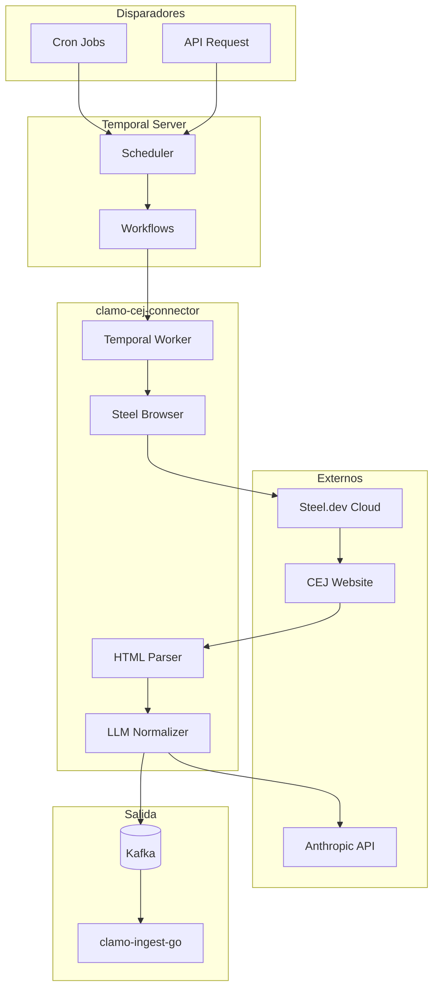

# clamo-cej-connector

Servicio Python que automatiza la extracción de datos de expedientes judiciales desde el CEJ (Centro de Justicia Electrónico) del Poder Judicial peruano. Usa **Temporal** para orquestación y **Steel.dev** para automatización de navegador.

## Información General

| Propiedad | Valor |
|-----------|-------|
| **Repositorio** | `GetClamo/clamo-cej-connector` |
| **Lenguaje** | Python 3.11 |
| **Orquestación** | Temporal |
| **Navegador** | Steel.dev + Playwright |
| **LLM** | Anthropic Claude |
| **Salida** | Kafka → clamo-ingest-go |

## Arquitectura



## Flujo de Extracción

1. **Trigger**: Cron job o request manual inicia workflow
2. **Browser Session**: Crea sesión en Steel.dev con proxy peruano
3. **Navegación**: Busca expediente en CEJ
4. **Parsing**: Extrae HTML de movimientos
5. **Normalización**: Claude normaliza datos crudos
6. **Publicación**: Envía a Kafka topic `cej.case.ready`

## Workflows

### ExtractCaseWorkflow

Workflow principal para extraer un caso específico:

```python
@workflow.defn
class ExtractCaseWorkflow:
    @workflow.run
    async def run(self, input: ExtractInput) -> ExtractResult:
        # 1. Crear sesión de browser
        session = await workflow.execute_activity(
            create_browser_session,
            start_to_close_timeout=timedelta(minutes=2),
            retry_policy=RetryPolicy(maximum_attempts=3),
        )
        
        try:
            # 2. Navegar y extraer
            raw_data = await workflow.execute_activity(
                extract_case_html,
                args=[session, input.expediente],
                start_to_close_timeout=timedelta(minutes=5),
            )
            
            # 3. Normalizar con LLM
            normalized = await workflow.execute_activity(
                normalize_case_data,
                args=[raw_data],
                start_to_close_timeout=timedelta(minutes=3),
            )
            
            # 4. Publicar a Kafka
            await workflow.execute_activity(
                publish_to_kafka,
                args=[input.company_id, normalized],
                start_to_close_timeout=timedelta(minutes=1),
            )
            
            return ExtractResult(success=True)
            
        finally:
            await workflow.execute_activity(
                close_browser_session,
                args=[session],
            )
```

### RefreshCasesWorkflow

Workflow para actualizar casos existentes de una empresa:

```python
@workflow.defn
class RefreshCasesWorkflow:
    @workflow.run
    async def run(self, input: RefreshInput) -> RefreshResult:
        # Obtener casos a actualizar
        cases = await workflow.execute_activity(
            get_cases_to_refresh,
            args=[input.company_id],
        )
        
        results = []
        for case in cases:
            # Ejecutar extracción como child workflow
            result = await workflow.execute_child_workflow(
                ExtractCaseWorkflow.run,
                ExtractInput(
                    company_id=input.company_id,
                    expediente=case.expediente,
                ),
            )
            results.append(result)
        
        return RefreshResult(
            total=len(cases),
            success=sum(1 for r in results if r.success),
        )
```

## Actividades

### Browser Control

```python
@activity.defn
async def create_browser_session() -> BrowserSession:
    """Crea sesión de browser en Steel.dev."""
    steel = SteelClient(api_key=os.environ["STEEL_API_KEY"])
    
    session = await steel.create_session(
        browser_type="chromium",
        proxy={
            "type": "residential",
            "country": "PE",  # Proxy peruano requerido
        },
    )
    
    return BrowserSession(
        session_id=session.id,
        ws_endpoint=session.ws_endpoint,
    )

@activity.defn
async def extract_case_html(
    session: BrowserSession,
    expediente: str,
) -> RawCaseData:
    """Extrae HTML del caso desde CEJ."""
    async with async_playwright() as p:
        browser = await p.chromium.connect_over_cdp(session.ws_endpoint)
        page = await browser.new_page()
        
        # Navegar al CEJ
        await page.goto("https://cej.pj.gob.pe/cej/forms/busquedaform.html")
        
        # Buscar por expediente
        await page.fill("#txtExpediente", expediente)
        await page.click("#btnBuscar")
        await page.wait_for_selector(".resultado-busqueda")
        
        # Extraer HTML de movimientos
        movements_html = await page.inner_html("#tablaMovimientos")
        
        return RawCaseData(
            expediente=expediente,
            html=movements_html,
            extracted_at=datetime.utcnow(),
        )
```

### Normalización LLM

```python
@activity.defn
async def normalize_case_data(raw: RawCaseData) -> NormalizedCase:
    """Normaliza datos usando Claude."""
    anthropic = Anthropic()
    
    response = await anthropic.messages.create(
        model="claude-3-haiku-20240307",
        max_tokens=4000,
        messages=[{
            "role": "user",
            "content": f"""
            Extrae y normaliza los movimientos del siguiente HTML de un caso judicial peruano.
            
            HTML:
            {raw.html}
            
            Responde en JSON con este formato:
            {{
                "movements": [
                    {{
                        "stablePosition": 1,
                        "cejEventDate": "YYYY-MM-DD",
                        "cejActo": "tipo de acto",
                        "cejResolution": "número de resolución",
                        "cejDescription": "descripción original",
                        "summary": "resumen en una oración"
                    }}
                ]
            }}
            """
        }],
    )
    
    data = json.loads(response.content[0].text)
    return NormalizedCase(
        expediente=raw.expediente,
        movements=data["movements"],
    )
```

## Configuración

### Variables de Entorno

```bash
# Steel.dev (Browser automation)
STEEL_API_KEY=...

# Temporal
TEMPORAL_ADDRESS=localhost:7233
TEMPORAL_NAMESPACE=clamo-cej

# Anthropic
ANTHROPIC_API_KEY=sk-ant-...

# Kafka
KAFKA_BROKERS=localhost:9092
KAFKA_TOPIC=cej.case.ready

# Tenant SDK (para obtener casos)
TENANT_SERVICE_URL=http://localhost:4001
CASES_SERVICE_URL=http://localhost:4000
```

### Docker Compose

```yaml
version: '3.8'
services:
  cej-connector-worker:
    build: .
    environment:
      - STEEL_API_KEY=${STEEL_API_KEY}
      - TEMPORAL_ADDRESS=temporal:7233
      - ANTHROPIC_API_KEY=${ANTHROPIC_API_KEY}
      - KAFKA_BROKERS=kafka:9092
    depends_on:
      - temporal
      - kafka

  temporal:
    image: temporalio/auto-setup:latest
    ports:
      - "7233:7233"
      - "8233:8233"  # Temporal UI

  kafka:
    image: bitnami/kafka:latest
    ports:
      - "9092:9092"
```

<Note>
**Temporal UI:** Disponible en http://localhost:8233 cuando ejecutas con Docker Compose.
</Note>

## Manejo de Errores

| Error | Causa | Manejo |
|-------|-------|--------|
| `CaptchaDetected` | CEJ muestra captcha | Reintentar con nuevo proxy |
| `SessionExpired` | Sesión de browser expiró | Crear nueva sesión |
| `RateLimited` | Demasiadas solicitudes | Backoff exponencial |
| `ParseError` | HTML inesperado | Log para revisión manual |

### Política de Reintentos

```python
retry_policy = RetryPolicy(
    initial_interval=timedelta(seconds=10),
    maximum_interval=timedelta(minutes=10),
    backoff_coefficient=2.0,
    maximum_attempts=5,
    non_retryable_error_types=[
        "InvalidExpedienteError",
        "CompanyNotFoundError",
    ],
)
```

## Desarrollo Local

```bash
# Instalar dependencias
uv sync

# Iniciar Temporal (requiere Docker)
docker-compose up -d temporal

# Ejecutar worker
python -m clamo_cej_connector.worker

# Ejecutar workflow manualmente
python -m clamo_cej_connector.cli extract --expediente "00001-2024-0-1234-JR-LA-01"
```

## Próximos Pasos

<CardGroup cols={2}>
  <Card
    title="clamo-ingest-go"
    icon="database"
    href="/es/servicios/clamo-ingest-go"
  >
    Worker que consume de Kafka e inserta en tenant DBs.
  </Card>
  <Card
    title="clamo-cej-discovery"
    icon="magnifying-glass"
    href="/es/servicios/clamo-cej-discovery"
  >
    Búsqueda masiva de expedientes.
  </Card>
</CardGroup>
