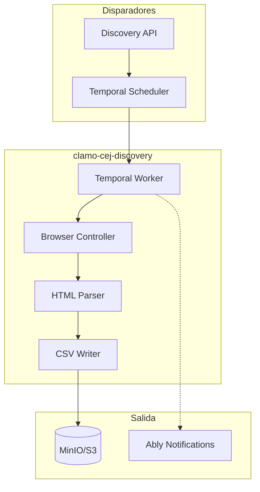

Servicio de descubrimiento y búsqueda masiva de expedientes en el CEJ. Automatiza la búsqueda por correlativos y almacena resultados en CSV.

## Información General

| Propiedad | Valor |
|-----------|-------|
| **Repositorio** | `GetClamo/clamo-cej-discovery` |
| **Lenguaje** | Python 3.11 |
| **Orquestación** | Temporal |
| **Navegador** | Playwright + Steel.dev |
| **Almacenamiento** | MinIO/S3 (CSV) |

## Diferencia con clamo-cases-cej-extractor

| Aspecto | clamo-cases-cej-extractor | clamo-cej-discovery |
|---------|---------------------------|---------------------|
| **Propósito** | Extrae detalles de casos conocidos | Descubre nuevos casos por correlativo |
| **Entrada** | Expediente específico | Rango de correlativos (1-99999) |
| **Salida** | Kafka → Base de datos | CSV en MinIO |
| **Uso** | Monitoreo continuo | Búsqueda inicial masiva |

## Arquitectura



## Características

- **Búsqueda por correlativos**: Busca expedientes del 1 al 99999
- **Modo local y stealth**: Playwright para desarrollo, Steel.dev para producción
- **Detención inteligente**: Se detiene cuando la tasa de "no encontrado" es alta
- **CSV incremental**: Guarda resultados progresivamente

## Configuración

### Variables de Entorno

```bash
# Steel.dev (modo stealth)
STEEL_API_KEY=...

# Temporal
TEMPORAL_HOST=localhost:7233
TEMPORAL_NAMESPACE=default

# MinIO/S3
ARTIFACT_STORE_S3_ENDPOINT=http://localhost:9000
ARTIFACT_STORE_S3_ACCESS_KEY=minioadmin
ARTIFACT_STORE_S3_SECRET_KEY=minioadmin
BULK_SEARCH_CSV_BUCKET=cej-bulk-search

# Ably (notificaciones)
ABLY_API_KEY=...
```

## Desarrollo Local

```bash
# Instalar dependencias
uv sync

# Instalar Playwright
uv run playwright install chromium

# Ejecutar tests
make test-browser
make test-parser
```

## Próximos Pasos

<CardGroup cols={2}>
  <Card
    title="clamo-cases-cej-extractor"
    icon="plug"
    href="/es/servicios/clamo-cases-cej-extractor"
  >
    Extracción detallada de casos conocidos.
  </Card>
  <Card
    title="Entidad Case"
    icon="database"
    href="/es/entidades/case"
  >
    Documentación de la entidad Case.
  </Card>
</CardGroup>
