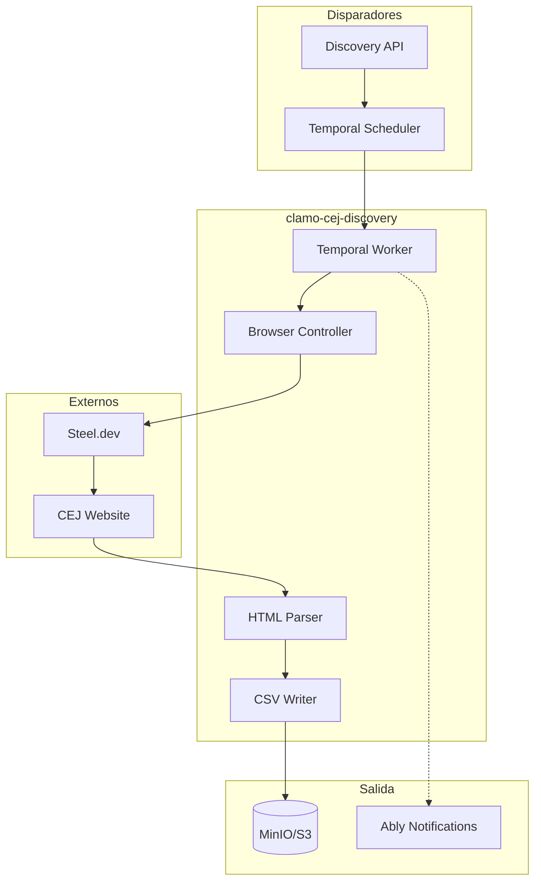

# clamo-cej-discovery

Servicio de descubrimiento y búsqueda masiva de expedientes en el CEJ. Automatiza la búsqueda por correlativos y almacena resultados en CSV para análisis posterior.

## Información General

| Propiedad | Valor |
|-----------|-------|
| **Repositorio** | `GetClamo/clamo-cej-discovery` |
| **Lenguaje** | Python 3.11 |
| **Orquestación** | Temporal |
| **Navegador** | Playwright + Steel.dev |
| **Almacenamiento** | MinIO/S3 (CSV) |

## Diferencia con clamo-cej-connector

| Aspecto | clamo-cej-connector | clamo-cej-discovery |
|---------|---------------------|---------------------|
| **Propósito** | Extrae detalles de casos conocidos | Descubre nuevos casos por correlativo |
| **Entrada** | Expediente específico | Rango de correlativos (1-99999) |
| **Salida** | Kafka → Base de datos | CSV en MinIO |
| **Uso** | Monitoreo continuo | Búsqueda inicial masiva |

## Arquitectura



## Características

- **Búsqueda por correlativos**: Busca expedientes del 1 al 99999
- **Modo local y stealth**: Playwright para desarrollo, Steel.dev para producción
- **Procesamiento por bloques**: Divide el trabajo en bloques configurables
- **Detención inteligente**: Se detiene cuando la tasa de "no encontrado" es alta
- **CSV incremental**: Guarda resultados progresivamente
- **Notificaciones Ably**: Alerta cuando se encuentra un caso

## Workflows

### BulkSearchWorkflow

```python
@workflow.defn
class BulkSearchWorkflow:
    @workflow.run
    async def run(self, input: BulkSearchInput) -> BulkSearchResult:
        # 1. Dividir rango en bloques
        blocks = create_blocks(
            start=input.start_correlativo,
            end=input.end_correlativo,
            block_size=input.block_size,
        )
        
        results = []
        not_found_count = 0
        
        for block in blocks:
            # 2. Procesar bloque
            block_result = await workflow.execute_activity(
                search_correlativo_block,
                args=[input.search_params, block],
                start_to_close_timeout=timedelta(minutes=30),
            )
            
            results.extend(block_result.cases)
            not_found_count += block_result.not_found_count
            
            # 3. Guardar CSV incremental
            await workflow.execute_activity(
                save_csv_incremental,
                args=[input.empresa, block_result.cases],
            )
            
            # 4. Verificar tasa de "no encontrado"
            if should_stop_early(not_found_count, len(results)):
                break
        
        return BulkSearchResult(
            total_found=len(results),
            csv_path=f"{input.empresa}/{input.distrito}/{input.anio}.csv",
        )
```

## Estructura del CSV

Los CSV se almacenan en MinIO con la estructura:

```
{empresa}/{instancia}/{especialidad}/{año}/{distrito}.csv
```

| Propiedad | Valor |
|-----------|-------|
| Separador | `\|` (pipe) |
| Encoding | `latin9` |
| Header | Sin header |
| Columnas | 25 |

## Configuración

### Variables de Entorno

```bash
# Steel.dev (modo stealth)
STEEL_API_KEY=...

# Temporal
TEMPORAL_HOST=localhost:7233
TEMPORAL_NAMESPACE=default

# MinIO/S3
ARTIFACT_STORE_S3_ENDPOINT=http://localhost:9000
ARTIFACT_STORE_S3_ACCESS_KEY=minioadmin
ARTIFACT_STORE_S3_SECRET_KEY=minioadmin
BULK_SEARCH_CSV_BUCKET=cej-bulk-search

# Ably (notificaciones)
ABLY_API_KEY=...
```

## Uso

### Iniciar Búsqueda Masiva

```bash
# Iniciar servicios
docker compose -f docker-compose.dev.yml up -d

# Ejecutar búsqueda
uv run python scripts/start_bulk_search.py \
    "EmpresaTest" \
    "LIMA" \
    "Sala Superior" \
    "Laboral" \
    "2025" \
    "" \
    "local" \
    1 \
    100 \
    10
```

| Parámetro | Descripción |
|-----------|-------------|
| `empresa` | Nombre de la empresa |
| `distrito` | Distrito judicial |
| `instancia` | Instancia (ej: "Sala Superior") |
| `especialidad` | Especialidad (ej: "Laboral") |
| `anio` | Año |
| `parte` | Nombre de parte (opcional) |
| `mode` | "local" o "stealth" |
| `start` | Correlativo inicial |
| `end` | Correlativo final |
| `block_size` | Tamaño de bloque |

## Detención Inteligente

El workflow se detiene automáticamente cuando:
- La tasa de "no encontrado" supera el 95% en los últimos 100 correlativos
- Se alcanza el límite de errores consecutivos

## Desarrollo Local

```bash
# Instalar dependencias
uv sync

# Instalar Playwright
uv run playwright install chromium

# Ejecutar tests
make test-browser
make test-parser

# Todos los tests
make check-all
```

## Próximos Pasos

<CardGroup cols={2}>
  <Card
    title="clamo-cej-connector"
    icon="plug"
    href="/es/servicios/clamo-cej-connector"
  >
    Extracción detallada de casos conocidos.
  </Card>
  <Card
    title="Pipeline de Ingesta"
    icon="database"
    href="/es/guias/debugging-ingesta"
  >
    Flujo completo de datos.
  </Card>
</CardGroup>
