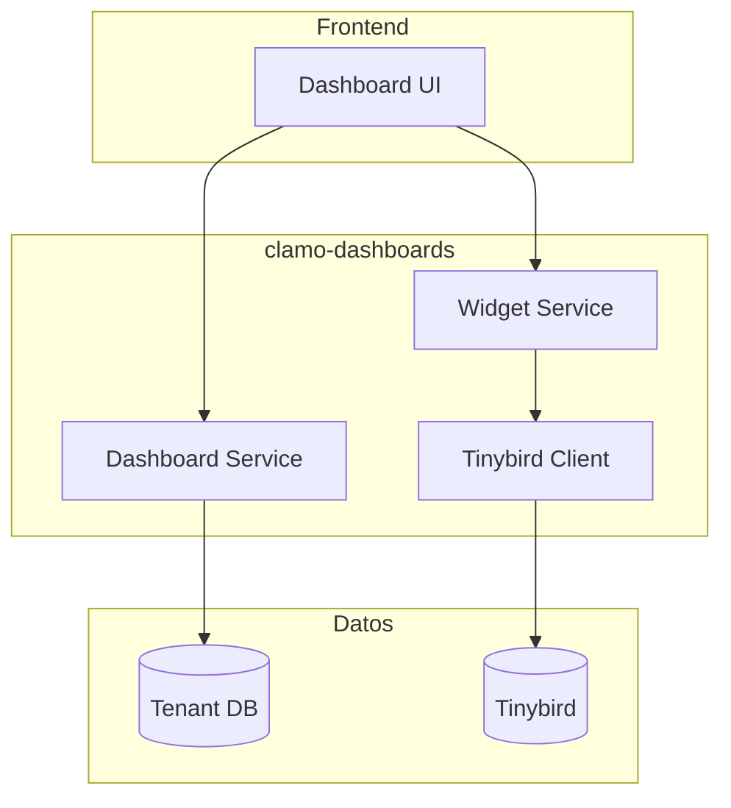

API en Rust para gestión de dashboards personalizables y widgets de analytics. Consume datos de Tinybird para visualizaciones en tiempo real.

## Información General

| Propiedad | Valor |
|-----------|-------|
| **Repositorio** | `GetClamo/clamo-dashboards` |
| **Lenguaje** | Rust |
| **Framework** | Axum |
| **Puerto** | 8020 |
| **Datos** | Tinybird |

## Arquitectura



## Tipos de Widget

- **Counter**: Valor único (ej: "Casos Activos")
- **Chart**: Gráficos de línea, barra, pie
- **Table**: Datos tabulares
- **List**: Lista de items con templates

## Configuración

### Variables de Entorno

```bash
# Server
PORT=8020

# Tinybird
TINYBIRD_TOKEN=p.eyJ...
TINYBIRD_API_URL=https://api.tinybird.co

# Database (para config de dashboards)
DATABASE_URL=postgresql://...
```

## Desarrollo Local

```bash
# Compilar
cargo build

# Ejecutar
cargo run

# Tests
cargo test
```

## Próximos Pasos

<CardGroup cols={2}>
  <Card
    title="clamo-sync"
    icon="sync"
    href="/es/servicios/clamo-sync"
  >
    Sincronización de datos a Tinybird.
  </Card>
  <Card
    title="ask-clamo"
    icon="robot"
    href="/es/servicios/ask-clamo"
  >
    Perfil Clamy para analytics con IA.
  </Card>
</CardGroup>
