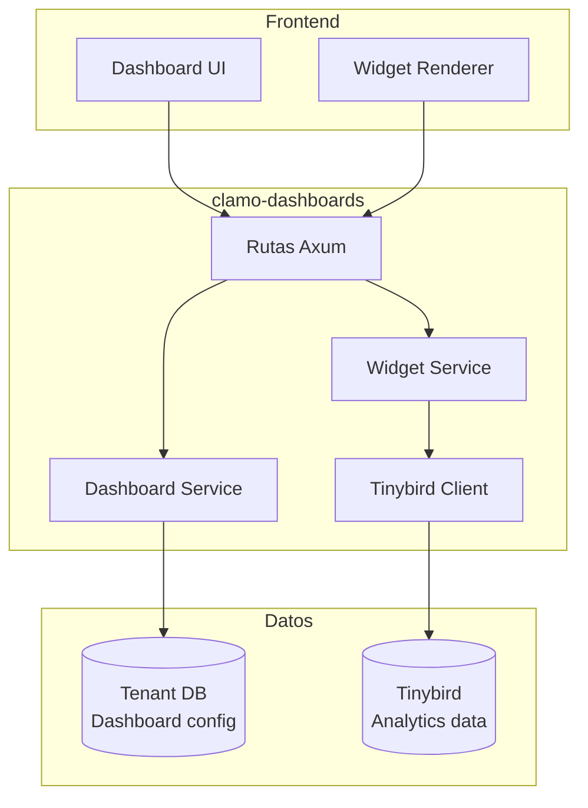

# clamo-dashboards

API en Rust para gestión de dashboards personalizables y widgets de analytics. Consume datos de **Tinybird** para visualizaciones en tiempo real.

## Información General

| Propiedad | Valor |
|-----------|-------|
| **Repositorio** | `GetClamo/clamo-dashboards` |
| **Lenguaje** | Rust |
| **Framework** | Axum |
| **Puerto** | 8020 |
| **Datos** | Tinybird |

## Arquitectura



## Modelo de Datos

### Dashboard

```rust
#[derive(Debug, Serialize, Deserialize)]
pub struct Dashboard {
    pub id: String,
    pub company_id: String,
    pub name: String,
    pub description: Option<String>,
    pub config: DashboardConfig,
    pub is_default: bool,
    pub created_at: DateTime<Utc>,
    pub updated_at: DateTime<Utc>,
}

#[derive(Debug, Serialize, Deserialize)]
pub struct DashboardConfig {
    pub layout: Vec<WidgetPlacement>,
}

#[derive(Debug, Serialize, Deserialize)]
pub struct WidgetPlacement {
    pub widget_type: WidgetType,
    pub title: String,
    pub data_source: String,  // Tinybird pipe name
    pub filters: HashMap<String, String>,
    pub col_span: u8,
    pub row_span: u8,
}
```

### Widget Types

```rust
#[derive(Debug, Serialize, Deserialize)]
#[serde(tag = "type")]
pub enum WidgetType {
    Counter {
        value_field: String,
        format: String,
    },
    Chart {
        chart_type: String,  // line, bar, pie
        x_axis: String,
        y_axis: String,
    },
    Table {
        columns: Vec<String>,
    },
    List {
        item_template: String,
    },
}
```

## API Endpoints

### Dashboards

| Método | Endpoint | Descripción |
|--------|----------|-------------|
| GET | `/dashboards` | Listar dashboards |
| GET | `/dashboards/:id` | Obtener dashboard |
| POST | `/dashboards` | Crear dashboard |
| PATCH | `/dashboards/:id` | Actualizar dashboard |
| DELETE | `/dashboards/:id` | Eliminar dashboard |

### Widget Data

| Método | Endpoint | Descripción |
|--------|----------|-------------|
| GET | `/widgets/:id/data` | Obtener datos del widget |
| POST | `/widgets/query` | Query personalizado |

## Cliente Tinybird

```rust
pub struct TinybirdClient {
    client: reqwest::Client,
    token: String,
    base_url: String,
}

impl TinybirdClient {
    pub async fn query(
        &self,
        pipe: &str,
        params: &HashMap<String, String>,
    ) -> Result<serde_json::Value, Error> {
        let url = format!("{}/v0/pipes/{}.json", self.base_url, pipe);
        
        let response = self.client
            .get(&url)
            .query(params)
            .header("Authorization", format!("Bearer {}", self.token))
            .send()
            .await?;
        
        let data: TinybirdResponse = response.json().await?;
        Ok(data.data)
    }
}
```

## Widgets Predefinidos

### Counter Widget

```json
{
  "type": "Counter",
  "title": "Casos Activos",
  "data_source": "cases_summary",
  "filters": { "status": "EN_TRAMITE" },
  "value_field": "count",
  "format": "number"
}
```

### Chart Widget

```json
{
  "type": "Chart",
  "title": "Distribución de Riesgo",
  "data_source": "risk_distribution",
  "chart_type": "pie",
  "value_field": "count",
  "label_field": "risk_level"
}
```

## Configuración

### Variables de Entorno

```bash
# Server
PORT=8020

# Tinybird
TINYBIRD_TOKEN=p.eyJ...
TINYBIRD_API_URL=https://api.tinybird.co

# Database (para config de dashboards)
DATABASE_URL=postgresql://...
```

## Desarrollo Local

```bash
# Compilar
cargo build

# Ejecutar
cargo run

# Tests
cargo test

# Watch mode
cargo watch -x run
```

## Próximos Pasos

<CardGroup cols={2}>
  <Card
    title="clamo-sync"
    icon="sync"
    href="/es/servicios/clamo-sync"
  >
    Sincronización de datos a Tinybird.
  </Card>
  <Card
    title="ask-clamo"
    icon="robot"
    href="/es/servicios/ask-clamo"
  >
    Perfil Clamy para analytics con IA.
  </Card>
</CardGroup>
