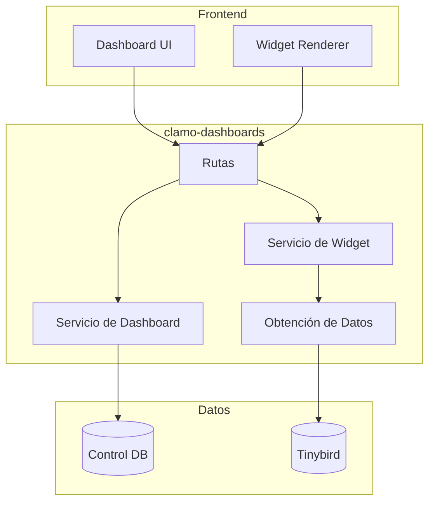

# clamo-dashboards

API en Rust para gestión de dashboards personalizables y widgets de analytics.

## Información General

| Propiedad | Valor |
|-----------|-------|
| **Repositorio** | `GetClamo/clamo-dashboards` |
| **Lenguaje** | Rust |
| **Framework** | Axum |
| **Puerto** | 8020 |

## Arquitectura



## Modelo de Datos

### Dashboard

```rust
#[derive(Debug, Serialize, Deserialize)]
pub struct Dashboard {
    pub id: String,
    pub company_id: String,
    pub name: String,
    pub description: Option<String>,
    pub layout: DashboardLayout,
    pub is_default: bool,
    pub created_at: DateTime<Utc>,
    pub updated_at: DateTime<Utc>,
}

#[derive(Debug, Serialize, Deserialize)]
pub struct DashboardLayout {
    pub columns: u8,
    pub rows: Vec<LayoutRow>,
}

#[derive(Debug, Serialize, Deserialize)]
pub struct LayoutRow {
    pub widgets: Vec<WidgetPlacement>,
}

#[derive(Debug, Serialize, Deserialize)]
pub struct WidgetPlacement {
    pub widget_id: String,
    pub col_span: u8,
    pub row_span: u8,
}
```

### Widget

```rust
#[derive(Debug, Serialize, Deserialize)]
pub struct Widget {
    pub id: String,
    pub company_id: String,
    pub widget_type: WidgetType,
    pub title: String,
    pub config: WidgetConfig,
    pub created_at: DateTime<Utc>,
}

#[derive(Debug, Serialize, Deserialize)]
#[serde(tag = "type")]
pub enum WidgetType {
    Counter,
    Chart,
    Table,
    List,
    Map,
}

#[derive(Debug, Serialize, Deserialize)]
pub struct WidgetConfig {
    pub data_source: String,  // Tinybird pipe name
    pub filters: HashMap<String, String>,
    pub visualization: VisualizationConfig,
}

#[derive(Debug, Serialize, Deserialize)]
pub struct VisualizationConfig {
    pub chart_type: Option<String>,  // line, bar, pie, etc.
    pub x_axis: Option<String>,
    pub y_axis: Option<String>,
    pub colors: Option<Vec<String>>,
}
```

## API Endpoints

### Dashboards

| Método | Endpoint | Descripción |
|--------|----------|-------------|
| GET | `/dashboards` | Listar dashboards |
| GET | `/dashboards/:id` | Obtener dashboard |
| POST | `/dashboards` | Crear dashboard |
| PATCH | `/dashboards/:id` | Actualizar dashboard |
| DELETE | `/dashboards/:id` | Eliminar dashboard |

### Widgets

| Método | Endpoint | Descripción |
|--------|----------|-------------|
| GET | `/widgets` | Listar widgets |
| GET | `/widgets/:id` | Obtener widget |
| GET | `/widgets/:id/data` | Obtener datos del widget |
| POST | `/widgets` | Crear widget |
| PATCH | `/widgets/:id` | Actualizar widget |
| DELETE | `/widgets/:id` | Eliminar widget |

## Implementación

### Main

```rust
use axum::{
    routing::{get, post, patch, delete},
    Router,
};
use std::sync::Arc;

#[tokio::main]
async fn main() {
    // Inicializar logging
    tracing_subscriber::init();
    
    // Cargar configuración
    let config = Config::from_env().expect("Failed to load config");
    
    // Crear estado compartido
    let state = Arc::new(AppState::new(config).await.unwrap());
    
    // Definir rutas
    let app = Router::new()
        // Dashboards
        .route("/dashboards", get(list_dashboards).post(create_dashboard))
        .route("/dashboards/:id", get(get_dashboard).patch(update_dashboard).delete(delete_dashboard))
        // Widgets
        .route("/widgets", get(list_widgets).post(create_widget))
        .route("/widgets/:id", get(get_widget).patch(update_widget).delete(delete_widget))
        .route("/widgets/:id/data", get(get_widget_data))
        // Health
        .route("/health", get(health_check))
        .with_state(state);
    
    // Iniciar servidor
    let listener = tokio::net::TcpListener::bind("0.0.0.0:8020").await.unwrap();
    tracing::info!("Server listening on :8020");
    axum::serve(listener, app).await.unwrap();
}
```

### Manejadores

```rust
use axum::{
    extract::{Path, State, Query},
    Json,
};

async fn list_dashboards(
    State(state): State<Arc<AppState>>,
    Extension(session): Extension<Session>,
) -> Result<Json<Vec<Dashboard>>, AppError> {
    let dashboards = state
        .dashboard_service
        .list_by_company(&session.company_id)
        .await?;
    
    Ok(Json(dashboards))
}

async fn get_widget_data(
    State(state): State<Arc<AppState>>,
    Path(widget_id): Path<String>,
    Query(params): Query<HashMap<String, String>>,
    Extension(session): Extension<Session>,
) -> Result<Json<WidgetData>, AppError> {
    // Obtener widget
    let widget = state
        .widget_service
        .get(&widget_id, &session.company_id)
        .await?
        .ok_or(AppError::NotFound)?;
    
    // Obtener datos de Tinybird
    let data = state
        .tinybird_client
        .query(&widget.config.data_source, &params)
        .await?;
    
    Ok(Json(WidgetData {
        widget_id,
        data,
        fetched_at: Utc::now(),
    }))
}
```

### Cliente Tinybird

```rust
pub struct TinybirdClient {
    client: reqwest::Client,
    token: String,
    base_url: String,
}

impl TinybirdClient {
    pub async fn query(
        &self,
        pipe: &str,
        params: &HashMap<String, String>,
    ) -> Result<serde_json::Value, Error> {
        let url = format!("{}/v0/pipes/{}.json", self.base_url, pipe);
        
        let response = self.client
            .get(&url)
            .query(params)
            .header("Authorization", format!("Bearer {}", self.token))
            .send()
            .await?;
        
        if !response.status().is_success() {
            return Err(Error::TinybirdError(response.text().await?));
        }
        
        let data: TinybirdResponse = response.json().await?;
        Ok(data.data)
    }
}
```

## Widgets Predefinidos

### Counter Widget

```json
{
  "type": "Counter",
  "title": "Casos Activos",
  "config": {
    "data_source": "cases_summary",
    "filters": {
      "status": "EN_TRAMITE"
    },
    "visualization": {
      "value_field": "count",
      "format": "number",
      "color": "#3B22FF"
    }
  }
}
```

### Chart Widget

```json
{
  "type": "Chart",
  "title": "Distribución de Riesgo",
  "config": {
    "data_source": "risk_distribution",
    "visualization": {
      "chart_type": "pie",
      "value_field": "count",
      "label_field": "risk_level",
      "colors": ["#22c55e", "#eab308", "#f97316", "#ef4444"]
    }
  }
}
```

### Timeline Widget

```json
{
  "type": "Chart",
  "title": "Movimientos por Día",
  "config": {
    "data_source": "trends",
    "filters": {
      "start_date": "{{today - 30d}}",
      "end_date": "{{today}}"
    },
    "visualization": {
      "chart_type": "line",
      "x_axis": "day",
      "y_axis": "movement_count",
      "show_moving_avg": true
    }
  }
}
```

## Configuración

### Variables de Entorno

```bash
# Database
DATABASE_URL=postgresql://...

# Tinybird
TINYBIRD_TOKEN=p.eyJ...
TINYBIRD_API_URL=https://api.tinybird.co

# Server
PORT=8020
```

### Cargo.toml

```toml
[package]
name = "clamo-dashboards"
version = "0.1.0"
edition = "2021"

[dependencies]
axum = "0.7"
tokio = { version = "1", features = ["full"] }
sqlx = { version = "0.7", features = ["runtime-tokio", "postgres"] }
reqwest = { version = "0.11", features = ["json"] }
serde = { version = "1", features = ["derive"] }
serde_json = "1"
tracing = "0.1"
tracing-subscriber = "0.3"
chrono = { version = "0.4", features = ["serde"] }
uuid = { version = "1", features = ["v4", "serde"] }
```

## Desarrollo Local

```bash
# Compilar
cargo build

# Ejecutar
cargo run

# Tests
cargo test

# Watch mode
cargo watch -x run
```

