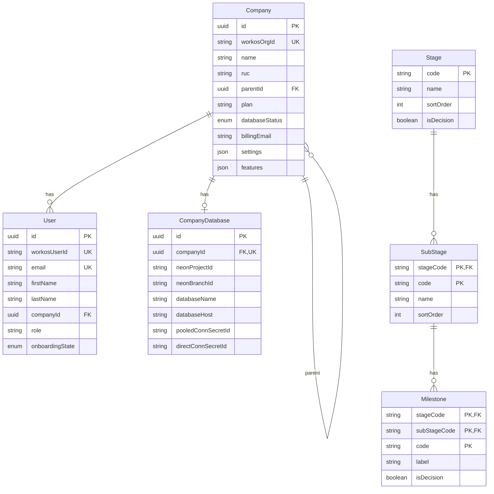
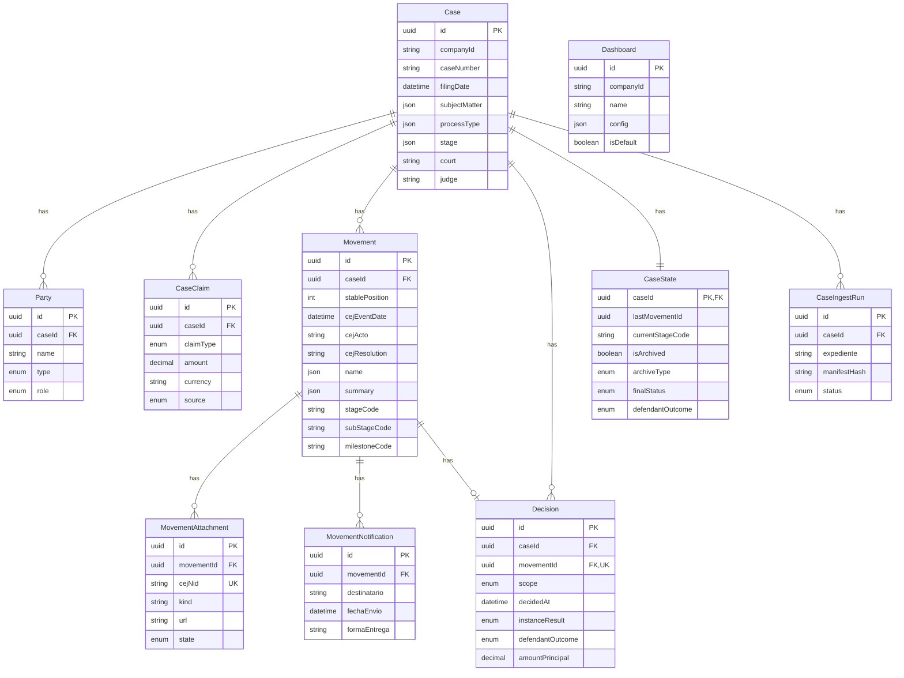

Paquete compartido con esquemas Prisma, migraciones y utilidades para gestión de conexiones multi-tenant.

## Información General

| Propiedad | Valor |
|-----------|-------|
| **Repositorio** | `GetClamo/clamo-database` |
| **Lenguaje** | TypeScript |
| **ORM** | Prisma |
| **Paquete** | `@getclamo/database` |
| **Bases de Datos** | Supabase (Control) + Neon (Tenants) |

## Arquitectura

```mermaid
flowchart TB
    subgraph Package [@getclamo/database]
        ControlSchema[Control Schema]
        TenantSchema[Tenant Schema]
        ClientFactory[Client Factory]
        LRUCache[LRU Cache]
    end

    subgraph Databases [Bases de Datos]
        Supabase[(Supabase<br/>Control Plane)]
        Neon1[(Neon Tenant 1)]
        Neon2[(Neon Tenant 2)]
        NeonN[(Neon Tenant N)]
    end

    ControlSchema --> Supabase
    TenantSchema --> Neon1
    TenantSchema --> Neon2
    TenantSchema --> NeonN

    ClientFactory --> LRUCache
    LRUCache --> Neon1
    LRUCache --> Neon2
    LRUCache --> NeonN
```

## Esquema Control Plane



## Esquema Tenant



## Uso

```typescript
import { controlDb, createTenantPrisma } from "@getclamo/database";

// Cliente control plane (singleton)
const companies = await controlDb.company.findMany();

// Cliente tenant (cacheado por conexión)
const tenantDb = createTenantPrisma(connectionString);
const cases = await tenantDb.case.findMany();
```

## Configuración

### Variables de Entorno

```bash
# Base de datos de control
CONTROL_DATABASE_URL=postgresql://...

# Supabase (para Vault)
SUPABASE_URL=https://...
SUPABASE_SERVICE_KEY=...

# Para desarrollo local con tenant específico
TENANT_DATABASE_URL=postgresql://...
```

## Desarrollo Local

```bash
# Instalar dependencias
pnpm install

# Generar clientes Prisma
pnpm db:generate

# Ejecutar migraciones de control
pnpm migrate:control

# Ejecutar migraciones de tenants (todos)
pnpm migrate:tenants

# Build del paquete
pnpm build
```

## Próximos Pasos

<CardGroup cols={2}>
  <Card
    title="Entidades"
    icon="database"
    href="/es/entidades/index"
  >
    Referencia completa de entidades.
  </Card>
  <Card
    title="Multi-Tenancy"
    icon="building"
    href="/es/guias/multi-tenancy"
  >
    Arquitectura multi-tenant.
  </Card>
</CardGroup>
