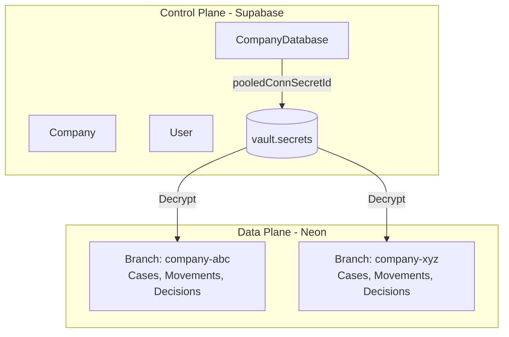

# clamo-database

Paquete central que define los esquemas de base de datos, migraciones, el patrón **SourcedValue** y utilidades para el modelo multi-tenant de Clamo.

## Información General

| Propiedad | Valor |
|-----------|-------|
| **Repositorio** | `GetClamo/clamo-database` |
| **Lenguaje** | TypeScript |
| **ORM** | Prisma |
| **Control Plane** | Supabase PostgreSQL |
| **Data Plane** | Neon PostgreSQL (branches por tenant) |

## Arquitectura de Bases de Datos

Clamo utiliza un modelo de **database-per-tenant** con dos planos:



## Patrón SourcedValue

El patrón **SourcedValue** permite rastrear el origen de datos que pueden venir de múltiples fuentes:

```typescript
// Estructura almacenada como JSONB en PostgreSQL
interface SourcedValue<T> {
  cej: T | null;      // Valor del scraper CEJ
  ai: T | null;       // Valor normalizado por IA
  manual: T | null;   // Valor corregido por humano
  updatedAt?: {
    cej?: string;     // ISO timestamp
    ai?: string;
    manual?: string;
  };
}
```

### Campos que usan SourcedValue

En el schema de tenant, estos campos usan el patrón:

```prisma
// prisma/tenant/schema.prisma
model Case {
  id         String    @id @default(uuid())
  companyId  String
  caseNumber String
  filingDate DateTime?

  // SourcedValue fields stored as JSONB: { cej, ai, manual }
  subjectMatter    Json? @default("[]") // Array of SourcedValue
  processType      Json? // SourcedValue
  stage            Json? // SourcedValue
  abstract         Json? // SourcedValue (Sumilla)
  observation      Json? // SourcedValue
  conclusionReason Json? // SourcedValue

  // CEJ-sourced fields (string directo, no SourcedValue)
  cejJudicialDistrict String?
  court               String?
  judge               String?
  // ...
}

model Movement {
  id     String @id
  caseId String

  // SourcedValue fields as JSONB
  name     Json? // SourcedValue - display name
  summary  Json? // SourcedValue
  tags     Json? // SourcedValue
  metadata Json? // SourcedValue
  // ...
}
```

### Resolución de Valor

```typescript
// Prioridad: manual > ai > cej
function resolveValue<T>(sourced: SourcedValue<T>): T | null {
  return sourced.manual ?? sourced.ai ?? sourced.cej ?? null;
}

// Verificar si se puede sobrescribir
function canOverwrite(current: SourcedValue, newSource: 'cej' | 'ai' | 'manual'): boolean {
  const priority = { cej: 1, ai: 2, manual: 3 };
  const currentSource = current.manual ? 'manual' : current.ai ? 'ai' : 'cej';
  return priority[newSource] >= priority[currentSource];
}
```

## Esquemas

### Control Schema (Supabase)

```prisma
// prisma/control/schema.prisma

model Company {
  id              String   @id @default(cuid())
  workosOrgId     String   @unique
  name            String
  ruc             String?
  parentId        String?
  plan            Plan     @default(free)
  settings        Json     @default("{}")
  metadata        Json     @default("{}")
  databaseStatus  DatabaseStatus @default(pending)
  ownerEmail      String?
  createdAt       DateTime @default(now())
  updatedAt       DateTime @updatedAt
  
  database        CompanyDatabase?
}

model CompanyDatabase {
  id                  String   @id @default(cuid())
  companyId           String   @unique
  neonProjectId       String
  neonBranchId        String
  databaseName        String
  databaseHost        String
  databaseUser        String
  pooledConnSecretId  String   // ID en Supabase Vault
  directConnSecretId  String   // ID en Supabase Vault
  status              DbStatus @default(active)
  
  company             Company  @relation(fields: [companyId], references: [id])
}

model User {
  id              String   @id @default(cuid())
  workosUserId    String   @unique
  email           String
  firstName       String?
  lastName        String?
  companyId       String
  role            Role     @default(member)
  onboardingState OnboardingState @default(pending_onboarding)
  createdAt       DateTime @default(now())
  
  company         Company  @relation(fields: [companyId], references: [id])
}

enum Plan { free, pro, enterprise }
enum DatabaseStatus { pending, provisioning, ready, failed }
enum Role { admin, member }
```

### Tenant Schema (Neon)

```prisma
// prisma/tenant/schema.prisma

model Case {
  id         String    @id @default(uuid())
  companyId  String
  caseNumber String
  filingDate DateTime?

  // SourcedValue fields (JSONB)
  subjectMatter    Json?
  processType      Json?
  stage            Json?
  abstract         Json?

  // CEJ fields
  cejJudicialDistrict String?
  court               String?
  judge               String?

  createdAt DateTime @default(now())
  updatedAt DateTime @updatedAt

  Movements  Movement[]
  Decisions  Decision[]
  State      CaseState?
  IngestRuns CaseIngestRun[]

  @@unique([caseNumber, companyId])
}

model Movement {
  id             String @id
  caseId         String
  stablePosition Int    // 1 = oldest, never changes

  // CEJ dates
  cejEventDate  DateTime?
  cejDecreeDate DateTime?

  // CEJ raw fields
  cejActo       String?
  cejResolution String?
  cejDescription String?

  // SourcedValue fields (JSONB)
  name     Json?
  summary  Json?
  tags     Json?

  // Classification codes
  stageCode     String?
  subStageCode  String?
  milestoneCode String?

  lastIngestRunId String?

  Case          Case           @relation(fields: [caseId], references: [id])
  LastIngestRun CaseIngestRun? @relation(fields: [lastIngestRunId], references: [id])

  @@unique([caseId, stablePosition])
}

model CaseIngestRun {
  id                String              @id
  caseId            String
  expediente        String
  manifestHash      String
  expectedPositions Json
  status            CaseIngestRunStatus @default(RUNNING)

  enrichmentReadyAt   DateTime?
  analysisCompletedAt DateTime?

  errorMessage String?
  errorDetails Json?

  Case      Case       @relation(fields: [caseId], references: [id])
  Movements Movement[]
}

enum CaseIngestRunStatus {
  RUNNING
  FAILED
  MOVEMENTS_COMPLETE
  ANALYSIS_COMPLETE
}
```

## Cliente Prisma

El paquete exporta clientes Prisma pre-configurados:

```typescript
import { 
  controlPrisma, 
  createTenantPrisma,
  TenantClientCache,
} from '@getclamo/database';

// Cliente de control (singleton)
const companies = await controlPrisma.company.findMany();

// Cliente de tenant (dinámico por conexión)
const tenantDb = createTenantPrisma(connectionString);
const cases = await tenantDb.case.findMany();
```

## Cache de Conexiones (LRU)

```typescript
// src/tenant-client.ts
import { LRUCache } from "lru-cache";

export class TenantClientCache {
  private cache: LRUCache<string, PrismaClient>;

  constructor(options?: { max?: number; ttl?: number }) {
    this.cache = new LRUCache({
      max: options?.max ?? 100,
      ttl: options?.ttl ?? 1000 * 60 * 30, // 30 min default
      dispose: async (client) => {
        await client.$disconnect();
      },
    });
  }

  async getClient(companyId: string, connectionString: string): Promise<PrismaClient> {
    let client = this.cache.get(companyId);
    
    if (!client) {
      client = new PrismaClient({
        datasources: { db: { url: connectionString } },
      });
      this.cache.set(companyId, client);
    }
    
    return client;
  }
}
```

## Scripts de Migración

### Migrar Control Plane

```bash
# Migrar base de datos de control
pnpm migrate:control

# O directamente con Prisma
npx prisma migrate deploy --schema=prisma/control/schema.prisma
```

### Migrar Todos los Tenants

```bash
# Migrar todas las bases de datos de tenant
pnpm migrate:tenants

# Con dry-run (no aplica cambios)
pnpm migrate:tenants --dry-run
```

El script `migrate:tenants`:
1. Lee todas las empresas con `databaseStatus = 'ready'`
2. Obtiene connection strings del Vault
3. Aplica migraciones a cada branch de Neon

## Estructura del Paquete

```
clamo-database/
├── prisma/
│   ├── control/
│   │   ├── schema.prisma
│   │   └── migrations/
│   └── tenant/
│       ├── schema.prisma
│       └── migrations/
├── src/
│   ├── generated/
│   │   ├── control-client/
│   │   └── tenant-client/
│   ├── control-client.ts
│   ├── tenant-client.ts
│   └── index.ts
├── scripts/
│   ├── migrate-control.ts
│   └── migrate-tenants.ts
└── package.json
```

## Configuración

### Variables de Entorno

```bash
# Control database (Supabase)
CONTROL_DATABASE_URL=postgresql://...

# Supabase (para Vault)
SUPABASE_URL=https://...
SUPABASE_SERVICE_KEY=...

# Para desarrollo local con tenant específico
TENANT_DATABASE_URL=postgresql://...
```

## Desarrollo Local

```bash
# Instalar dependencias
pnpm install

# Generar clientes Prisma
pnpm db:generate

# Abrir Prisma Studio (control)
pnpm studio:control

# Abrir Prisma Studio (tenant)
pnpm studio:tenant

# Build
pnpm build
```

## Consideraciones de Seguridad

<Warning>
Las credenciales de conexión a bases de datos de tenants **nunca** se almacenan en texto plano.
</Warning>

- Connection strings se guardan en **Supabase Vault**
- Se resuelven en tiempo de ejecución usando `pooledConnSecretId`
- Cada tenant tiene credenciales únicas
- Conexiones usan SSL obligatorio

## Próximos Pasos

<CardGroup cols={2}>
  <Card
    title="Modelo de Datos"
    icon="database"
    href="/es/arquitectura/modelo-datos"
  >
    Documentación completa del patrón SourcedValue.
  </Card>
  <Card
    title="Multi-Tenancy"
    icon="building"
    href="/es/guias/multi-tenancy"
  >
    Arquitectura de aislamiento de tenants.
  </Card>
</CardGroup>
