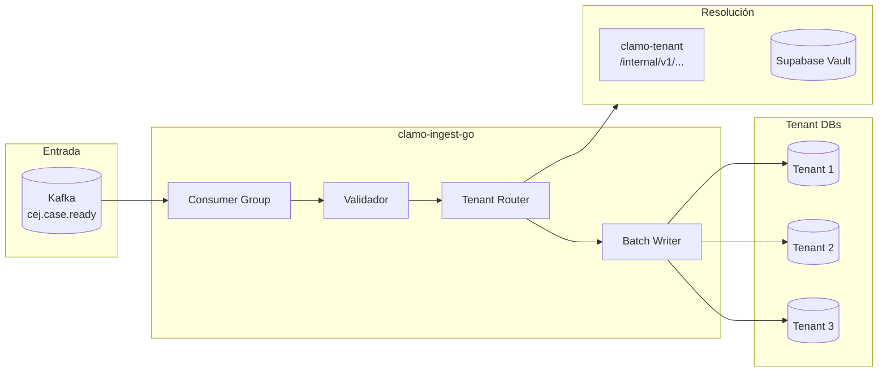

# clamo-ingest-go

Worker de alta performance en Go para la ingesta de datos desde Kafka hacia las bases de datos de tenant. Consume eventos del topic `cej.case.ready` y los inserta en las bases de datos correspondientes.

## Información General

| Propiedad | Valor |
|-----------|-------|
| **Repositorio** | `GetClamo/clamo-ingest-go` |
| **Lenguaje** | Go 1.22 |
| **Mensajería** | Kafka |
| **Base de Datos** | PostgreSQL (pgx) |
| **Cache** | LRU para conexiones de tenant |

## Arquitectura



## Flujo de Procesamiento

1. **Consumir**: Lee mensajes del topic `cej.case.ready`
2. **Validar**: Verifica estructura del evento
3. **Agrupar**: Agrupa por `companyId` para batch insert
4. **Resolver**: Obtiene connection string via Tenant SDK
5. **Insertar**: Usa `COPY` o upsert para inserción masiva
6. **Commit**: Confirma offset en Kafka

## Implementación

### Consumer

```go
type Worker struct {
    reader      *kafka.Reader
    tenantPool  *TenantConnectionPool
    batchSize   int
    flushPeriod time.Duration
}

func (w *Worker) Run(ctx context.Context) error {
    batch := make([]CaseReadyEvent, 0, w.batchSize)
    ticker := time.NewTicker(w.flushPeriod)
    defer ticker.Stop()
    
    for {
        select {
        case <-ctx.Done():
            return w.flush(batch)
            
        case <-ticker.C:
            if len(batch) > 0 {
                if err := w.flush(batch); err != nil {
                    log.Error("flush error", "error", err)
                }
                batch = batch[:0]
            }
            
        default:
            msg, err := w.reader.FetchMessage(ctx)
            if err != nil {
                continue
            }
            
            var event CaseReadyEvent
            if err := json.Unmarshal(msg.Value, &event); err != nil {
                log.Error("unmarshal error", "error", err)
                continue
            }
            
            batch = append(batch, event)
            
            if len(batch) >= w.batchSize {
                if err := w.flush(batch); err != nil {
                    log.Error("flush error", "error", err)
                }
                batch = batch[:0]
            }
            
            w.reader.CommitMessages(ctx, msg)
        }
    }
}
```

### Batch Insert

```go
func (w *Worker) flush(events []CaseReadyEvent) error {
    // Agrupar por tenant
    byTenant := make(map[string][]Case)
    for _, event := range events {
        byTenant[event.CompanyID] = append(
            byTenant[event.CompanyID],
            event.Cases...,
        )
    }
    
    // Insertar por tenant en paralelo
    g, ctx := errgroup.WithContext(context.Background())
    
    for companyID, cases := range byTenant {
        companyID, cases := companyID, cases
        g.Go(func() error {
            return w.insertCases(ctx, companyID, cases)
        })
    }
    
    return g.Wait()
}
```

### Pool de Conexiones por Tenant

```go
type TenantConnectionPool struct {
    tenantClient *TenantSDKClient
    connections  sync.Map // map[string]*pgxpool.Pool
}

func (p *TenantConnectionPool) Get(companyID string) (*pgxpool.Pool, error) {
    // Check cache
    if conn, ok := p.connections.Load(companyID); ok {
        return conn.(*pgxpool.Pool), nil
    }
    
    // Get connection string from Tenant SDK
    connStr, err := p.tenantClient.GetDatabaseConnection(companyID)
    if err != nil {
        return nil, err
    }
    
    // Create pool
    config, err := pgxpool.ParseConfig(connStr)
    if err != nil {
        return nil, err
    }
    
    config.MaxConns = 10
    config.MinConns = 2
    config.MaxConnLifetime = 30 * time.Minute
    
    pool, err := pgxpool.NewWithConfig(context.Background(), config)
    if err != nil {
        return nil, err
    }
    
    p.connections.Store(companyID, pool)
    return pool, nil
}
```

## Respeto a Trusted Sources

El worker respeta la jerarquía de fuentes al insertar:

```go
func (w *Worker) upsertCase(ctx context.Context, conn *pgxpool.Conn, c Case) error {
    // Solo actualiza campos CEJ, preserva manual
    _, err := conn.Exec(ctx, `
        INSERT INTO cases (
            id, case_number, company_id,
            subject_matter, process_type, stage,
            cej_judicial_district, court, judge,
            created_at, updated_at
        ) VALUES ($1, $2, $3, $4, $5, $6, $7, $8, $9, $10, $11)
        ON CONFLICT (case_number, company_id) DO UPDATE SET
            -- Solo actualiza SourcedValue.cej, preserva ai y manual
            subject_matter = jsonb_set(
                COALESCE(cases.subject_matter, '{}'),
                '{cej}',
                EXCLUDED.subject_matter->'cej'
            ),
            -- Campos CEJ directos sí se sobrescriben
            cej_judicial_district = EXCLUDED.cej_judicial_district,
            court = EXCLUDED.court,
            judge = EXCLUDED.judge,
            updated_at = EXCLUDED.updated_at
    `, c.ID, c.CaseNumber, c.CompanyID, /* ... */)
    
    return err
}
```

## Configuración

### Variables de Entorno

```bash
# Kafka
KAFKA_BROKERS=localhost:9092
KAFKA_TOPIC=cej.case.ready
KAFKA_GROUP_ID=clamo-ingest

# Tenant SDK
TENANT_SERVICE_URL=http://localhost:4001

# Worker
BATCH_SIZE=1000
FLUSH_PERIOD=5s
MAX_WORKERS=10
```

### Docker

```dockerfile
FROM golang:1.22-alpine AS builder

WORKDIR /app
COPY go.mod go.sum ./
RUN go mod download

COPY . .
RUN CGO_ENABLED=0 go build -o /ingest ./cmd/worker

FROM alpine:latest
RUN apk --no-cache add ca-certificates
COPY --from=builder /ingest /ingest
CMD ["/ingest"]
```

## Métricas

```go
var (
    messagesProcessed = promauto.NewCounterVec(
        prometheus.CounterOpts{
            Name: "ingest_messages_processed_total",
            Help: "Total messages processed",
        },
        []string{"status", "company_id"},
    )
    
    batchSize = promauto.NewHistogram(
        prometheus.HistogramOpts{
            Name:    "ingest_batch_size",
            Help:    "Size of processed batches",
            Buckets: []float64{10, 50, 100, 500, 1000},
        },
    )
    
    insertLatency = promauto.NewHistogramVec(
        prometheus.HistogramOpts{
            Name:    "ingest_insert_latency_seconds",
            Help:    "Latency of batch inserts",
            Buckets: prometheus.DefBuckets,
        },
        []string{"company_id"},
    )
)
```

## Desarrollo Local

```bash
# Compilar
go build -o bin/ingest ./cmd/worker

# Ejecutar
./bin/ingest

# Tests
go test ./...

# Benchmark
go test -bench=. ./...
```

## Próximos Pasos

<CardGroup cols={2}>
  <Card
    title="clamo-cej-connector"
    icon="plug"
    href="/es/servicios/clamo-cej-connector"
  >
    Servicio que produce eventos a Kafka.
  </Card>
  <Card
    title="Modelo de Datos"
    icon="database"
    href="/es/arquitectura/modelo-datos"
  >
    Patrón SourcedValue y jerarquía de fuentes.
  </Card>
</CardGroup>
