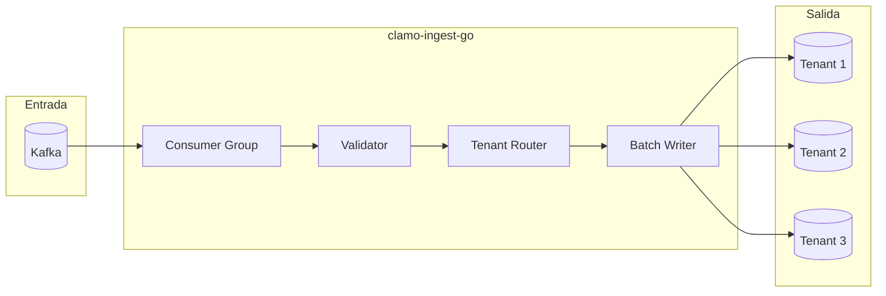

# clamo-ingest-go

Worker de alta performance en Go para la ingesta de datos desde Kafka hacia las bases de datos de tenant.

## Información General

| Propiedad | Valor |
|-----------|-------|
| **Repositorio** | `GetClamo/clamo-ingest-go` |
| **Lenguaje** | Go 1.22 |
| **Mensajería** | Kafka |
| **Base de Datos** | PostgreSQL (pgx) |

## Arquitectura



## Procesamiento de Eventos

### Consumer

```go
package main

import (
    "context"
    "encoding/json"
    "github.com/segmentio/kafka-go"
)

type Worker struct {
    reader      *kafka.Reader
    tenantPool  *TenantConnectionPool
    batchSize   int
    flushPeriod time.Duration
}

func NewWorker(cfg Config) *Worker {
    reader := kafka.NewReader(kafka.ReaderConfig{
        Brokers:  cfg.KafkaBrokers,
        GroupID:  "clamo-ingest",
        Topic:    "cej.case.ready",
        MinBytes: 10e3, // 10KB
        MaxBytes: 10e6, // 10MB
    })
    
    return &Worker{
        reader:      reader,
        tenantPool:  NewTenantConnectionPool(cfg),
        batchSize:   1000,
        flushPeriod: 5 * time.Second,
    }
}

func (w *Worker) Run(ctx context.Context) error {
    batch := make([]CaseReadyEvent, 0, w.batchSize)
    ticker := time.NewTicker(w.flushPeriod)
    defer ticker.Stop()
    
    for {
        select {
        case <-ctx.Done():
            return w.flush(batch)
            
        case <-ticker.C:
            if len(batch) > 0 {
                if err := w.flush(batch); err != nil {
                    log.Error("flush error", "error", err)
                }
                batch = batch[:0]
            }
            
        default:
            msg, err := w.reader.FetchMessage(ctx)
            if err != nil {
                continue
            }
            
            var event CaseReadyEvent
            if err := json.Unmarshal(msg.Value, &event); err != nil {
                log.Error("unmarshal error", "error", err)
                continue
            }
            
            batch = append(batch, event)
            
            if len(batch) >= w.batchSize {
                if err := w.flush(batch); err != nil {
                    log.Error("flush error", "error", err)
                }
                batch = batch[:0]
            }
            
            w.reader.CommitMessages(ctx, msg)
        }
    }
}
```

### Batch Insert

```go
func (w *Worker) flush(events []CaseReadyEvent) error {
    // Agrupar por tenant
    byTenant := make(map[string][]Case)
    for _, event := range events {
        byTenant[event.CompanyID] = append(
            byTenant[event.CompanyID],
            event.Cases...,
        )
    }
    
    // Insertar por tenant en paralelo
    g, ctx := errgroup.WithContext(context.Background())
    
    for companyID, cases := range byTenant {
        companyID, cases := companyID, cases // capture
        g.Go(func() error {
            return w.insertCases(ctx, companyID, cases)
        })
    }
    
    return g.Wait()
}

func (w *Worker) insertCases(ctx context.Context, companyID string, cases []Case) error {
    conn, err := w.tenantPool.Get(companyID)
    if err != nil {
        return fmt.Errorf("get connection: %w", err)
    }
    defer w.tenantPool.Put(companyID, conn)
    
    // Usar COPY para inserción masiva
    _, err = conn.CopyFrom(
        ctx,
        pgx.Identifier{"cases"},
        []string{
            "id", "expediente", "plaintiff", "defendant",
            "subject_matter", "risk_level", "claim_amount",
            "district", "court", "current_judge", "process_type",
            "filing_date", "status", "stage_code", "substage_code",
            "monitored_entity_id", "created_at", "updated_at",
        },
        pgx.CopyFromSlice(len(cases), func(i int) ([]any, error) {
            c := cases[i]
            return []any{
                c.ID, c.Expediente, c.Plaintiff, c.Defendant,
                c.SubjectMatter, c.RiskLevel, c.ClaimAmount,
                c.District, c.Court, c.CurrentJudge, c.ProcessType,
                c.FilingDate, c.Status, c.StageCode, c.SubstageCode,
                c.MonitoredEntityID, time.Now(), time.Now(),
            }, nil
        }),
    )
    
    if err != nil {
        return fmt.Errorf("copy from: %w", err)
    }
    
    // Insertar movimientos
    return w.insertMovements(ctx, conn, cases)
}
```

### Upsert Logic

```go
func (w *Worker) upsertCase(ctx context.Context, conn *pgxpool.Conn, c Case) error {
    _, err := conn.Exec(ctx, `
        INSERT INTO cases (
            id, expediente, plaintiff, defendant, subject_matter,
            risk_level, claim_amount, district, court, current_judge,
            process_type, filing_date, status, stage_code, substage_code,
            monitored_entity_id, created_at, updated_at
        ) VALUES (
            $1, $2, $3, $4, $5, $6, $7, $8, $9, $10,
            $11, $12, $13, $14, $15, $16, $17, $18
        )
        ON CONFLICT (expediente) DO UPDATE SET
            plaintiff = EXCLUDED.plaintiff,
            defendant = EXCLUDED.defendant,
            risk_level = EXCLUDED.risk_level,
            claim_amount = EXCLUDED.claim_amount,
            current_judge = EXCLUDED.current_judge,
            status = EXCLUDED.status,
            stage_code = EXCLUDED.stage_code,
            substage_code = EXCLUDED.substage_code,
            updated_at = EXCLUDED.updated_at
    `,
        c.ID, c.Expediente, c.Plaintiff, c.Defendant, c.SubjectMatter,
        c.RiskLevel, c.ClaimAmount, c.District, c.Court, c.CurrentJudge,
        c.ProcessType, c.FilingDate, c.Status, c.StageCode, c.SubstageCode,
        c.MonitoredEntityID, time.Now(), time.Now(),
    )
    return err
}
```

## Pool de Conexiones por Tenant

```go
type TenantConnectionPool struct {
    controlDB   *pgxpool.Pool
    connections sync.Map // map[string]*pgxpool.Pool
    vault       *VaultClient
}

func (p *TenantConnectionPool) Get(companyID string) (*pgxpool.Pool, error) {
    // Check cache
    if conn, ok := p.connections.Load(companyID); ok {
        return conn.(*pgxpool.Pool), nil
    }
    
    // Get connection string from vault
    connStr, err := p.resolveConnectionString(companyID)
    if err != nil {
        return nil, err
    }
    
    // Create pool
    config, err := pgxpool.ParseConfig(connStr)
    if err != nil {
        return nil, err
    }
    
    config.MaxConns = 10
    config.MinConns = 2
    config.MaxConnLifetime = 30 * time.Minute
    config.MaxConnIdleTime = 5 * time.Minute
    
    pool, err := pgxpool.NewWithConfig(context.Background(), config)
    if err != nil {
        return nil, err
    }
    
    p.connections.Store(companyID, pool)
    return pool, nil
}

func (p *TenantConnectionPool) resolveConnectionString(companyID string) (string, error) {
    // Get secret ID from control DB
    var secretID string
    err := p.controlDB.QueryRow(context.Background(), `
        SELECT pooled_conn_secret_id
        FROM company_databases
        WHERE company_id = $1 AND status = 'active'
    `, companyID).Scan(&secretID)
    
    if err != nil {
        return "", err
    }
    
    // Get secret from Vault
    return p.vault.GetSecret(secretID)
}
```

## Configuración

### Variables de Entorno

```bash
# Kafka
KAFKA_BROKERS=localhost:9092
KAFKA_TOPIC=cej.case.ready
KAFKA_GROUP_ID=clamo-ingest

# Control Database
CONTROL_DATABASE_URL=postgresql://...

# Vault
SUPABASE_URL=https://...
SUPABASE_SERVICE_KEY=...

# Worker
BATCH_SIZE=1000
FLUSH_PERIOD=5s
MAX_WORKERS=10
```

### Docker

```dockerfile
FROM golang:1.22-alpine AS builder

WORKDIR /app
COPY go.mod go.sum ./
RUN go mod download

COPY . .
RUN CGO_ENABLED=0 go build -o /ingest ./cmd/worker

FROM alpine:latest
RUN apk --no-cache add ca-certificates
COPY --from=builder /ingest /ingest
CMD ["/ingest"]
```

## Métricas

```go
var (
    messagesProcessed = promauto.NewCounterVec(
        prometheus.CounterOpts{
            Name: "ingest_messages_processed_total",
            Help: "Total messages processed",
        },
        []string{"status"},
    )
    
    batchSize = promauto.NewHistogram(
        prometheus.HistogramOpts{
            Name:    "ingest_batch_size",
            Help:    "Size of processed batches",
            Buckets: []float64{10, 50, 100, 500, 1000, 5000},
        },
    )
    
    insertLatency = promauto.NewHistogramVec(
        prometheus.HistogramOpts{
            Name:    "ingest_insert_latency_seconds",
            Help:    "Latency of batch inserts",
            Buckets: prometheus.DefBuckets,
        },
        []string{"company_id"},
    )
)
```

## Health Check

```go
func (w *Worker) HealthHandler(c *gin.Context) {
    health := map[string]string{
        "status": "healthy",
        "kafka":  "connected",
    }
    
    // Check Kafka
    if err := w.reader.Stats().Lag; err > 10000 {
        health["status"] = "degraded"
        health["kafka_lag"] = fmt.Sprintf("%d", err)
    }
    
    // Check connections
    w.tenantPool.connections.Range(func(key, value any) bool {
        pool := value.(*pgxpool.Pool)
        if pool.Stat().TotalConns() == 0 {
            health["status"] = "degraded"
        }
        return true
    })
    
    c.JSON(http.StatusOK, health)
}
```

## Desarrollo Local

```bash
# Compilar
go build -o bin/ingest ./cmd/worker

# Ejecutar
./bin/ingest

# Tests
go test ./...

# Benchmark
go test -bench=. ./...
```

