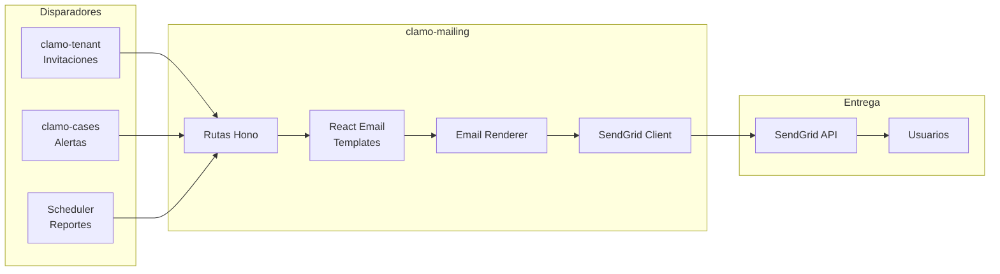

# clamo-mailing

Servicio para envío de emails transaccionales y notificaciones usando **React Email** para templates y **SendGrid** para delivery.

## Información General

| Propiedad | Valor |
|-----------|-------|
| **Repositorio** | `GetClamo/clamo-mailing` |
| **Lenguaje** | TypeScript |
| **Framework** | Hono |
| **Templates** | React Email |
| **Proveedor** | SendGrid |
| **Puerto** | 4002 |

## Arquitectura



## Templates Disponibles

| Template | Disparador | Descripción |
|----------|------------|-------------|
| `InvitationEmail` | clamo-tenant | Invitación a unirse a empresa |
| `NewMovementEmail` | clamo-cases | Nuevo movimiento en caso |
| `RiskAlertEmail` | clamo-cases | Alerta de cambio de riesgo |
| `WeeklyReportEmail` | Scheduler | Resumen semanal |

## Estructura de Directorios

```
clamo-mailing/src/
├── emails/
│   ├── components/
│   │   ├── Header.tsx
│   │   ├── Footer.tsx
│   │   └── Button.tsx
│   ├── InvitationEmail.tsx
│   ├── NewMovementEmail.tsx
│   ├── RiskAlertEmail.tsx
│   └── WeeklyReportEmail.tsx
├── routes/
│   ├── send.ts
│   └── preview.ts
├── lib/
│   └── sendgrid.ts
└── index.ts
```

## Ejemplo: InvitationEmail

```tsx
// src/emails/InvitationEmail.tsx
import {
  Body,
  Button,
  Container,
  Head,
  Heading,
  Html,
  Preview,
  Text,
} from '@react-email/components';

interface InvitationEmailProps {
  inviterName: string;
  companyName: string;
  inviteUrl: string;
  role: 'admin' | 'member';
}

export function InvitationEmail({
  inviterName,
  companyName,
  inviteUrl,
  role,
}: InvitationEmailProps) {
  return (
    <Html>
      <Head />
      <Preview>
        {inviterName} te ha invitado a unirte a {companyName} en Clamo
      </Preview>
      <Body style={main}>
        <Container style={container}>
          <Heading style={heading}>
            Te han invitado a {companyName}
          </Heading>
          
          <Text style={text}>
            {inviterName} te ha invitado a unirte a {companyName} en Clamo
            como {role === 'admin' ? 'Administrador' : 'Miembro'}.
          </Text>
          
          <Button style={button} href={inviteUrl}>
            Aceptar Invitación
          </Button>
        </Container>
      </Body>
    </Html>
  );
}
```

## API Endpoints

| Método | Endpoint | Descripción |
|--------|----------|-------------|
| POST | `/send/invitation` | Enviar invitación |
| POST | `/send/movement` | Notificar movimiento |
| POST | `/send/risk-alert` | Alerta de riesgo |
| POST | `/send/weekly-report` | Reporte semanal |
| GET | `/preview/:template` | Vista previa de template |

## Integración SendGrid

```typescript
// src/lib/sendgrid.ts
import sgMail from '@sendgrid/mail';

sgMail.setApiKey(process.env.SENDGRID_API_KEY!);

interface SendEmailOptions {
  to: string;
  subject: string;
  html: string;
}

export async function sendEmail(options: SendEmailOptions) {
  await sgMail.send({
    to: options.to,
    from: {
      email: 'noreply@clamo.dev',
      name: 'Clamo',
    },
    subject: options.subject,
    html: options.html,
    trackingSettings: {
      clickTracking: { enable: true },
      openTracking: { enable: true },
    },
  });
}
```

## Configuración

### Variables de Entorno

```bash
# SendGrid
SENDGRID_API_KEY=SG.xxx

# Email settings
FROM_EMAIL=noreply@clamo.dev
FROM_NAME=Clamo

# App URLs
APP_URL=https://app.clamo.dev
```

## Desarrollo Local

```bash
# Instalar dependencias
pnpm install

# Ejecutar en desarrollo
pnpm dev

# Preview de emails (React Email)
pnpm email:preview
# Abre http://localhost:3000

# Build
pnpm build
```

## Próximos Pasos

<CardGroup cols={2}>
  <Card
    title="clamo-tenant"
    icon="building"
    href="/es/servicios/clamo-tenant"
  >
    Servicio que dispara invitaciones.
  </Card>
  <Card
    title="clamo-cases"
    icon="folder"
    href="/es/servicios/clamo-cases"
  >
    Servicio que dispara alertas.
  </Card>
</CardGroup>
