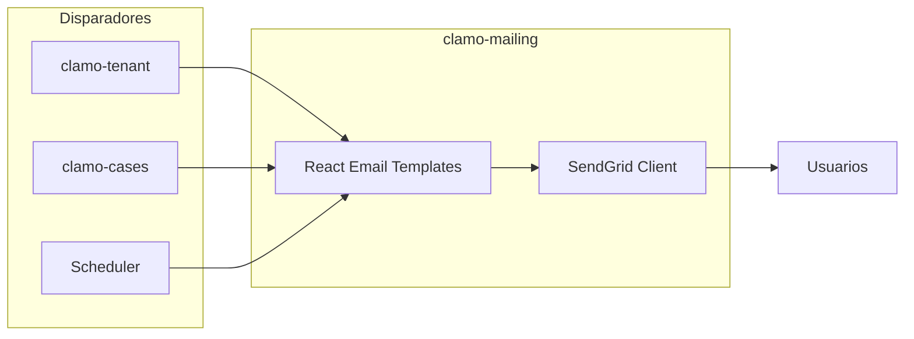

Servicio para envío de emails transaccionales y notificaciones usando React Email para templates y SendGrid para delivery.

## Información General

| Propiedad | Valor |
|-----------|-------|
| **Repositorio** | `GetClamo/clamo-mailing` |
| **Lenguaje** | TypeScript |
| **Framework** | Hono |
| **Templates** | React Email |
| **Proveedor** | SendGrid |
| **Puerto** | 4002 |

## Arquitectura



## Templates Disponibles

| Template | Disparador | Descripción |
|----------|------------|-------------|
| `InvitationEmail` | clamo-tenant | Invitación a unirse a empresa |
| `NewMovementEmail` | clamo-cases | Nuevo movimiento en caso |
| `RiskAlertEmail` | clamo-cases | Alerta de cambio de riesgo |
| `WeeklyReportEmail` | Scheduler | Resumen semanal |

## Configuración

### Variables de Entorno

```bash
# SendGrid
SENDGRID_API_KEY=SG.xxx

# Email settings
FROM_EMAIL=noreply@clamo.dev
FROM_NAME=Clamo

# App URLs
APP_URL=https://app.clamo.dev
```

## Desarrollo Local

```bash
# Instalar dependencias
pnpm install

# Ejecutar en desarrollo
pnpm dev

# Preview de emails (React Email)
pnpm email:preview

# Build
pnpm build
```

## Próximos Pasos

<CardGroup cols={2}>
  <Card
    title="clamo-tenant"
    icon="building"
    href="/es/servicios/clamo-tenant"
  >
    Servicio que dispara invitaciones.
  </Card>
  <Card
    title="clamo-cases"
    icon="folder"
    href="/es/servicios/clamo-cases"
  >
    Servicio que dispara alertas.
  </Card>
</CardGroup>
