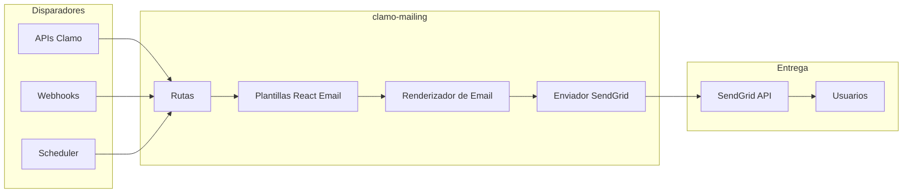

# clamo-mailing

Servicio para envío de emails transaccionales y notificaciones usando React Email y SendGrid.

## Información General

| Propiedad | Valor |
|-----------|-------|
| **Repositorio** | `GetClamo/clamo-mailing` |
| **Lenguaje** | TypeScript |
| **Framework** | Hono |
| **Templates** | React Email |
| **Proveedor** | SendGrid |
| **Puerto** | 4002 |

## Arquitectura



## Plantillas

### Estructura

```
src/
├── emails/
│   ├── components/
│   │   ├── Header.tsx
│   │   ├── Footer.tsx
│   │   └── Button.tsx
│   ├── InvitationEmail.tsx
│   ├── NewMovementEmail.tsx
│   ├── RiskAlertEmail.tsx
│   └── WeeklyReportEmail.tsx
├── routes/
│   └── send.ts
└── index.ts
```

### Ejemplo: InvitationEmail

```tsx
// src/emails/InvitationEmail.tsx
import {
  Body,
  Button,
  Container,
  Head,
  Heading,
  Html,
  Img,
  Link,
  Preview,
  Section,
  Text,
} from '@react-email/components';

interface InvitationEmailProps {
  inviterName: string;
  companyName: string;
  inviteUrl: string;
  role: 'admin' | 'member';
}

export function InvitationEmail({
  inviterName,
  companyName,
  inviteUrl,
  role,
}: InvitationEmailProps) {
  return (
    <Html>
      <Head />
      <Preview>
        {inviterName} te ha invitado a unirte a {companyName} en Clamo
      </Preview>
      <Body style={main}>
        <Container style={container}>
          
          
          <Heading style={heading}>
            Te han invitado a {companyName}
          </Heading>
          
          <Text style={text}>
            {inviterName} te ha invitado a unirte a {companyName} en Clamo
            como {role === 'admin' ? 'Administrador' : 'Miembro'}.
          </Text>
          
          <Section style={buttonContainer}>
            <Button style={button} href={inviteUrl}>
              Aceptar Invitación
            </Button>
          </Section>
          
          <Text style={footer}>
            Si no esperabas esta invitación, puedes ignorar este email.
          </Text>
        </Container>
      </Body>
    </Html>
  );
}

const main = {
  backgroundColor: '#f6f9fc',
  fontFamily: '-apple-system, BlinkMacSystemFont, "Segoe UI", Roboto, sans-serif',
};

const container = {
  backgroundColor: '#ffffff',
  margin: '0 auto',
  padding: '40px 20px',
  maxWidth: '600px',
};

const heading = {
  color: '#1a1a1a',
  fontSize: '24px',
  fontWeight: '600',
  margin: '30px 0',
};

const text = {
  color: '#4a4a4a',
  fontSize: '16px',
  lineHeight: '24px',
};

const buttonContainer = {
  textAlign: 'center' as const,
  margin: '30px 0',
};

const button = {
  backgroundColor: '#3B22FF',
  borderRadius: '6px',
  color: '#ffffff',
  fontSize: '16px',
  fontWeight: '600',
  padding: '12px 24px',
  textDecoration: 'none',
};

const footer = {
  color: '#8898aa',
  fontSize: '14px',
  marginTop: '30px',
};
```

### Ejemplo: NewMovementEmail

```tsx
// src/emails/NewMovementEmail.tsx
import {
  Body,
  Container,
  Head,
  Heading,
  Html,
  Preview,
  Section,
  Text,
  Hr,
} from '@react-email/components';

interface NewMovementEmailProps {
  userName: string;
  caseName: string;
  expediente: string;
  movementDate: string;
  movementDescription: string;
  movementSummary: string;
  caseUrl: string;
}

export function NewMovementEmail({
  userName,
  caseName,
  expediente,
  movementDate,
  movementDescription,
  movementSummary,
  caseUrl,
}: NewMovementEmailProps) {
  return (
    <Html>
      <Head />
      <Preview>
        Nuevo movimiento en {expediente}
      </Preview>
      <Body style={main}>
        <Container style={container}>
          <Heading style={heading}>
            Nuevo Movimiento Procesal
          </Heading>
          
          <Text style={text}>
            Hola {userName},
          </Text>
          
          <Text style={text}>
            Se ha registrado un nuevo movimiento en el caso:
          </Text>
          
          <Section style={caseBox}>
            <Text style={caseTitle}>{caseName}</Text>
            <Text style={caseExpediente}>{expediente}</Text>
          </Section>
          
          <Hr style={hr} />
          
          <Section style={movementBox}>
            <Text style={movementDate}>{movementDate}</Text>
            <Text style={movementDesc}>{movementDescription}</Text>
            {movementSummary && (
              <Text style={summary}>
                <strong>Resumen:</strong> {movementSummary}
              </Text>
            )}
          </Section>
          
          <Button style={button} href={caseUrl}>
            Ver Caso Completo
          </Button>
        </Container>
      </Body>
    </Html>
  );
}
```

## API

### Endpoints

| Método | Endpoint | Descripción |
|--------|----------|-------------|
| POST | `/send/invitation` | Enviar invitación |
| POST | `/send/movement` | Notificar movimiento |
| POST | `/send/risk-alert` | Alerta de riesgo |
| POST | `/send/weekly-report` | Reporte semanal |
| GET | `/preview/:template` | Vista previa de plantilla |

### Ejemplo: Enviar Invitación

```typescript
// src/routes/send.ts
import { Hono } from 'hono';
import { render } from '@react-email/render';
import { InvitationEmail } from '../emails/InvitationEmail';
import { sendEmail } from '../lib/sendgrid';

const app = new Hono();

app.post('/invitation', async (c) => {
  const body = await c.req.json();
  
  const {
    to,
    inviterName,
    companyName,
    inviteUrl,
    role,
  } = body;
  
  // Renderizar template
  const html = render(
    InvitationEmail({
      inviterName,
      companyName,
      inviteUrl,
      role,
    })
  );
  
  // Enviar email
  await sendEmail({
    to,
    subject: `${inviterName} te ha invitado a ${companyName}`,
    html,
  });
  
  return c.json({ success: true });
});

export default app;
```

## Integración SendGrid

```typescript
// src/lib/sendgrid.ts
import sgMail from '@sendgrid/mail';

sgMail.setApiKey(process.env.SENDGRID_API_KEY!);

interface SendEmailOptions {
  to: string;
  subject: string;
  html: string;
  attachments?: Array<{
    content: string;
    filename: string;
    type: string;
  }>;
}

export async function sendEmail(options: SendEmailOptions) {
  const msg = {
    to: options.to,
    from: {
      email: 'noreply@clamo.dev',
      name: 'Clamo',
    },
    subject: options.subject,
    html: options.html,
    attachments: options.attachments,
    trackingSettings: {
      clickTracking: { enable: true },
      openTracking: { enable: true },
    },
  };
  
  await sgMail.send(msg);
}

export async function sendBulkEmail(
  recipients: string[],
  subject: string,
  html: string
) {
  const messages = recipients.map(to => ({
    to,
    from: { email: 'noreply@clamo.dev', name: 'Clamo' },
    subject,
    html,
  }));
  
  await sgMail.send(messages);
}
```

## Vista Previa de Plantillas

```typescript
// src/routes/preview.ts
import { Hono } from 'hono';
import { render } from '@react-email/render';
import * as templates from '../emails';

const app = new Hono();

app.get('/:template', async (c) => {
  const templateName = c.req.param('template');
  const Template = templates[templateName];
  
  if (!Template) {
    return c.text('Template not found', 404);
  }
  
  // Mock data para preview
  const mockData = getMockData(templateName);
  
  const html = render(Template(mockData));
  
  return c.html(html);
});

function getMockData(templateName: string) {
  const mockDataMap = {
    InvitationEmail: {
      inviterName: 'Juan Pérez',
      companyName: 'Empresa Demo S.A.C.',
      inviteUrl: 'https://app.clamo.dev/invite/abc123',
      role: 'admin',
    },
    NewMovementEmail: {
      userName: 'María García',
      caseName: 'Pérez vs Empresa S.A.C.',
      expediente: '00001-2024-0-1234-JR-LA-01',
      movementDate: '02 de Enero, 2025',
      movementDescription: 'RESOLUCIÓN N° 15: Se tiene por contestada la demanda',
      movementSummary: 'El juzgado admite la contestación de demanda.',
      caseUrl: 'https://app.clamo.dev/cases/case_abc123',
    },
    // ... más mock data
  };
  
  return mockDataMap[templateName] || {};
}

export default app;
```

## Configuración

### Variables de Entorno

```bash
# SendGrid
SENDGRID_API_KEY=SG.xxx

# Email settings
FROM_EMAIL=noreply@clamo.dev
FROM_NAME=Clamo

# App URLs
APP_URL=https://app.clamo.dev
```

## Desarrollo Local

```bash
# Instalar dependencias
pnpm install

# Ejecutar en desarrollo
pnpm dev

# Preview de emails
pnpm email:preview

# Build
pnpm build
```

### Servidor de Vista Previa de Email

```bash
# Iniciar servidor de vista previa
npx email dev

# Abre http://localhost:3000 para ver plantillas
```

