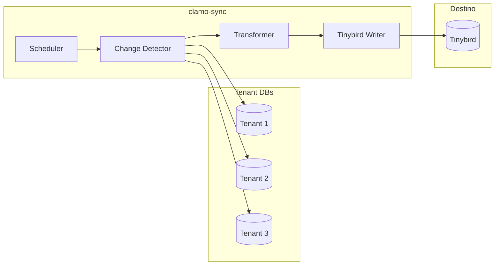

Servicio Rust que sincroniza datos desde las bases de datos de tenant hacia Tinybird para analytics en tiempo real.

## Información General

| Propiedad | Valor |
|-----------|-------|
| **Repositorio** | `GetClamo/clamo-sync` |
| **Lenguaje** | Rust |
| **Runtime** | Tokio |
| **Destino** | Tinybird |
| **Frecuencia** | Cada 5 minutos |

## Arquitectura



## Flujo de Sincronización

1. **Scheduler**: Ejecuta cada 5 minutos
2. **Obtener empresas**: Lista empresas activas desde control DB
3. **Por cada tenant**: Detectar cambios, transformar, enviar a Tinybird
4. **Actualizar marca de tiempo**

## Configuración

### Variables de Entorno

```bash
# Tenant SDK
TENANT_SERVICE_URL=http://localhost:4001

# Tinybird
TINYBIRD_TOKEN=p.eyJ...

# Sync
SYNC_INTERVAL_SECONDS=300
SYNC_BATCH_SIZE=10000
```

## Desarrollo Local

```bash
# Compilar
cargo build

# Ejecutar
cargo run

# Tests
cargo test

# Release build
cargo build --release
```

## Próximos Pasos

<CardGroup cols={2}>
  <Card
    title="clamo-dashboards"
    icon="chart-bar"
    href="/es/servicios/clamo-dashboards"
  >
    Consume datos de Tinybird para dashboards.
  </Card>
  <Card
    title="ask-clamo"
    icon="robot"
    href="/es/servicios/ask-clamo"
  >
    Perfil Clamy usa Tinybird para analytics.
  </Card>
</CardGroup>
