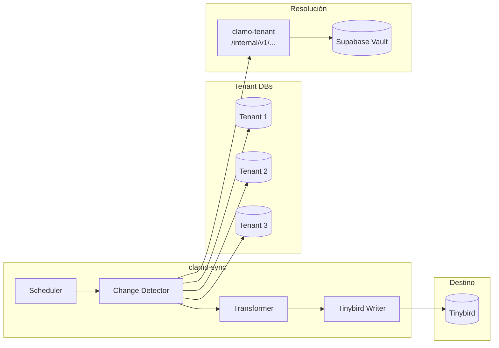

# clamo-sync

Servicio Rust que sincroniza datos desde las bases de datos de tenant hacia **Tinybird** para analytics en tiempo real.

## Información General

| Propiedad | Valor |
|-----------|-------|
| **Repositorio** | `GetClamo/clamo-sync` |
| **Lenguaje** | Rust |
| **Runtime** | Tokio |
| **Destino** | Tinybird |
| **Frecuencia** | Cada 5 minutos |

## Arquitectura



## Flujo de Sincronización

1. **Scheduler**: Ejecuta cada 5 minutos
2. **Obtener empresas**: Lista empresas activas desde control DB
3. **Por cada tenant**:
   - Obtener connection string via Tenant SDK
   - Detectar cambios desde última sincronización
   - Transformar a formato Tinybird
   - Enviar en batch a Tinybird
4. **Actualizar marca de tiempo**

## Implementación

### Main Loop

```rust
#[tokio::main]
async fn main() -> Result<(), Box<dyn std::error::Error>> {
    tracing_subscriber::init();
    
    let config = Config::from_env()?;
    let syncer = Syncer::new(config).await?;
    
    // Ejecutar sync periódico
    let mut interval = interval(Duration::from_secs(300)); // 5 minutos
    
    loop {
        interval.tick().await;
        
        match syncer.sync_all().await {
            Ok(stats) => {
                info!(
                    cases = stats.cases_synced,
                    movements = stats.movements_synced,
                    duration_ms = stats.duration_ms,
                    "Sync completed"
                );
            }
            Err(e) => {
                error!(error = %e, "Sync failed");
            }
        }
    }
}
```

### Sincronizador

```rust
pub struct Syncer {
    tenant_client: TenantSDKClient,
    tinybird: TinybirdClient,
}

impl Syncer {
    pub async fn sync_all(&self) -> Result<SyncStats, Error> {
        let start = std::time::Instant::now();
        let mut stats = SyncStats::default();
        
        // Obtener empresas activas
        let companies = self.tenant_client.list_active_companies().await?;
        
        for company in companies {
            match self.sync_tenant(&company).await {
                Ok(tenant_stats) => {
                    stats.cases_synced += tenant_stats.cases_synced;
                    stats.movements_synced += tenant_stats.movements_synced;
                }
                Err(e) => {
                    tracing::error!(
                        company_id = %company.id,
                        error = %e,
                        "Failed to sync tenant"
                    );
                    stats.failed_tenants += 1;
                }
            }
        }
        
        stats.duration_ms = start.elapsed().as_millis() as u64;
        Ok(stats)
    }
    
    async fn sync_tenant(&self, company: &Company) -> Result<TenantStats, Error> {
        // Obtener conexión via Tenant SDK
        let conn_info = self.tenant_client
            .get_database_connection(&company.id)
            .await?;
        
        let tenant_pool = PgPool::connect(&conn_info.connection_string).await?;
        
        // Sincronizar casos modificados
        let cases_stats = self.sync_cases(&tenant_pool, &company.id).await?;
        
        // Sincronizar movimientos modificados
        let movements_stats = self.sync_movements(&tenant_pool, &company.id).await?;
        
        Ok(TenantStats {
            cases_synced: cases_stats.count,
            movements_synced: movements_stats.count,
        })
    }
}
```

### Detección de Cambios

```rust
async fn sync_cases(&self, pool: &PgPool, company_id: &str) -> Result<SyncResult, Error> {
    // Obtener última sincronización
    let last_sync = self.get_last_sync(company_id).await?;
    
    // Obtener casos modificados
    let cases: Vec<CaseRow> = sqlx::query_as!(
        CaseRow,
        r#"
        SELECT
            id,
            case_number,
            company_id,
            subject_matter,
            process_type,
            stage,
            cej_judicial_district,
            court,
            judge,
            filing_date,
            created_at,
            updated_at
        FROM "Case"
        WHERE updated_at > $1
        ORDER BY updated_at
        LIMIT 10000
        "#,
        last_sync,
    )
    .fetch_all(pool)
    .await?;
    
    if cases.is_empty() {
        return Ok(SyncResult { count: 0 });
    }
    
    // Transformar a formato Tinybird
    let rows: Vec<TinybirdCaseRow> = cases
        .iter()
        .map(|c| self.transform_case(c, company_id))
        .collect();
    
    // Enviar a Tinybird
    self.tinybird.ingest("cases_ds", &rows).await?;
    
    Ok(SyncResult { count: rows.len() })
}
```

### Cliente Tinybird

```rust
pub struct TinybirdClient {
    client: reqwest::Client,
    token: String,
    base_url: String,
}

impl TinybirdClient {
    pub async fn ingest<T: Serialize>(&self, datasource: &str, rows: &[T]) -> Result<(), Error> {
        // Convertir a NDJSON
        let ndjson: String = rows
            .iter()
            .map(|r| serde_json::to_string(r).unwrap())
            .collect::<Vec<_>>()
            .join("\n");
        
        let response = self.client
            .post(format!("{}/v0/datasources", self.base_url))
            .query(&[("name", datasource), ("mode", "append")])
            .header("Authorization", format!("Bearer {}", self.token))
            .header("Content-Type", "application/x-ndjson")
            .body(ndjson)
            .send()
            .await?;
        
        if !response.status().is_success() {
            let error = response.text().await?;
            return Err(Error::TinybirdError(error));
        }
        
        Ok(())
    }
}
```

## Configuración

### Variables de Entorno

```bash
# Tenant SDK
TENANT_SERVICE_URL=http://localhost:4001

# Tinybird
TINYBIRD_TOKEN=p.eyJ...

# Sync
SYNC_INTERVAL_SECONDS=300
SYNC_BATCH_SIZE=10000
```

### Docker

```dockerfile
FROM rust:1.75-alpine AS builder

RUN apk add --no-cache musl-dev openssl-dev

WORKDIR /app
COPY Cargo.toml Cargo.lock ./
COPY src ./src

RUN cargo build --release

FROM alpine:latest
RUN apk --no-cache add ca-certificates
COPY --from=builder /app/target/release/clamo-sync /clamo-sync
CMD ["/clamo-sync"]
```

## Métricas

```rust
lazy_static! {
    static ref SYNC_TOTAL: Counter = register_counter!(
        "sync_total",
        "Total sync operations"
    ).unwrap();
    
    static ref SYNC_DURATION: Histogram = register_histogram!(
        "sync_duration_seconds",
        "Duration of sync operations"
    ).unwrap();
    
    static ref RECORDS_SYNCED: Counter = register_counter!(
        "records_synced_total",
        "Total records synced"
    ).unwrap();
}
```

## Desarrollo Local

```bash
# Compilar
cargo build

# Ejecutar
cargo run

# Tests
cargo test

# Release build
cargo build --release
```

## Próximos Pasos

<CardGroup cols={2}>
  <Card
    title="clamo-dashboards"
    icon="chart-bar"
    href="/es/servicios/clamo-dashboards"
  >
    Consume datos de Tinybird para dashboards.
  </Card>
  <Card
    title="ask-clamo"
    icon="robot"
    href="/es/servicios/ask-clamo"
  >
    Perfil Clamy usa Tinybird para analytics.
  </Card>
</CardGroup>
