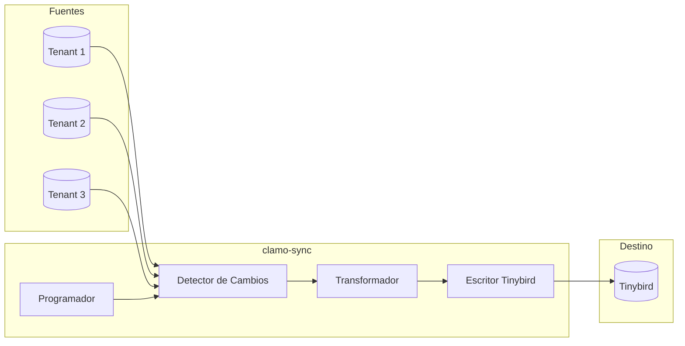

# clamo-sync

Servicio Rust que sincroniza datos desde las bases de datos de tenant hacia Tinybird para analytics en tiempo real.

## Información General

| Propiedad | Valor |
|-----------|-------|
| **Repositorio** | `GetClamo/clamo-sync` |
| **Lenguaje** | Rust |
| **Runtime** | Tokio |
| **Destino** | Tinybird |

## Arquitectura



## Implementación

### Main

```rust
use tokio::time::{interval, Duration};
use tracing::{info, error};

#[tokio::main]
async fn main() -> Result<(), Box<dyn std::error::Error>> {
    // Inicializar logging
    tracing_subscriber::init();
    
    // Cargar configuración
    let config = Config::from_env()?;
    
    // Crear syncer
    let syncer = Syncer::new(config).await?;
    
    // Ejecutar sync periódico
    let mut interval = interval(Duration::from_secs(300)); // 5 minutos
    
    loop {
        interval.tick().await;
        
        match syncer.sync_all().await {
            Ok(stats) => {
                info!(
                    cases = stats.cases_synced,
                    movements = stats.movements_synced,
                    duration_ms = stats.duration_ms,
                    "Sync completed"
                );
            }
            Err(e) => {
                error!(error = %e, "Sync failed");
            }
        }
    }
}
```

### Sincronizador

```rust
use sqlx::{PgPool, postgres::PgPoolOptions};
use reqwest::Client;

pub struct Syncer {
    control_pool: PgPool,
    tinybird: TinybirdClient,
    vault: VaultClient,
}

impl Syncer {
    pub async fn new(config: Config) -> Result<Self, Error> {
        let control_pool = PgPoolOptions::new()
            .max_connections(5)
            .connect(&config.control_database_url)
            .await?;
        
        let tinybird = TinybirdClient::new(&config.tinybird_token);
        let vault = VaultClient::new(&config.supabase_url, &config.supabase_key);
        
        Ok(Self {
            control_pool,
            tinybird,
            vault,
        })
    }
    
    pub async fn sync_all(&self) -> Result<SyncStats, Error> {
        let start = std::time::Instant::now();
        let mut stats = SyncStats::default();
        
        // Obtener empresas activas
        let companies = self.get_active_companies().await?;
        
        for company in companies {
            match self.sync_tenant(&company).await {
                Ok(tenant_stats) => {
                    stats.cases_synced += tenant_stats.cases_synced;
                    stats.movements_synced += tenant_stats.movements_synced;
                }
                Err(e) => {
                    tracing::error!(
                        company_id = %company.id,
                        error = %e,
                        "Failed to sync tenant"
                    );
                    stats.failed_tenants += 1;
                }
            }
        }
        
        stats.duration_ms = start.elapsed().as_millis() as u64;
        Ok(stats)
    }
    
    async fn sync_tenant(&self, company: &Company) -> Result<TenantStats, Error> {
        // Obtener conexión del tenant
        let tenant_pool = self.get_tenant_pool(&company.id).await?;
        
        // Sincronizar casos
        let cases_stats = self.sync_cases(&tenant_pool, &company.id).await?;
        
        // Sincronizar movimientos
        let movements_stats = self.sync_movements(&tenant_pool, &company.id).await?;
        
        // Actualizar marca de tiempo
        self.update_last_sync(&company.id).await?;
        
        Ok(TenantStats {
            cases_synced: cases_stats.count,
            movements_synced: movements_stats.count,
        })
    }
}
```

### Detección de Cambios

```rust
impl Syncer {
    async fn sync_cases(&self, pool: &PgPool, company_id: &str) -> Result<SyncResult, Error> {
        // Obtener última sincronización
        let last_sync = self.get_last_sync(company_id).await?;
        
        // Obtener casos modificados
        let cases: Vec<CaseRow> = sqlx::query_as!(
            CaseRow,
            r#"
            SELECT
                id,
                expediente,
                plaintiff,
                defendant,
                subject_matter,
                risk_level as "risk_level: RiskLevel",
                claim_amount,
                district,
                court,
                current_judge,
                process_type,
                filing_date,
                status as "status: CaseStatus",
                stage_code,
                substage_code,
                created_at,
                updated_at
            FROM cases
            WHERE updated_at > $1
            ORDER BY updated_at
            LIMIT 10000
            "#,
            last_sync,
        )
        .fetch_all(pool)
        .await?;
        
        if cases.is_empty() {
            return Ok(SyncResult { count: 0 });
        }
        
        // Transformar a formato Tinybird
        let rows: Vec<TinybirdCaseRow> = cases
            .iter()
            .map(|c| TinybirdCaseRow {
                company_id: company_id.to_string(),
                case_id: c.id.clone(),
                expediente: c.expediente.clone(),
                plaintiff: c.plaintiff.clone(),
                defendant: c.defendant.clone(),
                subject_matter: c.subject_matter.clone(),
                risk_level: c.risk_level.to_string(),
                claim_amount: c.claim_amount,
                district: c.district.clone(),
                court: c.court.clone(),
                status: c.status.to_string(),
                stage_code: c.stage_code.clone(),
                substage_code: c.substage_code.clone(),
                filing_date: c.filing_date,
                created_at: c.created_at,
                updated_at: c.updated_at,
            })
            .collect();
        
        // Enviar a Tinybird
        self.tinybird.ingest("cases_ds", &rows).await?;
        
        Ok(SyncResult { count: rows.len() })
    }
}
```

### Cliente Tinybird

```rust
pub struct TinybirdClient {
    client: Client,
    token: String,
    base_url: String,
}

impl TinybirdClient {
    pub fn new(token: &str) -> Self {
        Self {
            client: Client::new(),
            token: token.to_string(),
            base_url: "https://api.tinybird.co".to_string(),
        }
    }
    
    pub async fn ingest<T: Serialize>(&self, datasource: &str, rows: &[T]) -> Result<(), Error> {
        // Convertir a NDJSON
        let ndjson: String = rows
            .iter()
            .map(|r| serde_json::to_string(r).unwrap())
            .collect::<Vec<_>>()
            .join("\n");
        
        let response = self.client
            .post(format!("{}/v0/datasources", self.base_url))
            .query(&[("name", datasource), ("mode", "append")])
            .header("Authorization", format!("Bearer {}", self.token))
            .header("Content-Type", "application/x-ndjson")
            .body(ndjson)
            .send()
            .await?;
        
        if !response.status().is_success() {
            let error = response.text().await?;
            return Err(Error::TinybirdError(error));
        }
        
        Ok(())
    }
}
```

## Configuración

### Variables de Entorno

```bash
# Control Database
CONTROL_DATABASE_URL=postgresql://...

# Supabase (Vault)
SUPABASE_URL=https://...
SUPABASE_SERVICE_KEY=...

# Tinybird
TINYBIRD_TOKEN=p.eyJ...

# Sync
SYNC_INTERVAL_SECONDS=300
SYNC_BATCH_SIZE=10000
```

### Cargo.toml

```toml
[package]
name = "clamo-sync"
version = "0.1.0"
edition = "2021"

[dependencies]
tokio = { version = "1", features = ["full"] }
sqlx = { version = "0.7", features = ["runtime-tokio", "postgres", "chrono"] }
reqwest = { version = "0.11", features = ["json"] }
serde = { version = "1", features = ["derive"] }
serde_json = "1"
tracing = "0.1"
tracing-subscriber = "0.3"
chrono = { version = "0.4", features = ["serde"] }
thiserror = "1"
```

## Docker

```dockerfile
FROM rust:1.75-alpine AS builder

RUN apk add --no-cache musl-dev openssl-dev

WORKDIR /app
COPY Cargo.toml Cargo.lock ./
COPY src ./src

RUN cargo build --release

FROM alpine:latest
RUN apk --no-cache add ca-certificates
COPY --from=builder /app/target/release/clamo-sync /clamo-sync
CMD ["/clamo-sync"]
```

## Métricas

```rust
use prometheus::{Counter, Histogram, register_counter, register_histogram};

lazy_static! {
    static ref SYNC_TOTAL: Counter = register_counter!(
        "sync_total",
        "Total sync operations"
    ).unwrap();
    
    static ref SYNC_DURATION: Histogram = register_histogram!(
        "sync_duration_seconds",
        "Duration of sync operations"
    ).unwrap();
    
    static ref RECORDS_SYNCED: Counter = register_counter!(
        "records_synced_total",
        "Total records synced"
    ).unwrap();
}
```

## Desarrollo Local

```bash
# Compilar
cargo build

# Ejecutar
cargo run

# Tests
cargo test

# Release build
cargo build --release
```

