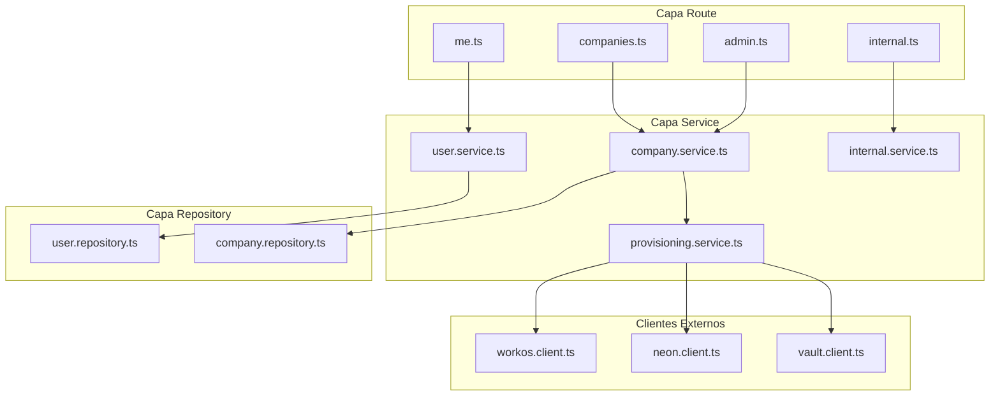
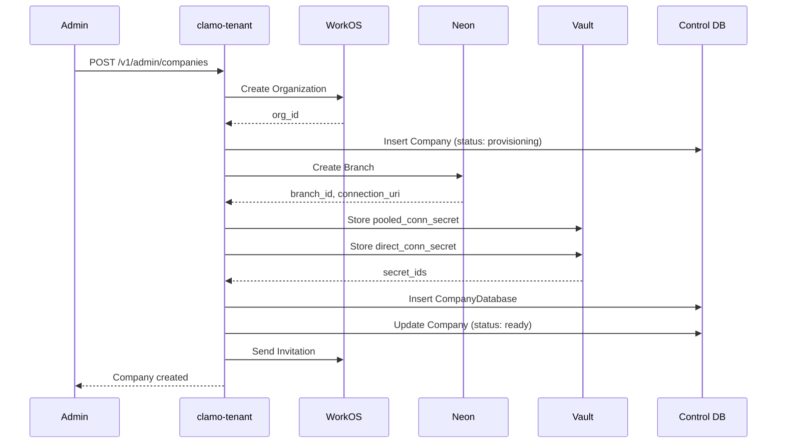

# clamo-tenant

Servicio central para la gestión de tenants (empresas), usuarios, onboarding y provisioning de bases de datos. Actúa como **fuente de verdad** para la resolución de conexiones de tenant.

## Información General

| Propiedad | Valor |
|-----------|-------|
| **Repositorio** | `GetClamo/clamo-tenant` |
| **Lenguaje** | TypeScript |
| **Framework** | Hono |
| **Puerto** | 4001 |
| **Base de Datos** | Supabase PostgreSQL (Control Plane) |
| **ORM** | Prisma (`@getclamo/database`) |

## Responsabilidades

- Gestión del ciclo de vida de empresas (crear, actualizar, eliminar)
- **Provisioning de bases de datos** por tenant en Neon
- Integración con **WorkOS** para autenticación y organizaciones
- Gestión de usuarios y roles
- Flujo de onboarding para nuevas empresas
- Almacenamiento de credenciales en **Supabase Vault**
- **Fuente de verdad** para resolución de conexiones de tenant

## Arquitectura RRS



## Estructura de Directorios

```
clamo-tenant/src/
├── routes/
│   ├── me.ts              # /v1/me - Usuario actual
│   ├── companies.ts       # /v1/companies
│   ├── admin.ts           # /v1/admin/... - Operaciones admin
│   ├── internal.ts        # /internal/v1/... - Servicio-a-servicio
│   └── reference-data.ts  # Datos de referencia
├── services/
│   ├── user.service.ts
│   ├── company.service.ts
│   ├── provisioning.service.ts  # Crea branches en Neon
│   └── internal.service.ts      # Resolución de conexiones
├── repositories/
│   ├── user.repository.ts
│   └── company.repository.ts
├── clients/
│   ├── workos.client.ts   # SDK de WorkOS
│   ├── neon.client.ts     # API de Neon
│   └── vault.client.ts    # Supabase Vault
├── middleware/
│   └── auth.ts            # Parsea x-workos-* headers
└── events/
    └── kafka.adapter.ts   # Eventos de provisioning
```

## Autenticación

El servicio usa headers `x-workos-*` inyectados por Kong:

```typescript
// middleware/auth.ts
const userId = headers.get("x-workos-user-id");
const orgId = headers.get("x-workos-org-id");
const role = headers.get("x-workos-role") ?? "member";
const permissionsHeader = headers.get("x-workos-permissions");
```

## Endpoints Principales

### Usuario Actual

| Método | Endpoint | Descripción |
|--------|----------|-------------|
| GET | `/v1/me` | Obtener usuario actual |
| GET | `/v1/me/company` | Obtener empresa del usuario |
| PATCH | `/v1/me/onboarding` | Completar onboarding |

### Empresas

| Método | Endpoint | Descripción |
|--------|----------|-------------|
| GET | `/v1/companies/:id` | Obtener empresa |
| PATCH | `/v1/companies/:id` | Actualizar empresa |

### Admin

| Método | Endpoint | Descripción |
|--------|----------|-------------|
| POST | `/v1/admin/companies` | Crear empresa |
| GET | `/v1/admin/companies` | Listar empresas |
| DELETE | `/v1/admin/companies/:id` | Eliminar empresa |
| POST | `/v1/admin/companies/:id/invite` | Invitar usuario |

### Endpoints Internos

<Warning>
**Solo para servicio-a-servicio.** Estos endpoints son la fuente de verdad para resolución de conexiones.
</Warning>

| Método | Endpoint | Descripción |
|--------|----------|-------------|
| GET | `/internal/v1/companies/:id` | Obtener empresa (interno) |
| GET | `/internal/v1/companies/:id/database` | Obtener conexión de DB |
| GET | `/internal/v1/companies/by-org/:orgId` | Buscar por WorkOS org |

## Flujo de Provisioning



## Modelo de Datos

### Company

```typescript
interface Company {
  id: string;
  workosOrgId: string;
  name: string;
  ruc: string | null;
  parentId: string | null;
  plan: 'free' | 'pro' | 'enterprise';
  settings: Record<string, unknown>;
  metadata: Record<string, unknown>;
  databaseStatus: 'pending' | 'provisioning' | 'ready' | 'failed';
  ownerEmail: string | null;
  createdAt: Date;
  updatedAt: Date;
}
```

### CompanyDatabase

```typescript
interface CompanyDatabase {
  id: string;
  companyId: string;
  neonProjectId: string;
  neonBranchId: string;
  neonEndpointId: string | null;
  databaseName: string;
  databaseHost: string;
  databaseUser: string;
  pooledConnSecretId: string;  // ID en Supabase Vault
  directConnSecretId: string;  // ID en Supabase Vault
  status: 'active' | 'suspended' | 'deleted';
}
```

### User

```typescript
interface User {
  id: string;
  workosUserId: string;
  email: string;
  firstName: string | null;
  lastName: string | null;
  companyId: string;
  role: 'admin' | 'member';
  onboardingState: 'pending_onboarding' | 'completed';
  createdAt: Date;
}
```

## Resolución de Conexiones

El servicio expone endpoints internos para que otros servicios resuelvan conexiones:

```typescript
// Desde clamo-cases usando el SDK
import Tenant from "@getclamo/tenant";

const tenant = new Tenant({ baseURL: env.TENANT_SERVICE_URL });

// Obtener conexión de base de datos
const { connectionString } = await tenant.internal
  .companies(companyId)
  .database.get();
```

## Configuración

### Variables de Entorno

```bash
# Servidor
PORT=4001

# Base de datos de control
CONTROL_DATABASE_URL=postgresql://...

# WorkOS
WORKOS_API_KEY=sk_...
WORKOS_CLIENT_ID=client_...

# Neon
NEON_API_KEY=...
NEON_PROJECT_ID=...

# Supabase (para Vault)
SUPABASE_URL=https://...
SUPABASE_SERVICE_KEY=...

# Kafka (eventos de provisioning)
KAFKA_BROKERS=localhost:9092
```

## SDK

Este servicio publica un SDK de TypeScript:

```bash
pnpm add @getclamo/tenant
```

```typescript
import Tenant from "@getclamo/tenant";

const tenant = new Tenant({ baseURL: process.env.TENANT_SERVICE_URL });

// Obtener usuario actual
const user = await tenant.me.get();

// Obtener empresa del usuario
const company = await tenant.me.company();

// Endpoints internos (servicio-a-servicio)
const companyData = await tenant.internal.companies(companyId).get();
const dbConnection = await tenant.internal.companies(companyId).database.get();
```

## Desarrollo Local

```bash
# Instalar dependencias
pnpm install

# Generar cliente Prisma
pnpm db:generate

# Ejecutar en modo desarrollo
pnpm dev

# Build
pnpm build

# Tests
pnpm test
```

## Próximos Pasos

<CardGroup cols={2}>
  <Card
    title="SDKs de Servicio"
    icon="plug"
    href="/es/arquitectura/sdks-servicio"
  >
    Comunicación servicio-a-servicio.
  </Card>
  <Card
    title="Seguridad"
    icon="shield"
    href="/es/arquitectura/seguridad"
  >
    Cadena de confianza y Vault.
  </Card>
</CardGroup>
