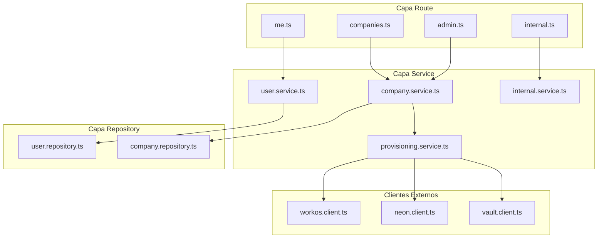
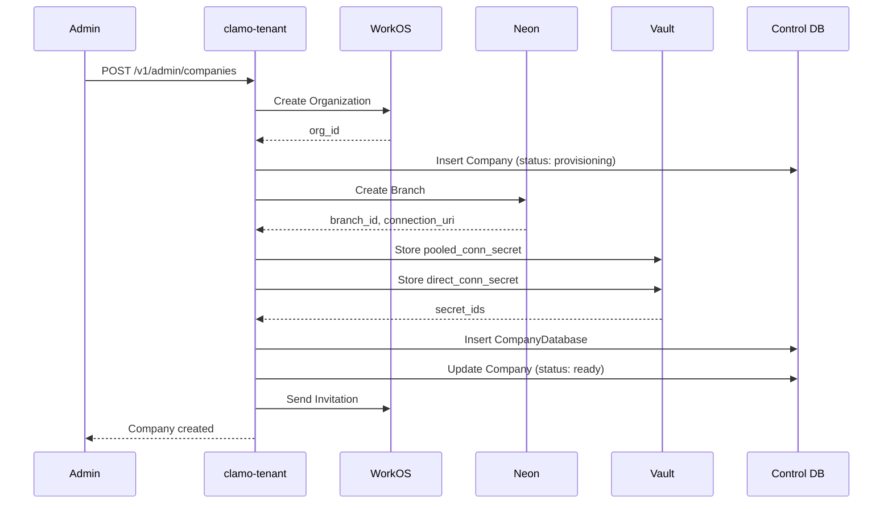

Servicio central para la gestión de tenants (empresas), usuarios, onboarding y provisioning de bases de datos. Actúa como **fuente de verdad** para la resolución de conexiones de tenant.

## Información General

| Propiedad | Valor |
|-----------|-------|
| **Repositorio** | `GetClamo/clamo-tenant` |
| **Lenguaje** | TypeScript |
| **Framework** | Hono |
| **Puerto** | 4001 |
| **Base de Datos** | Supabase PostgreSQL (Control Plane) |
| **ORM** | Prisma (`@getclamo/database`) |

## Responsabilidades

- Gestión del ciclo de vida de empresas (crear, actualizar, eliminar)
- **Provisioning de bases de datos** por tenant en Neon
- Integración con **WorkOS** para autenticación y organizaciones
- Gestión de usuarios y roles
- Flujo de onboarding para nuevas empresas
- Almacenamiento de credenciales en **Supabase Vault**
- **Fuente de verdad** para resolución de conexiones de tenant

## Arquitectura



## Autenticación

El servicio usa headers `x-workos-*` inyectados por Kong:

```typescript
// middleware/auth.ts
const userId = headers.get("x-workos-user-id");
const orgId = headers.get("x-workos-org-id");
const role = headers.get("x-workos-role") ?? "member";
const permissionsHeader = headers.get("x-workos-permissions");
```

## Endpoints de API

<Info>
Para la documentación interactiva completa de la API, consulta la [Referencia de API de Tenant](/api-reference/tenant/usuario/obtener-usuario-actual).
</Info>

## Flujo de Provisioning



## Modelo de Datos

<Info>
Para la documentación completa de entidades incluyendo Company, CompanyDatabase y User, consulta la sección de [Entidades](/es/entidades/company).
</Info>

## Resolución de Conexiones

El servicio expone endpoints internos para que otros servicios resuelvan conexiones de bases de datos de tenant. Consulta la sección de [SDKs](#sdks) para ejemplos de uso en TypeScript, Python y Rust.

## Configuración

### Variables de Entorno

```bash
# Servidor
PORT=4001

# Base de datos de control
CONTROL_DATABASE_URL=postgresql://...

# WorkOS
WORKOS_API_KEY=sk_...
WORKOS_CLIENT_ID=client_...

# Neon
NEON_API_KEY=...
NEON_PROJECT_ID=...

# Supabase (para Vault)
SUPABASE_URL=https://...
SUPABASE_SERVICE_KEY=...

# Kafka (eventos de provisioning)
KAFKA_BROKERS=localhost:9092
```

## SDKs

Este servicio publica SDKs tipados generados desde la especificacion OpenAPI usando [Stainless](https://stainless.com) (TypeScript/Python) y OpenAPI Generator (Rust).

| SDK | Paquete | Repositorio |
|-----|---------|-------------|
| TypeScript | `@getclamo/tenant` | [GetClamo/clamo-tenant-sdk-ts](https://github.com/GetClamo/clamo-tenant-sdk-ts) |
| Python | `getclamo-tenant` | [GetClamo/clamo-tenant-sdk-py](https://github.com/GetClamo/clamo-tenant-sdk-py) |
| Rust | `clamo-tenant-sdk` | [GetClamo/clamo-tenant-sdk-rust](https://github.com/GetClamo/clamo-tenant-sdk-rust) |

### Instalacion

<CodeGroup>
```bash TypeScript
pnpm add @getclamo/tenant
# o
npm install @getclamo/tenant
```

```bash Python
pip install getclamo-tenant
```

```bash Rust
cargo add clamo-tenant-sdk
```
</CodeGroup>

### Uso

<Tabs>
<Tab title="TypeScript">
```typescript
import Tenant from "@getclamo/tenant";

const tenant = new Tenant({ baseURL: process.env.TENANT_SERVICE_URL });

// Obtener usuario actual
const user = await tenant.me.get();

// Obtener empresa del usuario
const company = await tenant.me.company();

// Endpoints internos (servicio-a-servicio)
const companyData = await tenant.internal.companies(companyId).get();
const dbConnection = await tenant.internal.companies(companyId).database.get();
```
</Tab>
<Tab title="Python">
```python
from getclamo_tenant import Tenant

tenant = Tenant(base_url=os.environ["TENANT_SERVICE_URL"])

# Obtener usuario actual
user = tenant.me.get()

# Obtener empresa del usuario
company = tenant.me.company()

# Endpoints internos (servicio-a-servicio)
company_data = tenant.internal.companies(company_id).get()
db_connection = tenant.internal.companies(company_id).database.get()
```
</Tab>
<Tab title="Rust">
```rust
use clamo_tenant_sdk::Client;

let tenant = Client::new(std::env::var("TENANT_SERVICE_URL")?);

// Obtener usuario actual
let user = tenant.me().get().send().await?;

// Obtener empresa del usuario
let company = tenant.me().company().send().await?;
```
</Tab>
</Tabs>

## Desarrollo Local

```bash
# Instalar dependencias
pnpm install

# Generar cliente Prisma
pnpm db:generate

# Ejecutar en modo desarrollo
pnpm dev

# Build
pnpm build

# Tests
pnpm test
```

## Próximos Pasos

<CardGroup cols={2}>
  <Card
    title="Entidades"
    icon="database"
    href="/es/entidades/company"
  >
    Documentación de la entidad Company.
  </Card>
  <Card
    title="clamo-cases"
    icon="briefcase"
    href="/es/servicios/clamo-cases"
  >
    Servicio de gestión de casos.
  </Card>
</CardGroup>
