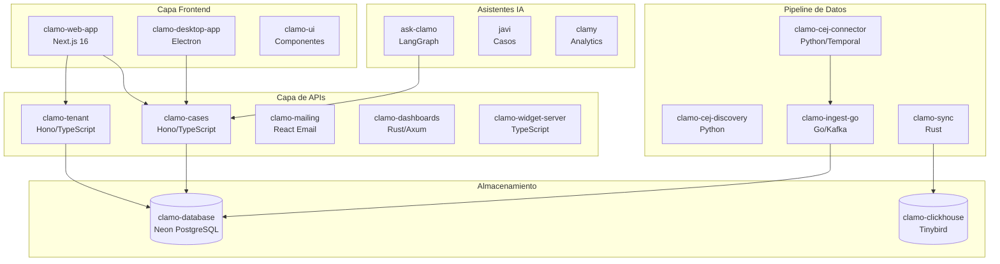
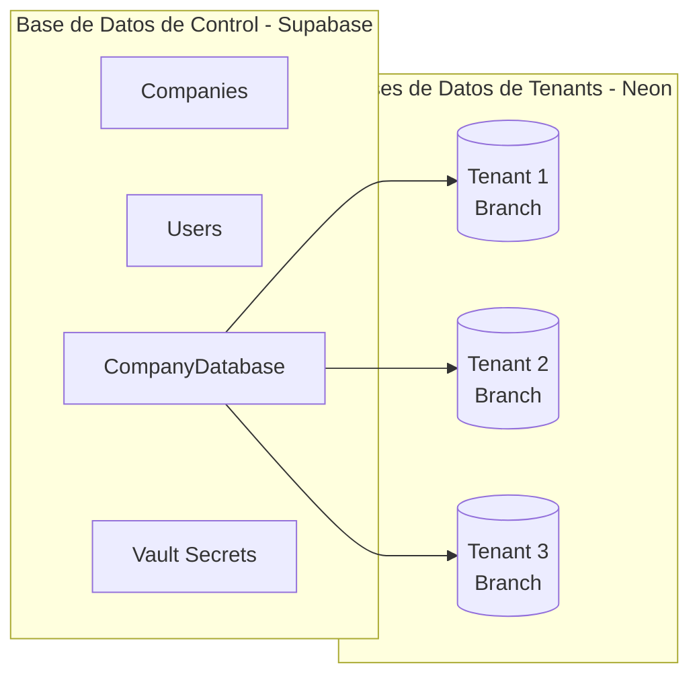
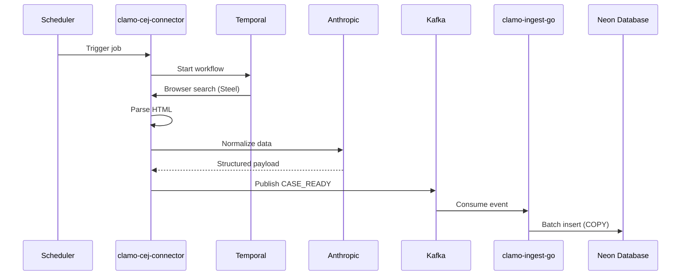

# Arquitectura del Sistema

Clamo está construido como una arquitectura de microservicios distribuida, optimizada para el procesamiento de datos legales y la escalabilidad multi-tenant.

## Diagrama General

## Componentes por Capa

### Capa Frontend

| Servicio | Tecnología | Descripción |
|----------|------------|-------------|
| `clamo-web-app` | Next.js 16, React 19 | Aplicación web principal con dashboard, gestión de casos y onboarding |
| `clamo-desktop-app` | Electron, TypeScript | Aplicación de escritorio para acceso offline |
| `clamo-ui` | React, Radix UI | Librería de componentes compartidos |

### Capa de APIs

| Servicio | Tecnología | Puerto | Descripción |
|----------|------------|--------|-------------|
| `clamo-tenant` | Hono, TypeScript | 4001 | Gestión de empresas, usuarios, onboarding y configuración |
| `clamo-cases` | Hono, TypeScript | 4000 | CRUD de casos, movimientos, hitos y documentos |
| `clamo-mailing` | React Email, SendGrid | 4002 | Envío de emails transaccionales y notificaciones |
| `clamo-dashboards` | Rust, Axum | 8020 | API de dashboards y widgets personalizables |
| `clamo-widget-server` | TypeScript | 3005 | Servidor de widgets embebibles |

### Asistentes IA

| Servicio | Tecnología | Descripción |
|----------|------------|-------------|
| `ask-clamo` | LangGraph, Python | Agente unificado que consolida Javi y Clamy |
| `javi` | LangGraph, Python | Asistente especializado en consultas de casos |
| `clamy` | LangGraph, Python | Asistente de analytics con integración MCP/Tinybird |

### Pipeline de Datos

| Servicio | Tecnología | Descripción |
|----------|------------|-------------|
| `clamo-cej-connector` | Python, Temporal | Scraping del CEJ con browser automation y normalización LLM |
| `clamo-cej-discovery` | Python | Descubrimiento de nuevos expedientes por RUC |
| `clamo-ingest-go` | Go, Kafka | Worker de ingesta de alta performance con batch inserts |
| `clamo-sync` | Rust | Sincronización de datos hacia Tinybird para analytics |

### Almacenamiento

| Servicio | Tecnología | Descripción |
|----------|------------|-------------|
| `clamo-database` | Prisma, Neon | Esquemas y migraciones para base de datos multi-tenant |
| `clamo-clickhouse` | Tinybird | Configuración de datasources y pipes para analytics |

## Modelo Multi-Tenant

Clamo implementa un modelo de **database-per-tenant** usando Neon PostgreSQL:

### Flujo de Provisioning

1. Admin crea una empresa en el panel de administración
2. `clamo-tenant` crea una Organization en WorkOS
3. Se provisiona un nuevo branch en Neon
4. Las credenciales se almacenan en Supabase Vault
5. Se envía invitación al administrador de la empresa

## Flujo de Datos del CEJ

## Autenticación y Seguridad

- **WorkOS AuthKit**: SSO, invitaciones y gestión de organizaciones
- **Supabase Vault**: Almacenamiento seguro de secretos y credenciales
- **Row Level Security**: Aislamiento de datos por tenant en queries

## Paquetes Compartidos

| Paquete | Descripción |
|---------|-------------|
| `@getclamo/contracts` | Schemas Zod y tipos TypeScript compartidos |
| `@getclamo/database` | Cliente Prisma y utilidades de base de datos |
| `@getclamo/tenant-sdk` | SDK para integración con el servicio de tenants |
| `@getclamo/cases-sdk` | SDK para integración con el servicio de casos |

## Próximos Pasos

<CardGroup cols={2}>
  <Card
    title="Inicio Rápido"
    icon="rocket"
    href="/inicio/inicio-rapido"
  >
    Comienza a integrar con las APIs de Clamo.
  </Card>
  <Card
    title="Servicios"
    icon="server"
    href="/servicios/catalogo"
  >
    Documentación detallada de cada servicio.
  </Card>
</CardGroup>

