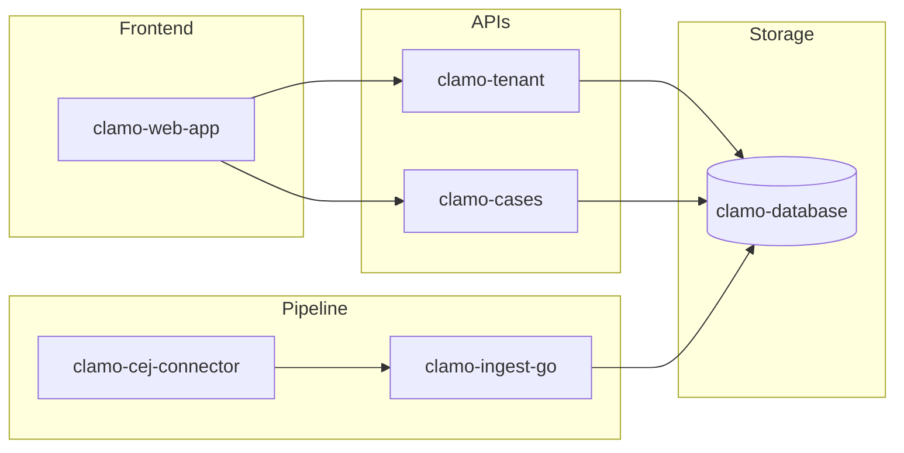

# Catálogo de Servicios

Clamo está compuesto por múltiples microservicios especializados. Esta página proporciona una vista general de cada uno.

## Servicios Core

Estos son los servicios fundamentales para el funcionamiento de la plataforma.

<CardGroup cols={2}>
  <Card
    title="clamo-tenant"
    icon="building"
    href="/servicios/clamo-tenant"
  >
    **Gestión de Tenants**
    
    Maneja empresas, usuarios, onboarding y configuración multi-tenant. Integra con WorkOS para autenticación.
    
    - TypeScript / Hono
    - Puerto: 4001
  </Card>
  
  <Card
    title="clamo-cases"
    icon="briefcase"
    href="/servicios/clamo-cases"
  >
    **Gestión de Casos**
    
    CRUD completo de expedientes judiciales, movimientos, hitos y documentos.
    
    - TypeScript / Hono
    - Puerto: 4000
  </Card>
  
  <Card
    title="clamo-database"
    icon="database"
    href="/servicios/clamo-database"
  >
    **Esquemas de Base de Datos**
    
    Definiciones Prisma, migraciones y utilidades para bases de datos de control y tenant.
    
    - Prisma ORM
    - Neon PostgreSQL
  </Card>
</CardGroup>

## Pipeline de Datos

Servicios responsables de la ingesta y procesamiento de datos del CEJ.

<CardGroup cols={2}>
  <Card
    title="clamo-cej-connector"
    icon="spider"
    href="/servicios/clamo-cej-connector"
  >
    **Conector CEJ**
    
    Scraping automatizado del Centro de Justicia Electrónico con normalización LLM.
    
    - Python / Temporal
    - Steel + Playwright
  </Card>
  
  <Card
    title="clamo-ingest-go"
    icon="bolt"
    href="/servicios/clamo-ingest-go"
  >
    **Worker de Ingesta**
    
    Consumidor Kafka de alta performance para inserción batch en PostgreSQL.
    
    - Go
    - Kafka / Temporal
  </Card>
  
  <Card
    title="clamo-sync"
    icon="arrows-rotate"
    href="/servicios/clamo-sync"
  >
    **Sincronización Analytics**
    
    Sincroniza datos de tenants hacia Tinybird para analytics en tiempo real.
    
    - Rust
    - Tinybird
  </Card>
</CardGroup>

## Servicios Adicionales

Servicios complementarios para funcionalidades específicas.

<CardGroup cols={2}>
  <Card
    title="clamo-mailing"
    icon="envelope"
    href="/servicios/clamo-mailing"
  >
    **Servicio de Email**
    
    Emails transaccionales y notificaciones con templates React Email.
    
    - TypeScript / Hono
    - SendGrid
  </Card>
  
  <Card
    title="clamo-dashboards"
    icon="chart-line"
    href="/servicios/clamo-dashboards"
  >
    **API de Dashboards**
    
    CRUD para dashboards personalizables y widgets de analytics.
    
    - Rust / Axum
    - Puerto: 8020
  </Card>
  
  <Card
    title="ask-clamo"
    icon="robot"
    href="/servicios/ask-clamo"
  >
    **Asistentes IA**
    
    Agentes LangGraph para consultas de casos (Javi) y analytics (Clamy).
    
    - Python / LangGraph
    - Anthropic
  </Card>
</CardGroup>

## Matriz de Tecnologías

| Servicio | Lenguaje | Framework | Base de Datos | Mensajería |
|----------|----------|-----------|---------------|------------|
| clamo-tenant | TypeScript | Hono | Neon (Prisma) | - |
| clamo-cases | TypeScript | Hono | Neon (Prisma) | Ably |
| clamo-database | TypeScript | Prisma | Neon | - |
| clamo-cej-connector | Python | FastAPI | PostgreSQL | Kafka |
| clamo-ingest-go | Go | - | Neon | Kafka |
| clamo-sync | Rust | - | Neon | - |
| clamo-mailing | TypeScript | Hono | PostgreSQL | - |
| clamo-dashboards | Rust | Axum | Neon | - |
| ask-clamo | Python | LangGraph | - | - |

## Puertos por Defecto

| Servicio | Puerto |
|----------|--------|
| clamo-web-app | 3001 |
| clamo-cases | 4000 |
| clamo-tenant | 4001 |
| clamo-mailing | 4002 |
| clamo-widget-server | 3005 |
| clamo-dashboards | 8020 |
| javi (LangGraph) | 8123 |
| clamy (LangGraph) | 8124 |

## Dependencias entre Servicios



## Health Checks

Todos los servicios exponen endpoints de health check:

| Endpoint | Descripción |
|----------|-------------|
| `/health` | Estado general con checks de dependencias |
| `/health/live` | Liveness probe (servicio corriendo) |
| `/health/ready` | Readiness probe (listo para tráfico) |

Ejemplo de respuesta:

```json
{
  "status": "healthy",
  "timestamp": "2025-01-02T12:00:00Z",
  "checks": {
    "database": "healthy",
    "redis": "healthy",
    "kafka": "healthy"
  }
}
```

